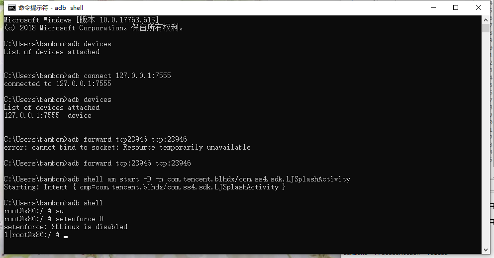
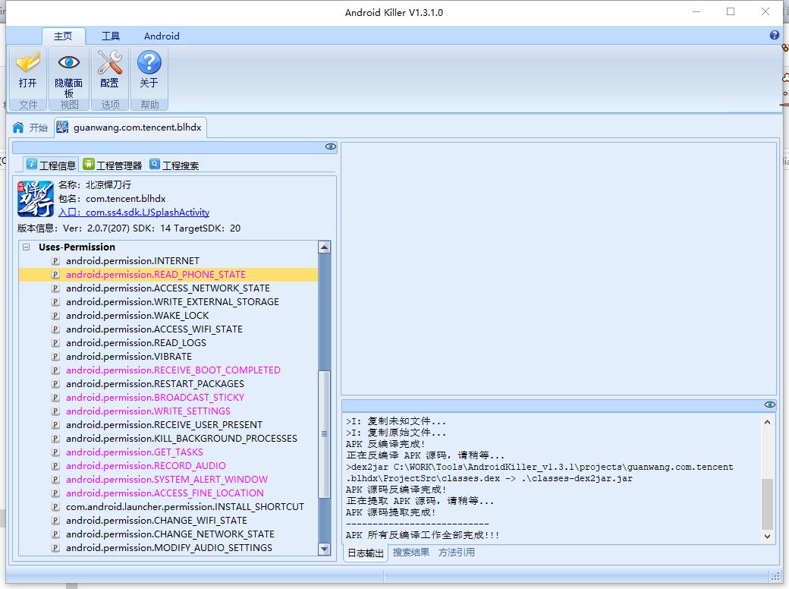
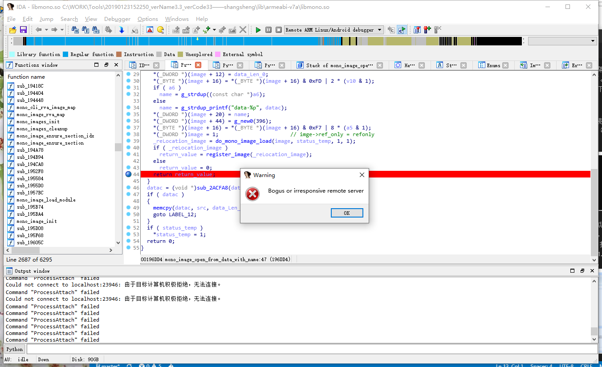

今天想分析下大梦龙图他们的游戏框架。 发现是mono发布的Unity游戏。 dll加壳了。然后网上找了一些脱壳教程。实现过程记录下

一下记录用ida链接模拟器。

* 使用的是网易mumu模拟器，装了北凉悍刀行，然后通过adb 启动apk，等待 ida 附加debug进程。 
  
  

  要注意的是，要先把mumu模拟器添加到设备列表，然后转发端口什么，具体理论以后再补上，
然后 解包apk ，找到包名和入口。 用的Android Killer v1.3.1.0 解的包。 顺利启动

ida 选择AndroidDebuger 然后附加到进程，包错了网上说关了防火墙 关了，SELinux 还是没好，先这样吧。
