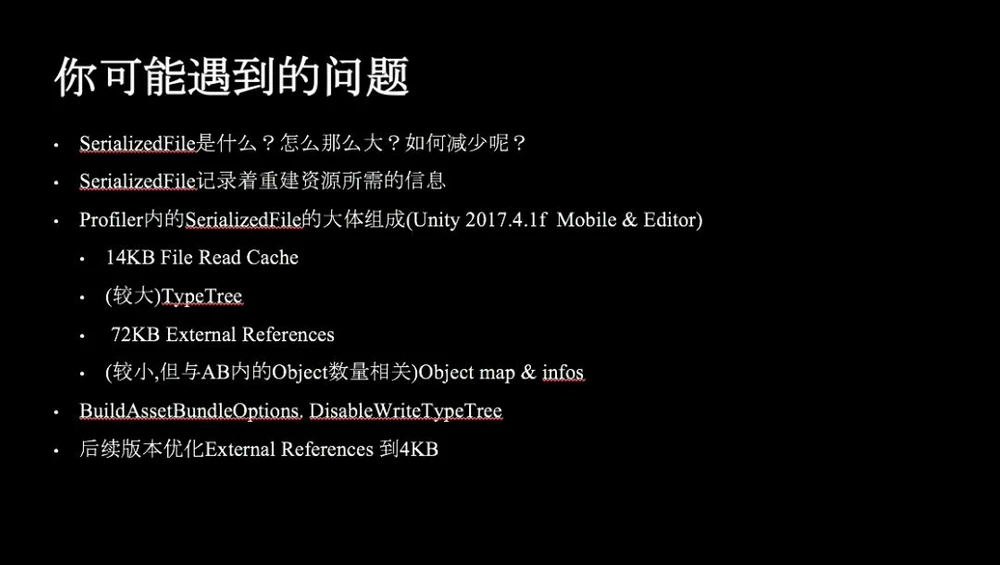

* [unity中的资源接口](#0)
* [unity中的ab细节](#1)
* [ab的运行时管理思路](#2)
<h3 id = "#1">unity中的资源接口</h3>

 unity的资源加载接口有：
  Resource.Load 
  AssetBundle.Load：
  Instacse：实例化，从asset 实例化出来的对象有的是 conle 有的是引用，属于引用类型资源的有
 卸载接口：
  GameObject.Destroy(gameObject)，销毁该物体；
  AssetBundle.Unload(false)，释放AssetBundle文件内存镜像，不销毁Load创建的Assets对象；
  AssetBundle.Unload(true)，释放AssetBundle文件内存镜像同时销毁所有已经Load的Assets内存镜像；
  Resources.UnloadAsset(Object)，释放已加载的Asset对象；
  Resources.UnloadUnusedAssets，释放所有没有引用的Asset对象。

动态加载，res.load 和 ab.load . 静态加载 Instantiate 实例化

AB的运行时加载：
来自文件用CreateFromeFile 创建一个assetbundle，创建完后等于把硬盘或者网络的一个文件读到内存区域，这个时候ab只是内存镜像数据块，还没有asset。
ab打包方式的不同，又导致内存加载这块有所差别。 
Lz4 加载ab 只把ab的数据头加载进内存。 lzma会将整个ab加载进内存。

Asset的加载：
Ab.Load 从ab的内存镜像读取创建一个asset对象。创建asset也会分配内存存放。

AB的释放：
ab.unload(false) 释放ab文件内存镜像，不包含load创建的asset内存对象
ab.unload(true)  释放ab内存镜像和销毁所有load创建的asset内存对象

资源创建的过程：
资源创建分两步，一个是Load Asset, 一个是 Instantiate。
Load 出来的资源类型有GameObject,Transform ,Mesh ,Textrue , Material ,Shader ,Script等。Res.load 出来asset ，在第一次Instantiate前没有创建Asset。而
ab.load 的时候就创建了asset。
Instantiate 的过程是对Asset Clone(复制)和引用结合的过程。 Clone 需要申请内存存放自己数据，引用只是一个简单的指针指向已经Load的asset。例如Transform是通过Clone出来的，Texture和TerrainData是通过引用复制的，而Mesh，Material，PhysicalMaterial和Script是Clone和引用同时存在的。以Script为例，Script分为代码段和数据段，所有需要使用该Script的GameObject使用的代码是一样的，而大家的数据有所区别，因此对数据段需要使用Clone的方式，而对代码段需要使用引用的方式来复制。因此Load操作其实Load一些数据源出来，用于创建新对象时被Clone或者被引用。

资源销毁的过程：
Object.Desctroy 只会销毁clone的asset，不会释放引用的asset。场景中没有任何引用asset的时候，会被标记为UnusedAsset 可以通过res.unloadUnsedAssets释放。Ab.unload(false) 只会释放ab内存镜像不会释放asset，ab.unload(true) 会把所有的ab和asset全部删除。

场景加载：所有内存对象都会被自动销毁，包括instantiate 和 load的asset，但是ab本身不会被销毁，要手动同过ab.unload 销毁。

<h3 id = "#2">ab的运行时管理思路</h3>
基于以上：
ab运行时的管理方式就有多种了，都和ab的打包方式相关联。
方案一：
卸载ab通过ab.unload(true) 的方式。
    这种方式需要对资源本身进行引用计数，然后关联的对ab进行引用计数。 直到逻辑层确保没有任何资源对ab引用了就强制卸载所有
    这种方式和ab打包的方式有关。适合按英雄模块等打包方式。例如一个英雄的特效打包到一个ab,对于特效中有公共用到的资源 需要单独放到一个ab中。
    这种方式资源使用期间ab是不卸载的。lz4方式ab的内存镜像加载并不大，是可以接受的。

方案二：
卸载ab通过ab.unload(false) 的方式。
    这种方式需每次加载完asset 就直接对ab进行卸载。 对于lzma方式比较合适，lzma 每次把文件的镜像都加载进内存了，及时卸载ab能减少内存占中。
    但是这种方式ab的打包颗粒度需要更加细化。 不然容易出现内存的泄露，例如上面所得 英雄特效 ，ab1【eff1，eff2，tex1】eff1,2都引用了tex1，加载了
    eff1 ，tex1 也创建了asset，卸载ab后再次加载eff2的话，就丢失了对已经存在的tex1的引用，又从新创建了一份tex1的asset。除非加载逻辑层吧每个资源
    的依赖asset也做记录，然后对asset 做一套换成记录系统，自己保持对asset的引用，但是这样一是让系统更加复杂，二是，还不如细分ab，将这种有多重依赖的
    资源打成单个的ab。 但这样细读更细了，势必会导致加载过程比第一种更慢，有更多的io了。

    具体取舍和项目有关。

 

 

 <h3 id = "#1">unity中的ab细节</h3>

Bundle的size 有header信息和block数据块和额外的一些数据data组成。
Blocks根据不同的压缩方式会有不同的组织形式，譬如下图LZ4，它会产生三个压缩的Blocks，所以在读取资源的时候会先找到资源被压缩在哪个Blocks上，然后把Blocks解压并且Seek到对应位置去读对应的数据。而LZMA只有一个Block，需要把整个Blocks都解压后在读取对应的数据。

ab加载的时候 lz4 也只是加载信息头到内存，读取数据的时候根据数据偏移去寻找加载数据块
 

 

WebExtract解开的文件都是二进制文件，并不是明文，通过使用Binary2Text的工具可以把这些二进制文件直接反序列化成明文。
-detailed这个参数可以让序列化出来的文本带上更多详细的信息，包括这个资源占用了大小是多少，哪些大哪些小。
-hexfloat这个参数是把浮点数都以16进制的格式来输出，这样能够保证浮点精度的输出。我们曾经遇到过两次构建有差异的问题，通过WebExtract跟Binary2Text解开后发现文件还是一致的，但后面细查发现是因为float的输出的问题。所以加入了这个参数。

 

 

解开的文本文件大家可以一目了然的清楚知道里面的结构是如何，会包含哪些东西。
解开后文本内不同资源需要关注的一些点：
Assetbundle块：记录着当前AB的Assets，而Asset又会有PreloadIndex以及PreloadSzie来定义如何能把Asset给组织起来。
PreloadData块：当前AB的Assets的依赖的Asset资源。
External References块：引用外部的Assetbundle的列表，m_FileID & m_PathID: m_FileID为0表示资源在当前包内，不为0所以引用这外部的资源。其ID值对应着External Referecnes的列表。m_PathID为当前包内的唯一ID。
Material：可以确认其ShaderKeyword的数量是否是符合预期的，还可以看到ShaderProperty数值是否是正确的。
Texture：可以检查是否被重复打包了，其大小占用了多少。
Shader：可以检查是否含有了默认的Standard 或者额外的变体，通过SubProgram的数量来大致判断一下是否符合变体组合的数量。另外还可以有编译后的二进制大小。这些都直接影响到项目中ShaderLab的内存占用。
MonoScript: 我们脚本的关联，另外还会存有一些该脚本的一些数据。

 

 

SerializedFile
其实SerializedFile记录着重建资源所需的信息。而其大体的组成是有2 x 7KB的文件读取Buffer，较大的TypeTree占用，如果存有外部引用，会有一个最少72KB的External References的Buffer，剩下的就是我们资源的数据了，我们会在后续版本把External References的内存占用降到4KB+。 海贼中由于resources目录中资源太多，占用的TypeTree 很大，有几十m，为了较少吧很多东西打ab了。

 

 