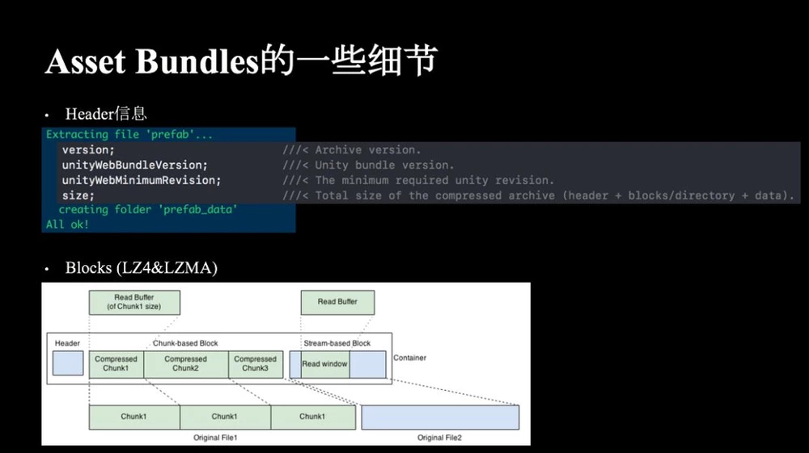
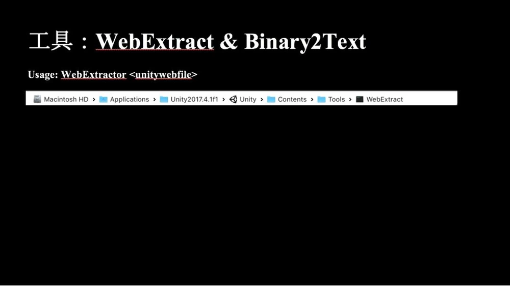
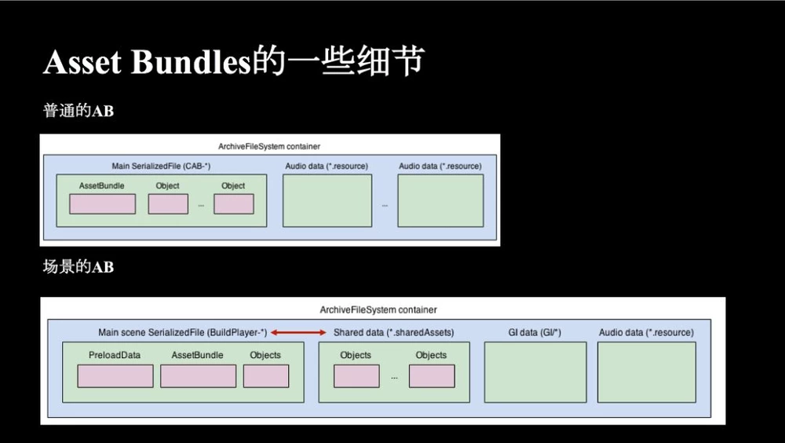

* [unity中的资源关系](#-1)
* [unity中的资源接口](#0)
* [unity中的ab细节](#1)
* [ab的运行时管理思路](#2)

<h3 id = "#-1">unity中的资源关系</h3>

[unity内存管理](https://www.jianshu.com/p/cf3ab3bac1ab) 
[资源管理](https://blog.uwa4d.com/archives/USparkle_Addressable1.html) 
[资源加载而](https://mp.weixin.qq.com/s/0XFQt8LmqoTxxst_kKDMjw?) 
[unity数据格式](https://blog.uwa4d.com/archives/USparkle_inf_UnityEngine.html) 

<h3 id = "#1">unity中的资源接口</h3>

[unityAssetBundle运行时](http://blog.sina.com.cn/s/blog_c3e21e750102yfng.html)

 unity的资源加载接口有：
  Resource.Load 
  AssetBundle.Load：
  Instacse：实例化，从asset 实例化出来的对象有的是 conle 有的是引用，属于引用类型资源的有
 卸载接口：
  GameObject.Destroy(gameObject)，销毁该物体；
  AssetBundle.Unload(false)，释放AssetBundle文件内存镜像，不销毁Load创建的Assets对象；
  AssetBundle.Unload(true)，释放AssetBundle文件内存镜像同时销毁所有已经Load的Assets内存镜像；
  Resources.UnloadAsset(Object)，释放已加载的Asset对象；
  Resources.UnloadUnusedAssets，释放所有没有引用的Asset对象。

动态加载，res.load 和 ab.load . 静态加载 Instantiate 实例化

AB的运行时加载：
来自文件用CreateFromeFile 创建一个assetbundle，创建完后等于把硬盘或者网络的一个文件读到内存区域，这个时候ab只是内存镜像数据块，还没有asset。
ab打包方式的不同，又导致内存加载这块有所差别。 
Lz4 加载ab 只把ab的数据头加载进内存。 lzma会将整个ab加载进内存。
ab使用lz4的方式加载ab的时候只加载ab头速度比较快。 unity5.6的源码中，加载ab内部实现加载ab的实现，也是在主线程加载的，因为加载ab的时候需要创建texture ，gameobject这些的guid，
不同ab间的这个guid是要保持一致性的，用异步的话就需要对这些guid加锁。所以unity在创建的时候再主线程分时间片，加载，没帧分固定时间加载，没有加载完的话就到下次加载。所以ab的asyn和synunity内部都是同步实现的。同时业务上用异步的话需要遍历活开携程，总是会慢一帧

Asset的加载：
Ab.Load 从ab的内存镜像读取创建一个asset对象。创建asset也会分配内存存放。

AB的释放：
ab.unload(false) 释放ab文件内存镜像，不包含load创建的asset内存对象
ab.unload(true)  释放ab内存镜像和销毁所有load创建的asset内存对象

资源创建的过程：
资源创建分两步，一个是Load Asset, 一个是 Instantiate。
Load 出来的资源类型有GameObject,Transform ,Mesh ,Textrue , Material ,Shader ,Script等。Res.load 出来asset ，在第一次Instantiate前没有创建Asset。而
ab.load 的时候就创建了asset。
Instantiate 的过程是对Asset Clone(复制)和引用结合的过程。 Clone 需要申请内存存放自己数据，引用只是一个简单的指针指向已经Load的asset。例如Transform是通过Clone出来的，Texture和TerrainData是通过引用复制的，而Mesh，Material，PhysicalMaterial和Script是Clone和引用同时存在的。以Script为例，Script分为代码段和数据段，所有需要使用该Script的GameObject使用的代码是一样的，而大家的数据有所区别，因此对数据段需要使用Clone的方式，而对代码段需要使用引用的方式来复制。因此Load操作其实Load一些数据源出来，用于创建新对象时被Clone或者被引用。

资源销毁的过程：
Object.Desctroy 只会销毁clone的asset，不会释放引用的asset。场景中没有任何引用asset的时候，会被标记为UnusedAsset 可以通过res.unloadUnsedAssets释放。Ab.unload(false) 只会释放ab内存镜像不会释放asset，ab.unload(true) 会把所有的ab和asset全部删除。

场景加载：所有内存对象都会被自动销毁，包括instantiate 和 load的asset，但是ab本身不会被销毁，要手动同过ab.unload 销毁。

<h3 id = "#2">ab的运行时管理思路</h3>
基于以上：
ab运行时的管理方式就有多种了，都和ab的打包方式相关联。
方案一：
卸载ab通过ab.unload(true) 的方式。
    这种方式需要对资源本身进行引用计数，然后关联的对ab进行引用计数。 直到逻辑层确保没有任何资源对ab引用了就强制卸载所有
    这种方式和ab打包的方式有关。适合按英雄模块等打包方式。例如一个英雄的特效打包到一个ab,对于特效中有公共用到的资源 需要单独放到一个ab中。
    这种方式资源使用期间ab是不卸载的。lz4方式ab的内存镜像加载并不大，是可以接受的。
    这种方式就不好对asset 进行引用缓存，因为asset引用归零后，ab也可能立马归零，这时候直接卸载ab ，那缓存的池也要立马卸载。不然就会出现引用丢失情况。
    除非可以对ab做缓存的卸载延时。 这样可以控制从ab加载出来的asset的资源的池控制。
    如果一个asset引用为0 ，他的ab不一定就会马上卸载，因为其他资源可能还有对这个ab的引用。

    所以这种方式想要对asset做可控的缓存池的话。 需要先对asset做缓存控制，然后为了不让asset立马被ab引用为0的时候立马被卸载掉，还要对ab做缓存延时管理。也就是说，需要一个管理器，记录asset的引用，同时还有他的ab的引用当要卸载的时候 是不是立即卸载还是一直保持在内存，还是等一小段时间再做卸载都可以可控。

    这种方式还是需要做这种控制的，比如一些资源是常驻内存的，需要将这部分功能进行可控只，比如海贼中的shader 是一直在内存不卸载ab的。

    所以true的方式资源管理下有以下需求：
        

    1、需要有常驻内存的资源管理系统，比如shader是可以常驻内存的。
    2、需要做对资源和ab的池管理缓存。使得ab和asset 不会立马进行卸载。 而是拥有可控的卸载时间段管理。
    ----由于计数管理是assetmgr 内部的，他有asset的计数和ab的计数，ab的计数卸载是在asset的计数卸载之下执行的，所以，如果 要做延时管理的话，只需要对asset 的引用计数进行缓存的延时管理就行，ab的实际卸载在asset本身的卸载后自动进行。
    ----方便对经常用的资源进行控制配置处理。 这里做的比较麻烦，asset的引用和ab的引用是基于 assetmgr 的。再次做一套缓存的话，管理器，需要对asset 和 ab的引用进行监听，如果是需要做缓存管理的资源，那么是需要监听assetmgr 本身的状态， 要么对assetmgr进行显示调用保持一个增加的计数。

    需要 ResCacheMgr系统,加载资源先看Cache系统里是不是已经有了,同时他还承担对资源的常驻内存资源的管理和缓存资源的管理。
    需要一个go池，他是给Cache系统用的。有需要的Asset要池的处理，和对应asset的引用管理。
    需要一个BResources 加载器，决定资源的时候是从池里面加载 还是 从ab或其他加载器里面加载。这个主要是一个中转层。

    实现细节：
        实现Cache系统，Cahce系统主要保存一个AssetMgr中Asset的状态。，在AssetMgr要卸载Asset的时候需要在看下Cahce系统中是否可以直接卸载这个Asset，可以就直接卸载，不可以就等Cache系统要卸载的时候再次去调用AsssetMgr真正的卸载。
        难点在于如何判断Cache系统是真的可以卸载，然后调用assetMgr:
        卸载是手动调用assetmgr接口，对assetmgr中的引用计数更新卸载。从assetmgr中加载的资源是正确的计数，如果是从cache系统缓存池里加载如何计算呢。

        ----从上层BRes获取一个资源，不需要cache系统，加载卸载都是直接走正常的assetmgr 接口周期
        ----如果需要cache系统cache ，没有加到cache的话那么同时对assetmgr 和 cache系统的引用计数增加；cache中已经有了的话，那么不增加assetMgr的引用，只增加cache系统引用 ； 
        ----移除一个资源的时候，调用assetmgr卸载移除接口，在接口中做处理判断是立即卸载还是等待cache系统做处理。 如果资源不需要cahche系统就直接卸载 ，需要cache系统，计数为0后还需要判断 ，如果需要cache系统的，看cache的状态是否可以清除这个资源，可以就直接清除，不可以就等cache系统自己判断可以清除了在清除。  这样就可以保证又池的情况下还能严格保证计数正确。
        ----cache系统可以直接调用assetmgr立即清除接口清除一个资源，而外部系统只能调用assetmgr普通卸载接口，卸载的时候要判断cahce系统，是否可以直接清除。
        ----底层池系统的设计，加载出资源的时候对go的hash做记录，并且添加路径的类型引用。 每从资源接口加载出来数据对象，是要缓存的类型，就讲这个对象信息加入池，他的类型引用计数也加1。  当对go回收的时候，因为已经有要维护存的次对象的go数据，可以看是不是放入次中，放入的话，那计数等不变放入池中。直接将go放入池节点。 如果不是或者不池满了等，就要销毁当前go，减少池对象数量。
        池对象的添加： 从res接口中药缓存的对象加载出实例后产生的。 当即添加此对象的属性信息，真假引用计数。还是需要上层手动回收调用。
        池对象的回收： 从业务层调用回收对象的接口。 回收只有等销毁的时候，需要减少引用计数。
        池对象的引用计数： 用于是否可以销毁 cache系统的asset cache。没有引用的时候可以清楚相关的池。

        对于GameObject类型对象是有池的处理，其他对象没有。
        上层调用res接口的时候，还是要先依次对于调用卸载接口。 然后如果是GameObject类型还要调用 安全的Destry 进行回收处理

        获取的AssetIns 如果是需要缓存池类型的，当回收的时候需要做两件事情，调用AssetMgr的资源卸载 ，和对AssetIns的资源缓存接口进行缓存。 卸载可以封装到和缓存一个接口么？
        
        有一个难点： 对于卸载的细节实现：通常上层只调用assetmgr的卸载接口，所以对于cache的引用也是要用基于上层调用的卸载而不是，基于加载res时候添加记基于GameObject 实例添加引用，然后卸载GameObject 调用销毁接口进行引用减。

        但是如果能把使用的Obj的销毁的时候 做成自动调用的回收的话，那就不用通过上层的assetmgr卸载调用来减少引用了。

        反思： 资源底层的接口，是没有办法完全做到单项加载的。 比如池管理，就必须要要结合上层管理器去做处理。 那么同理，资源的卸载接口也是如此。 资源主要关注三个，英雄，特效，模型。 每个资源都有他的生命周期，资源管理器需要在架构的周期内进行资源的加载卸载周期处理。

        现在从资源管理器中加载一个资源，那么卸载的时候一定要调用卸载资源，如果是GameObject的类型，那还要周期内调用池的卸载接口。
        

方案二：
卸载ab通过ab.unload(false) 的方式。
    这种方式需每次加载完asset 就直接对ab进行卸载。 对于lzma方式比较合适，lzma 每次把文件的镜像都加载进内存了，及时卸载ab能减少内存占中。
    但是这种方式ab的打包颗粒度需要更加细化。 不然容易出现内存的泄露，例如上面所得 英雄特效 ，ab1【eff1，eff2，tex1】eff1,2都引用了tex1，加载了
    eff1 ，tex1 也创建了asset，卸载ab后再次加载eff2的话，就丢失了对已经存在的tex1的引用，又从新创建了一份tex1的asset。除非加载逻辑层吧每个资源
    的依赖asset也做记录，然后对asset 做一套换成记录系统，自己保持对asset的引用，但是这样一是让系统更加复杂，二是，还不如细分ab，将这种有多重依赖的
    资源打成单个的ab。 但这样细读更细了，势必会导致加载过程比第一种更慢，有更多的io了。

    这种方式通过对asset对引用计数缓存。 没有用引用了也可以暂时不马上标记没引用，而是等一段时间没有在标记卸载。

    具体取舍和项目有关。

 

 

 <h3 id = "#1">unity中的ab细节</h3>

Bundle的size 有header信息和block数据块和额外的一些数据data组成。
Blocks根据不同的压缩方式会有不同的组织形式，譬如下图LZ4，它会产生三个压缩的Blocks，所以在读取资源的时候会先找到资源被压缩在哪个Blocks上，然后把Blocks解压并且Seek到对应位置去读对应的数据。而LZMA只有一个Block，需要把整个Blocks都解压后在读取对应的数据。

ab加载的时候 lz4 也只是加载信息头到内存，读取数据的时候根据数据偏移去寻找加载数据块
 

 

WebExtract解开的文件都是二进制文件，并不是明文，通过使用Binary2Text的工具可以把这些二进制文件直接反序列化成明文。
-detailed这个参数可以让序列化出来的文本带上更多详细的信息，包括这个资源占用了大小是多少，哪些大哪些小。
-hexfloat这个参数是把浮点数都以16进制的格式来输出，这样能够保证浮点精度的输出。我们曾经遇到过两次构建有差异的问题，通过WebExtract跟Binary2Text解开后发现文件还是一致的，但后面细查发现是因为float的输出的问题。所以加入了这个参数。

 

 

解开的文本文件大家可以一目了然的清楚知道里面的结构是如何，会包含哪些东西。
解开后文本内不同资源需要关注的一些点：
Assetbundle块：记录着当前AB的Assets，而Asset又会有PreloadIndex以及PreloadSzie来定义如何能把Asset给组织起来。
PreloadData块：当前AB的Assets的依赖的Asset资源。
External References块：引用外部的Assetbundle的列表，m_FileID & m_PathID: m_FileID为0表示资源在当前包内，不为0所以引用这外部的资源。其ID值对应着External Referecnes的列表。m_PathID为当前包内的唯一ID。
Material：可以确认其ShaderKeyword的数量是否是符合预期的，还可以看到ShaderProperty数值是否是正确的。
Texture：可以检查是否被重复打包了，其大小占用了多少。
Shader：可以检查是否含有了默认的Standard 或者额外的变体，通过SubProgram的数量来大致判断一下是否符合变体组合的数量。另外还可以有编译后的二进制大小。这些都直接影响到项目中ShaderLab的内存占用。
MonoScript: 我们脚本的关联，另外还会存有一些该脚本的一些数据。

 

 

SerializedFile
其实SerializedFile记录着重建资源所需的信息。而其大体的组成是有2 x 7KB的文件读取Buffer，较大的TypeTree占用，如果存有外部引用，会有一个最少72KB的External References的Buffer，剩下的就是我们资源的数据了，我们会在后续版本把External References的内存占用降到4KB+。 海贼中由于resources目录中资源太多，占用的TypeTree 很大，有几十m，为了较少吧很多东西打ab了。

 

 