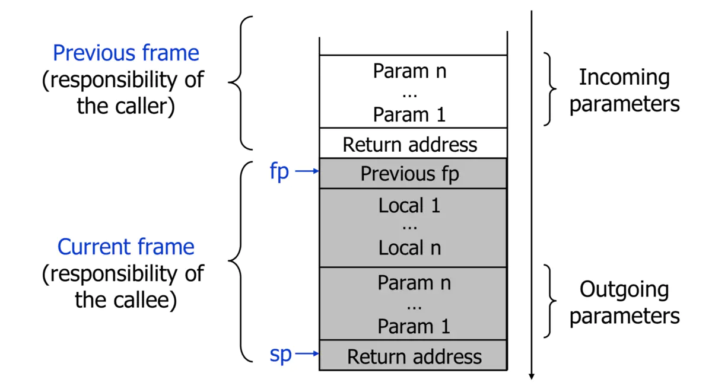
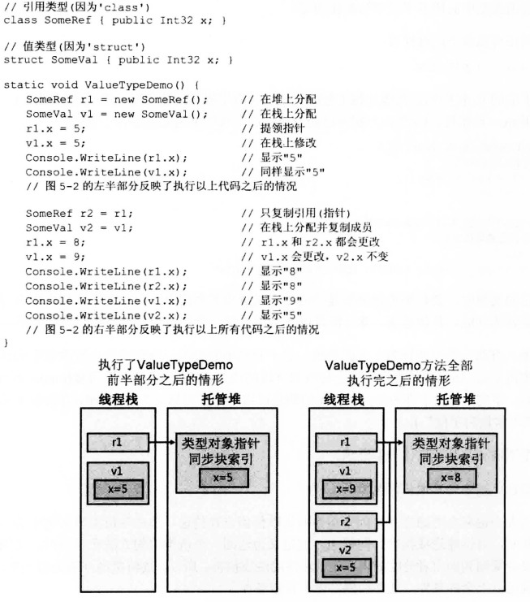
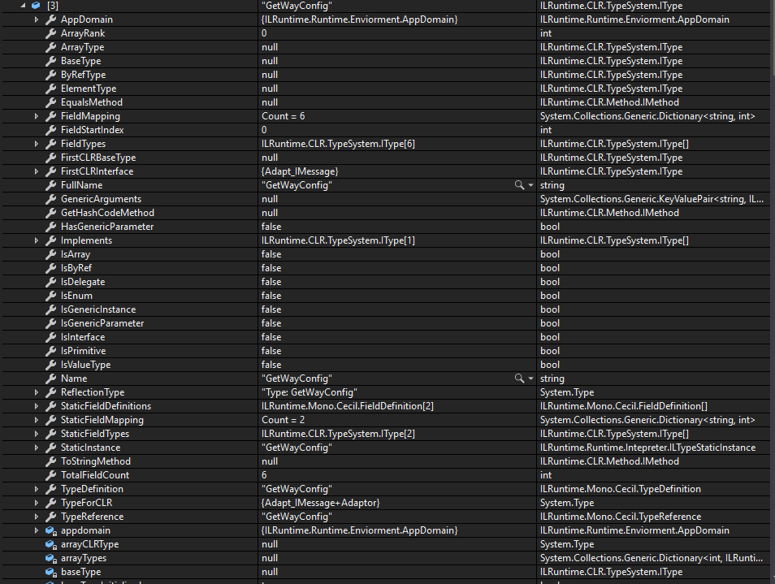
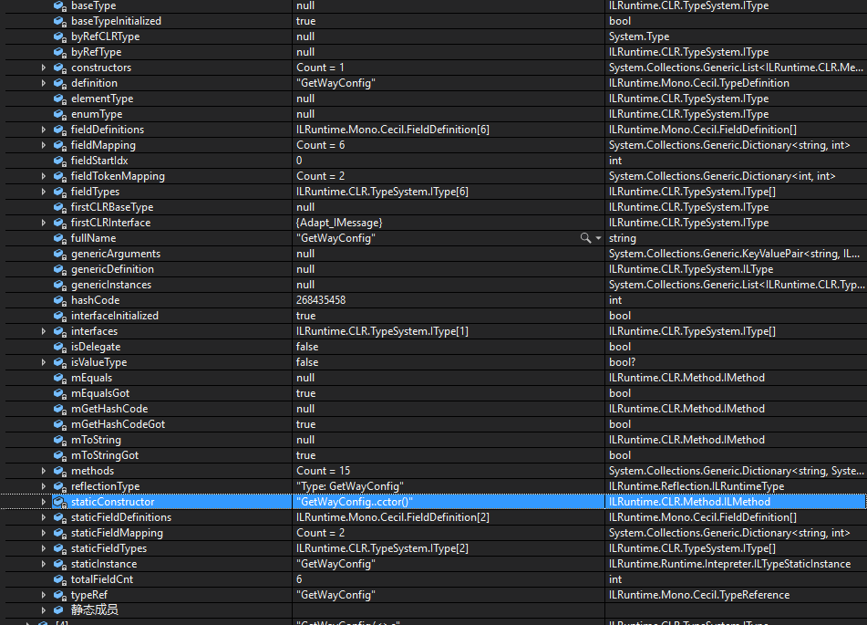

* [前置](#000)
* [ILR基于栈的解释器实现原理](#001)
* [ILR的PE文件解析](#0011)
* [ILR的类型加载](#0012)
* [ILR的类型实例创建](#0013)
* [ILR的类型函数调用](#0014)
* [ILR使用委托](#002)
* [ILR跨域继承](#003)
* [ILR中的反射](#004)
* [CLR重定向](#005)
* [CLR绑定](#006)
* [iOS IL2CPP打包注意事项](#008)
* [ILR性能优化建议](#009)
* [适应ILR的Protobuff改造](#010)
* [网络模块框架](#011)
* [IL下的逻辑热更框架](#012)

* [常见问题链接(FAQ)](https://github.com/Ourpalm/ILRuntime/tree/master/docs/source/src/v1/guide)
* [OLOpCode Enum](https://docs.microsoft.com/en-us/dotnet/api/system.reflection.metadata.ilopcode?view=netcore-3.1)

<h1 id="000">0、CLR运行时 </h3>

* 栈: 在计算机系统中，栈也可以称之为栈内存是一个具有动态内存区域,存储函数内部（包括main函数）的局部变量和方法调用和函数参数值，是由系统自动分配的，一般速度较快；存储地址是连续且存在有限栈容量，会出现溢出现象程序可以将数据压入栈中，也可以将数据从栈顶弹出。压栈操作使得栈增大，而弹出操作使栈减小。栈用于维护函数调用的上下文，离开了栈函数调用就没法实现。

* 栈帧(Stack Frame)：每一次函数的调用,都会在调用栈(call stack)上维护一个独立的栈帧(stack frame).每个独立的栈帧一般包括: 
    * 函数的返回地址和参数.
    *  临时变量: 包括函数的非静态局部变量以及编译器自动生成的其他临时变量
    *  函数调用的上下文 和一些额外的附加信息。 每个函数的栈帧大小在函数编译的时候就已经确定大小，运行时大小取决于栈帧运行时如何存储组织数据的实现。<br>

* ESP（Extended Stack Pointer）为扩展栈指针寄存器，是指针寄存器的一种，用于存放函数栈顶指针,指向栈的栈顶（下一个压入栈的活动记录的顶部）。维护函数调用运行时的变量寄存器<br>

* EBP（Extended Base Pointer），扩展基址指针寄存器，也被称为帧指针寄存器，用于存放函数栈底指针,指向当前活动记录的底部。主要用于维护栈帧的一个存储寄存器<br>

操作系统栈帧：


    函数调用：

        参数入栈: 将参数按照调用约定(C 是从右向左)依次压入系统栈中;
        返回地址入栈: 将当前代码区调用指令的下一条指令地址压入栈中，供函数返回时继续执行;
        代码跳转: 处理器将代码区跳转到被调用函数的入口处;
        栈帧调整的操作: 
            1.push ebp ;将调用者的ebp压栈处理，保存指向栈底的ebp的地址（方便函数返回之后的现场恢复），此时esp指向新的栈顶位置； -- 当前esp是上一个的ebp。
            2.mov ebp, esp ;   将当前栈帧切换到新栈帧(将esp值装入ebp，更新栈帧底部), 这时ebp指向栈顶，而此时栈底就是old ebp；   
            3.sub esp,xxx  ;   设置新栈帧的顶部 (抬高栈顶，为新栈帧开辟空间) (减是因为内存分配从高到低)
        指令调用：执行函数指令。

    函数返回：

        1、 mov eax, xxx ; 保存返回值，通常将函数的返回值保存在寄存器EAX中。 
        2、 mov ebp, esp ; 恢复 esp 同时回收局部变量空间.
        3、将上一个栈帧底部位置恢复到 ebp； pop ebp
        4、弹出当前栈顶元素,从栈中取到返回地址,并跳转到该位置 ret;
    

引用类型：<br>

    * 内存必须从托管堆分配。<br>
    * 堆上分配的每个对象都有一些额外的成员，这些成员必须初始化。<br>
    * 对象中的其他字节(为字段而设)总是设为零。<br>
    * 从托管堆分配对象时，可能强制执行一次垃圾回收。<br>
<br>

值类型：<br>

    * 值类型的实例一般在线程栈上分配(虽然也有可能作为字段嵌入引用类型的对象中这时候是分配在堆上的)<br>
    * 执行类实例的变量中不包含指向实例的指针。变量中包含了实例本身的字段。操作实例中的字段不需要提领指针。<br>
    * 值类型的实例不受垃圾回收器的控制()。<br>
<br>

<br>



<br>

* unsafe: 关键字表示不安全上下文，该上下文是任何涉及指针的操作所必需的。不安全代码就是允许自己使用指针访问内存，但同时又要使用CLR提供的垃圾回收机制、类型安全检查等服务，有的资料认为是介于CLR和非托管代码之间的一种代码运行机制，也可以理解。<br>

* 托管代码就是由CLR去执行的代码而不是操作系统去执行的代码。<br>

* 而非托管代码就是绕过CLR，由操作系统直接执行，它有自己的垃圾回收、类型安全检查等服务。<br>

* fixed : 语句设置指向托管变量的指针，并在执行该语句期间"固定"此变量。这样就可以防止变量的重定位。<br>


* 指针：一个特殊的变量，它里面存储的数值被解释为内存的一个地址。指针类型不从 object 继承，并且指针类型与 object 之间不存在转换。 此外，装箱和取消装箱不支持指针。 但是，可在不同的指针类型之间以及指针类型和整型之间进行转换。<br>
    操作指针只需要操作一个4字节，操作类型对象涉及到复制拷贝等各种过程，因此操作指针更快。
    * 指针的类型：【int *ptr//指针的类型是int *  】【int **ptr; //指针的类型是 int ** 指向int *指针的指针】<br>
    * 指针指项的类型:【int *ptr; //指针的类型是int 】【int **ptr; //指针的类型是 int *】<br>
    * 指针的值：和操作系统有关，32位就是32位长度的一个值。64位就是64位长度的值。 <br>
    * 指针所指向的内存区：从指针的值所代表的内存地址开始，长度为sizeof(指针所指向的类型)的一片内存区域。<br>
    * 指针运算符： *p 间接预算符 ，就是p地址所指向的东西 ; &p 取址运算符：取p的地址<br>


<br>

函数执行：

```C#
class Program
{
    public static void Main(string[] args)
    {
        CLR_8 cLR_8 = new CLR_8();
        string hhName = "Bambom";
        int hh = 999;
        var myage= cLR_8.GetAge(hh);
        Console.WriteLine(hhName + " : age:" + myage);
    }
}

/*********************************************************************/
.method public hidebysig static void  Main(string[] args) cil managed
{
  .entrypoint
  // 代码大小       52 (0x34)
  .maxstack  3
  .locals init ([0] class CLR._8.CLR_8 cLR_8, //在计算机上分配4个本地变量
           [1] string hhName,
           [2] int32 hh,
           [3] int32 myage)
  IL_0000:  nop       /*如果修补操作码，则填充空间。尽管可能消耗处理周期，但未执行任何有意义的操作。*/
  IL_0001:  newobj     instance void CLR._8.CLR_8::.ctor() /* 创建一个值类型的新对象或新实例，并将对象引用（O 类型）推送到计算堆栈上。*/
  IL_0006:  stloc.0    /*从计算堆栈的顶部弹出当前值并将其存储到指定索引处的局部变量列表中。*/
  IL_0007:  ldstr      "Bambom" /*推送对元数据中存储的字符串的新对象引用。*/
  IL_000c:  stloc.1     //给hhName 赋值
  IL_000d:  ldc.i4     0x3e7  /*将所提供的 int64 类型的值作为 int64 推送到计算堆栈上。*/
  IL_0012:  stloc.2     //给hh 赋值
  IL_0013:  ldloc.0     /*将指定索引0处的局部变量加载到计算堆栈上。*/  /*将函数类型实例压入栈 供调用*/
  IL_0014:  ldloc.2     /*将指定索引2处的局部变量加载到计算堆栈上。*/  /*将参数压入栈*/
  IL_0015:  callvirt   instance int32 CLR._8.CLR_8::GetAge(int32)  /*对对象调用后期绑定方法，并且将返回值推送到计算堆栈上。 调用实例函数*/
  IL_001a:  stloc.3     /*将当前栈顶的函数返回值 赋值给myage*/
  IL_001b:  ldloc.1     /*将指索引1的局部变量加载到计算堆栈上。 hhName*/ 
  IL_001c:  ldstr      " : age:"
  IL_0021:  ldloca.s   myage /*将位于特定索引处的局部变量的地址加载到计算堆栈上。*/
  IL_0023:  call       instance string [mscorlib]System.Int32::ToString() /*将当前栈顶myage转换成str并覆盖*/
  IL_0028:  call       string [mscorlib]System.String::Concat(string,    /*将栈顶的三个参数合并并放到栈顶*/
                                                              string,
                                                              string)
  IL_002d:  call       void [mscorlib]System.Console::WriteLine(string)  /*调用打印*/
  IL_0032:  nop
  IL_0033:  ret         /*从当前方法返回，并将返回值（如果存在）从调用方的计算堆栈推送到被调用方的计算堆栈上。*/
} // end of method Program::Main

/***********************************************************************************/
internal sealed class CLR_8
    {
        private Int32 m_x;
        public CLR_8() { }
        public int GetAge(int mama)
        {
            var baba = 1993;
            var myAge = baba + mama + m_x;
            return myAge;
        }
    }
/***********************************************************************************/

创建一个新的栈帧，有前置代码对参数，本地变量，函数类型对象，函数地址，函数执行完前会将返回值放入栈顶。

.method public hidebysig instance int32  GetAge(int32 mama) cil managed
{
  // 代码大小       24 (0x18)
  .maxstack  2
  .locals init ([0] int32 baba,   //分配本地变量
           [1] int32 ,           // myage
           [2] int32 V_2)         //创建的返回值，这里是创建 复制 拷贝的过程
  IL_0000:  nop
  IL_0001:  ldc.i4     0x7c9  /*将所提供的 int32 类型的值作为 int32 推送到计算堆栈上。  */ baba
  IL_0006:  stloc.0           /*  从计算堆栈的顶部弹出当前值并将其存储到指定索引处的局部变量列表中。*/给baba赋值
  IL_0007:  ldloc.0           /* 将指定索引 0 处的局部变量加载到计算堆栈上。*/   baba
  IL_0008:  ldarg.1           /* 将索引为 1 的参数加载到计算堆栈上。 */ 参数有两个 一个是函数对象实例本身 ，一个是参数 mama 
  IL_0009:  add               /*将两个值相加并将结果推送到计算堆栈上。*/ baba + mama ---- addValue0
  IL_000a:  ldarg.0           /*将指定索引0处的局部变量加载到计算堆栈上。  */   CLR_8的实例对象放到栈顶
  IL_000b:  ldfld       int32 CLR._8.CLR_8::m_x /* 查找对象中其引用当前位于计算堆栈的字段的值。*/ 将指定对象的值放到栈顶
  IL_0010:  add         addValue0 + m_x  值放入栈顶
  IL_0011:  stloc.1     将栈顶值存放入 局部变量myAge
  IL_0012:  ldloc.1     将 局部变量myAge 放入栈顶
  IL_0013:  stloc.2     将 myage放入V_2 临时变量
  IL_0014:  br.s        IL_0016 /无条件地将控制转移到目标指令。/
  IL_0016:  ldloc.2     将局部变量2 放入栈顶 .作为函数返回值
  IL_0017:  ret         返回
} // end of method CLR_8::GetAge
当前

 可以看到返回值是会另外在创建对象，然后进行复制返回。

```
<br>


<br>

值类型的装箱和拆箱：<br>
大部分的类型对象使用时都有对值类型的装箱和拆箱：
stack.Push(object) 使用值类型会引发值类型转换成引用类型的操作，也就是装箱机制。

    * 在托管堆中分配内存。分配的内存量是值类型各字段所需的内存量，还要机上托管堆所有对象都有的两个额外成员(类型对象指针和同步索引快)所需的内存量。
    * 值类型的字段复制到新分配的堆内存。
    * 返回对象地址。现在该地址是对象引用；值类型成了引用类型。 

泛型集合类运行在对值类型的集合时不需要对集合中的项，进行装修/拆箱。

拆箱：
拆箱代价比装箱低的多。拆箱是获取指针的过程，该指针指向包含在一个对象中的原始值类型(数据字段)。指针指向的是已装箱实例中未装箱的部分。所以和装箱不同，拆箱
不要求在内存中复制任何字节。拆箱往往紧接着一次字段复制。


备注：FCL, Framework Class Library Framework类库。
泛型：CLR 允许创建泛型引用类型和泛型值类型，但不允许创建泛型枚举，同时也支持创建泛型接口和泛型委托。由于值类型的实例可以传值进行传递，CLR不需要执行任何装箱操作。


<br><br><br><br><br><br><br><br><br><br><br><br><br><br>[返回目录](#000)
<h1 id="001">1、ILR实现原理 </h3>

ILRuntime借助Mono.Cecil库来读取DLL的PE信息，以及当中类型的所有信息，最终得到方法的IL汇编码，然后通过内置的IL解译执行虚拟机来执行DLL中的代码。

IL托管栈和托管对象栈

***

 * 为了高性能进行运算，尤其是栈上的基础类型运算，如int,float,long之类类型的运算，直接借助C#的Stack类实现IL托管栈肯定是个非常糟糕的做法。因为这意味着每次读取和写入这些基础类型的值，都需要将他们进行装箱和拆箱操作，这个过程会非常耗时并且会产生巨量的GC Alloc，使得整个运行时执行效率非常低下。(泛型集合对于基础类型不会再装修和拆箱，但是栈本身的操作还是没有操作内存更快和方便。指令操作涉及到创建对象，拷贝对象等，例如参数加载到计算机堆栈的指令。直接使用指针操作内存，还可以减少使用对象的拷贝复制等操作。)<br>

* 因此ILRuntime使用unsafe代码以及非托管内存，实现了自己的IL托管栈(使用unsafe代码直接操作非托管内存，自己进行运行栈内存分配释放)。<br>

* ILRuntime中的所有对象都是以StackObject类来表示的，他的定义如下：
```C#
    struct StackObject
    {
        public ObjectTypes ObjectType;
        public int Value; //高32位
        public int ValueLow; //低32位
    }
    enum ObjectTypes
    {
        Null,//null
        Integer,
        Long,
        Float,
        Double,
        StackObjectReference,//引用指针，Value = 指针地址, 
        StaticFieldReference,//静态变量引用,Value = 类型Hash， ValueLow= Field的Index
        Object,//托管对象，Value = 对象Index
        FieldReference,//类成员变量引用，Value = 对象Index, ValueLow = Field的Index
        ArrayReference,//数组引用，Value = 对象Index, ValueLow = 元素的Index
    }
```

通过StackObject这个值类型，我们可以表达C#当中所有的基础类型，因为所有基础类型都可以表达为8位到64位的integer。对于非基础类型而言，我们额外需要一个List来储存他的object引用对象，而Value则可以存储这个对象在List中的Index。由此我们就可以表达C#中所有的类型了。

```C#
    unsafe class RuntimeStack : IDisposable
    {
        ILIntepreter intepreter; //解释器
        StackObject* pointer;    //非托管栈栈起始地址
        StackObject* endOfMemory;//非托管栈栈结束地址
        StackObject* valueTypePtr;//非托管栈的运行栈内存地址

        IntPtr nativePointer;

#if DEBUG && !DISABLE_ILRUNTIME_DEBUG
        IList<object> managedStack = new List<object>(32); //存储引用类型对象的托管栈，充当CLR堆功能
#else
        IList<object> managedStack = new UncheckedList<object>(32);
#endif

        Stack<StackFrame> frames = new Stack<StackFrame>();//函数栈帧
        public const int MAXIMAL_STACK_OBJECTS = 1024 * 16;

        public Stack<StackFrame> Frames { get { return frames; } }
        public RuntimeStack(ILIntepreter intepreter)
        {
            this.intepreter = intepreter;

            nativePointer = System.Runtime.InteropServices.Marshal.AllocHGlobal(sizeof(StackObject) * MAXIMAL_STACK_OBJECTS); //非托管内存
            pointer = (StackObject*)nativePointer.ToPointer();
            endOfMemory = Add(pointer, MAXIMAL_STACK_OBJECTS);
            valueTypePtr = endOfMemory - 1;
        }
        public void Dispose()
        {
            if (nativePointer != IntPtr.Zero)
            {
                System.Runtime.InteropServices.Marshal.FreeHGlobal(nativePointer);
                nativePointer = IntPtr.Zero;
            }
        }
        ~RuntimeStack()
        {
            Dispose();
        }
```


托管调用栈
-----------------------------
ILRuntime在进行方法调用时，遵循以下步骤：

    1、需要将方法的参数先压入托管栈。
    2、然后执行函数：
        初始化函数栈帧 -> 
        创建分配本地变量内存 ->初始化本地变量 ->
        执行完所有函数指令 -> (中间会有函数调用，跳转到第二步，直到最底层调用执行完，然后依次返回)
        移除当前栈帧 ->
        将ILR运行栈还原，并把方法返回值压入栈,更新当前栈指针。将CLR托管栈还原。

```C#
        /// <summary>
        /// 基于栈的函数执行
        /// 这里是外部直接调用函数。在函数执行指令中，将参数，本地变量，函数实例对象，函数指针推入栈是由函数指令完成这些前置操作的
        /// </summary>
        public object Run(ILMethod method, object instance, object[] p)
        {
            //执行函数的的前置操作
            IList<object> mStack = stack.ManagedStack;
            int mStackBase = mStack.Count;
            StackObject* esp = stack.StackBase;//当前栈顶指针
            stack.ResetValueTypePointer();
            if (method.HasThis)
            {
                if (instance is CrossBindingAdaptorType) //跨域继承的适配对象
                    instance = ((CrossBindingAdaptorType)instance).ILInstance;
                if (instance == null)
                    throw new NullReferenceException("instance should not be null!");
                esp = PushObject(esp, mStack, instance); //先将 类型实例压入栈，如果需要用到实例的话
            }
            esp = PushParameters(method, esp, p);//将参数压入栈 / 函数对象的实例是不是也算一个参数 ？
            bool unhandledException;
            esp = Execute(method, esp, out unhandledException);//可以执行函数了
            //返回栈顶返回值
            object result = method.ReturnType != domain.VoidType ? method.ReturnType.TypeForCLR.CheckCLRTypes(StackObject.ToObject((esp - 1), domain, mStack)) : null;
            //ClearStack
#if DEBUG && !DISABLE_ILRUNTIME_DEBUG
            ((List<object>)mStack).RemoveRange(mStackBase, mStack.Count - mStackBase); //执行完毕函数清除当前函数栈引用
#else
            ((UncheckedList<object>)mStack).RemoveRange(mStackBase, mStack.Count - mStackBase);
#endif
            return result;
        }

        /// <summary> 添加完参数，开始执行函数 </summary>
        internal StackObject* Execute(ILMethod method, StackObject* esp, out bool unhandledException)
        {
            if (method == null)
                throw new NullReferenceException();
#if DEBUG && (UNITY_EDITOR || UNITY_ANDROID || UNITY_IPHONE)
            if (System.Threading.Thread.CurrentThread.ManagedThreadId == AppDomain.UnityMainThreadID)

#if UNITY_5_5_OR_NEWER
                UnityEngine.Profiling.Profiler.BeginSample(method.ToString());
#else
                UnityEngine.Profiler.BeginSample(method.ToString());
#endif

#endif
            OpCode[] body = method.Body;
            StackFrame frame;
            stack.InitializeFrame(method, esp, out frame);//创建栈帧，记录相关信息用以平衡栈，分配本地变量内存地址，更新栈指针
            StackObject* v1 = frame.LocalVarPointer; 
            StackObject* v2 = frame.LocalVarPointer + 1;
            StackObject* v3 = frame.LocalVarPointer + 1 + 1;
            StackObject* v4 = Add(frame.LocalVarPointer, 3);//预先创建用于opcode操作的本地变量指针，方便指令对本地变量操作直接使用
            int finallyEndAddress = 0;

            esp = frame.BasePointer; //当前栈帧的起始栈指针
            var arg = Minus(frame.LocalVarPointer, method.ParameterCount);//参数在函数执行前的前置工作就已经压入栈，这时候定位，取出参数的起始地址
            IList<object> mStack = stack.ManagedStack;
            int paramCnt = method.ParameterCount;
            if (method.HasThis)//this parameter is always object reference | 如果是需要对实例对象，则还要算上实例本身？
            {
                arg--;
                paramCnt++;
            }
            unhandledException = false;
            StackObject* objRef, objRef2, dst, val, a, b, arrRef;
            object obj;
            IType type;
            Type clrType;
            int intVal;

            //Managed Stack reserved for arguments(In case of starg)
            for (int i = 0; i < paramCnt; i++)
            {
                a = Add(arg, i);
                switch (a->ObjectType)
                {
                    case ObjectTypes.Null:
                        //Need to reserve place for null, in case of starg
                        a->ObjectType = ObjectTypes.Object;
                        a->Value = mStack.Count;
                        mStack.Add(null);
                        break;
                    case ObjectTypes.ValueTypeObjectReference:
                        CloneStackValueType(a, a, mStack);
                        break;
                    case ObjectTypes.Object:
                    case ObjectTypes.FieldReference:
                    case ObjectTypes.ArrayReference:
                        frame.ManagedStackBase--;
                        break;
                }
            }

            stack.PushFrame(ref frame); //存储栈帧信息
            
            int locBase = mStack.Count;
            //Managed Stack reserved for local variable
            for (int i = 0; i < method.LocalVariableCount; i++) //预分配本地变量托管栈对象内存
            {
                mStack.Add(null);
            }

            //给分配的本地变量内存块初始化本地类型变量
            for (int i = 0; i < method.LocalVariableCount; i++)
            {
                var v = method.Variables[i];
                //是值类型，且不是基元类型
                if (v.VariableType.IsValueType && !v.VariableType.IsPrimitive)
                {
                    var t = AppDomain.GetType(v.VariableType, method.DeclearingType, method);
                    if (t is ILType) //是ilr中的值类型，直接在非托管栈上分配内存
                    {
                        //var obj = ((ILType)t).Instantiate(false);
                        var loc = Add(v1, i);//获取第i个本地变量的地址
                        stack.AllocValueType(loc, t);

                        /*loc->ObjectType = ObjectTypes.Object;
                        loc->Value = mStack.Count;
                        mStack.Add(obj);*/

                    }
                    else //是CLR中的值类型
                    {
                        CLRType cT = (CLRType)t;
                        var loc = Add(v1, i);//获取第i个本地变量的地址
                        if (cT.ValueTypeBinder != null)//如果做了值绑定，则在非托管栈上分配内存
                        {
                            stack.AllocValueType(loc, t);
                        }
                        else//纯CLR类型，则一律当成object，创建的实例对象放到托管栈上
                        {
                            obj = ((CLRType)t).CreateDefaultInstance();
                            loc->ObjectType = ObjectTypes.Object;
                            loc->Value = locBase + i;
                            mStack[locBase + i] = obj;
                        }
                    }
                }
                else //引用类型
                {
                    if (v.VariableType.IsPrimitive) //不是基元类型的引用类型， object
                    {
                        var t = AppDomain.GetType(v.VariableType, method.DeclearingType, method);
                        var loc = Add(v1, i);//获取第i个本地变量的地址
                        StackObject.Initialized(loc, t); //初始化第i个本地变量
                    }
                    else //正常的引用类型
                    {
                        var loc = Add(v1, i);
                        loc->ObjectType = ObjectTypes.Object;
                        loc->Value = locBase + i;
                    }
                }
            }

            var bp = stack.ValueTypeStackPointer;
            ValueTypeBasePointer = bp;
            fixed (OpCode* ptr = body)// 开始执行函数指令
            {
                OpCode* ip = ptr;
                OpCodeEnum code = ip->Code;
                bool returned = false;
                //挨个解析方法指令
                while (!returned)//OpCodeEnum.Callvirt,OpCodeEnum.Ret,OpCodeEnum.Newobjo创建异常，执行异常跳出
                {
                    try
                    {
#if DEBUG && !DISABLE_ILRUNTIME_DEBUG
                        if (ShouldBreak)
                            Break();
                        var insOffset = (int)(ip - ptr);
                        frame.Address.Value = insOffset;
                        AppDomain.DebugService.CheckShouldBreak(method, this, insOffset);
#endif
                        code = ip->Code;
                        switch (code)
                        {
                            ....指令集...
                        }
                    }
                }
            }

                   //平衡栈
            return stack.PopFrame(ref frame, esp); 
        }


        /// <summary> 平衡栈 </summary>
        public StackObject* PopFrame(ref StackFrame frame, StackObject* esp)
        {
            if (frames.Count > 0 && frames.Peek().BasePointer == frame.BasePointer)
                frames.Pop();
            else
                throw new NotSupportedException();
            StackObject* returnVal = esp - 1; //当前的栈顶，如果有返回值就是函数执行的返回值
            var method = frame.Method;
            StackObject* ret = ILIntepreter.Minus(frame.LocalVarPointer, method.ParameterCount);// 要返回的地址 平衡栈
            int mStackBase = frame.ManagedStackBase;//托管栈的原始数量
            if (method.HasThis) //是否持有本身对象压入栈
                ret--;
            if(method.ReturnType != intepreter.AppDomain.VoidType)
            {
                *ret = *returnVal; //将返回值放入平衡后的栈顶
                if(ret->ObjectType == ObjectTypes.Object) //返回值是引用类型，将托管栈上的值归位
                {
                    ret->Value = mStackBase;
                    managedStack[mStackBase] = managedStack[returnVal->Value];
                    mStackBase++;
                }
                else if(ret->ObjectType == ObjectTypes.ValueTypeObjectReference) //值引用类型
                {
                    StackObject* oriAddr = frame.ValueTypeBasePointer;
                    RelocateValueType(ret, ref frame.ValueTypeBasePointer, ref mStackBase);
                    *(long*)&ret->Value = (long)oriAddr;
                }
                ret++;
            }
#if DEBUG && !DISABLE_ILRUNTIME_DEBUG
            ((List<object>)managedStack).RemoveRange(mStackBase, managedStack.Count - mStackBase);
#else
            ((UncheckedList<object>)managedStack).RemoveRange(mStackBase, managedStack.Count - mStackBase); //平衡托管栈
#endif
            valueTypePtr = frame.ValueTypeBasePointer;
            return ret;
        }
```

函数指令执行：

```C#
```

具体过程如下图所示

```
ILR托管栈 调用前:                                调用完成后:
|---------------|                     |---------------|
|     参数1     |     |-------------->|   [返回值]    |
|---------------|     |               |---------------|
|      ...      |     |               |     NULL      |
|---------------|     |               |---------------|
|     参数N     |     |               |      ...      |
|---------------|     |
|   局部变量1   |     |
|---------------|     |
|      ...      |     |
|---------------|     |
|   局部变量1   |     |
|---------------|     |
|  方法栈基址   |     |
|---------------|     |
|   [返回值]    |------
|---------------|
```

函数调用进入目标方法体后，栈指针（后面我们简称为ESP）会被指向方法栈基址(就是当前栈顶)那个位置，可以通过ESP-X获取到该方法的参数和方法内部申明的局部变量，在方法执行完毕后，如果有返回值，则把返回值写在方法栈基址位置即可（上图因为空间原因写在了基址后面）。

当方法体执行完毕后，ILRuntime会自动平衡托管栈，释放所有方法体占用的栈内存，然后把返回值复制到参数1的位置，这样后续代码直接取栈顶部就可以取到上次方法调用的返回值了。

```
1. Managed Object

 ILR 托管栈                             CLR 托管栈
|---------------|                     |---------------|
|  StackObject  |                     |  ManagedStack |
|---------------|                     |---------------|
|  Type:Object  |                     |   Slot(idx)   |
|---------------|        引用类型      |---------------|
|  Value:Index  |-------------------->|    ObjRef     |
|---------------|                     |---------------|

2.CallFrame

EnterFrame 函数执行时的栈帧:             LeaveFrame 执行结束后:
|---------------|                     |---------------|
|   Argument1   |     |-------------->|  [ReturnVal]  |
|---------------|     |               |---------------|
|      ...      |     |               |     NULL      |
|---------------|     |               |---------------|
|   ArgumentN   |     |               |      ...      |
|---------------|     |
|   LocalVar1   |     |
|---------------|     |
|      ...      |     |
|---------------|     |
|   LocalVarN   |     |
|---------------|     |
|   FrameBase   |     |
|---------------|     |
|  [ReturnVal]  |------
|---------------|
```

3. ValueType
Field1 - FieldN are Object Body, can be seperated from the Header, The ValueLow Field stores the pointer to Field1's StackObject
```
|---------------|                             |---------------|
|StackObj:Field1|                             |  StackObject  |
|---------------|                             |---------------|
|     ...       |                     /----\  | Type:ValueType|
|---------------|---------------------     -> |---------------|  
|StackObj:FieldN|                     \----/  |Value:TypeToken|
|---------------|                             |---------------|
|StackObj:ValTyp|<----Pointer at Here         |Value2:FieldPtr|
|---------------|                             |---------------|
```

<br>


<br><br><br><br><br><br><br><br><br><br><br><br><br><br>[返回目录](#000)
<h1 id="0011">1.0  ILR的PE文件解析</h3>


<br><br><br><br><br><br><br><br><br><br><br><br><br><br>[返回目录](#000)
<h1 id="0012">1.1ILR的类型加载 </h3>

ILR初始化加载程序集后，将dll中的类型，CLR中绑定的类型都显示注册存储起来。
AppDomain 存储了所有的dll中的类型ILType，每个类型存储该函数所有的信息

```C#
 public class AppDomain
    {
        Queue<ILIntepreter> freeIntepreters = new Queue<ILIntepreter>();
        Dictionary<int, ILIntepreter> intepreters = new Dictionary<int, ILIntepreter>();
        Dictionary<Type, CrossBindingAdaptor> crossAdaptors = new Dictionary<Type, CrossBindingAdaptor>(new ByReferenceKeyComparer<Type>());
        Dictionary<Type, ValueTypeBinder> valueTypeBinders = new Dictionary<Type, ValueTypeBinder>();
        ThreadSafeDictionary<string, IType> mapType = new ThreadSafeDictionary<string, IType>();
        Dictionary<Type, IType> clrTypeMapping = new Dictionary<Type, IType>(new ByReferenceKeyComparer<Type>());
        ThreadSafeDictionary<int, IType> mapTypeToken = new ThreadSafeDictionary<int, IType>();
        ThreadSafeDictionary<int, IMethod> mapMethod = new ThreadSafeDictionary<int, IMethod>();
        ThreadSafeDictionary<long, string> mapString = new ThreadSafeDictionary<long, string>();
        Dictionary<System.Reflection.MethodBase, CLRRedirectionDelegate> redirectMap = new Dictionary<System.Reflection.MethodBase, CLRRedirectionDelegate>();
        Dictionary<System.Reflection.FieldInfo, CLRFieldGetterDelegate> fieldGetterMap = new Dictionary<System.Reflection.FieldInfo, CLRFieldGetterDelegate>();
        Dictionary<System.Reflection.FieldInfo, CLRFieldSetterDelegate> fieldSetterMap = new Dictionary<System.Reflection.FieldInfo, CLRFieldSetterDelegate>();
        Dictionary<Type, CLRMemberwiseCloneDelegate> memberwiseCloneMap = new Dictionary<Type, CLRMemberwiseCloneDelegate>(new ByReferenceKeyComparer<Type>());
        Dictionary<Type, CLRCreateDefaultInstanceDelegate> createDefaultInstanceMap = new Dictionary<Type, CLRCreateDefaultInstanceDelegate>(new ByReferenceKeyComparer<Type>());
        Dictionary<Type, CLRCreateArrayInstanceDelegate> createArrayInstanceMap = new Dictionary<Type, CLRCreateArrayInstanceDelegate>(new ByReferenceKeyComparer<Type>());
        IType voidType, intType, longType, boolType, floatType, doubleType, objectType;
        DelegateManager dMgr;
        Assembly[] loadedAssemblies;
        Dictionary<string, byte[]> references = new Dictionary<string, byte[]>();
        DebugService debugService;

```

ILR 中的类型存储类型元数据

```C#
public class ILType : IType
    {
        Dictionary<string, List<ILMethod>> methods;
        TypeReference typeRef;
        TypeDefinition definition;
        ILRuntime.Runtime.Enviorment.AppDomain appdomain;
        ILMethod staticConstructor;
        List<ILMethod> constructors;
        IType[] fieldTypes;
        FieldDefinition[] fieldDefinitions;
        IType[] staticFieldTypes;
        FieldDefinition[] staticFieldDefinitions;
        Dictionary<string, int> fieldMapping;
        Dictionary<string, int> staticFieldMapping;
        ILTypeStaticInstance staticInstance;
        Dictionary<int, int> fieldTokenMapping = new Dictionary<int, int>();
        int fieldStartIdx = -1;
        int totalFieldCnt = -1;
        KeyValuePair<string, IType>[] genericArguments;
        IType baseType, byRefType, enumType, elementType;
        Dictionary<int, IType> arrayTypes;
        Type arrayCLRType, byRefCLRType;
        IType[] interfaces;
        bool baseTypeInitialized = false;
        bool interfaceInitialized = false;
        List<ILType> genericInstances;
        bool isDelegate;
        ILRuntimeType reflectionType;
        ILType genericDefinition;
        IType firstCLRBaseType, firstCLRInterface;
        int hashCode = -1;
        static int instance_id = 0x10000000;
        public TypeDefinition TypeDefinition { get { return definition; } }
        bool mToStringGot, mEqualsGot, mGetHashCodeGot;
        IMethod mToString, mEquals, mGetHashCode;

         public IType BaseType
        {
            get
            {
                if (!baseTypeInitialized)
                    InitializeBaseType();//初始化基类信息
                return baseType;
            }
        }

        public IType[] Implements
        {
            get
            {
                if (!interfaceInitialized)
                    InitializeInterfaces(); //初始化多接口
                return interfaces;
            }
        }
    }
```

ILR 方法存储元数据对象

```C#
    public class ILMethod : IMethod
    {
        OpCode[] body; //初次调用进行op解析
        MethodDefinition def;
        List<IType> parameters;
        ILRuntime.Runtime.Enviorment.AppDomain appdomain;
        ILType declaringType;
        ExceptionHandler[] exceptionHandler;
        KeyValuePair<string, IType>[] genericParameters;
        IType[] genericArguments;
        Dictionary<int, int[]> jumptables;
        bool isDelegateInvoke;
        ILRuntimeMethodInfo refletionMethodInfo;
        ILRuntimeConstructorInfo reflectionCtorInfo;
        int paramCnt, localVarCnt; //代码中的本地变量的初始化包含在 厨师指令中
        Mono.Collections.Generic.Collection<Mono.Cecil.Cil.VariableDefinition> variables;
        int hashCode = -1;
        static int instance_id = 0x10000000;
    }
```

ILR中的实例对象：
```C#
    public class ILTypeInstance
    {
        protected ILType type;
        protected StackObject[] fields;//属性信息
        protected IList<object> managedObjs;//对应的引用类型
        object clrInstance;
        Dictionary<ILMethod, IDelegateAdapter> delegates;
    }
    unsafe class ILEnumTypeInstance : ILTypeInstance{}
    public class ILTypeStaticInstance : ILTypeInstance{}
```

一、ILR 的类型导入。

目前的理解CLRType：看该类型是不是dll中存在，不存在就将类型信息导入为CLRType 类型(AppDomain p.854) 。比如 System.Void，System.Int32 ，System.Int64，System.Boolean，System.Single，System.Double， System.Object，ILRuntime.Runtime.Adaptors.AttributeAdaptor+Adaptor等。 <br>
除CLRType之外的类型就是ILR类型。<br>

跨域继承的绑定对象一定是CLRType.
<br>

```C#
     一 AppDomain、  public void RegisterCrossBindingAdaptor(CrossBindingAdaptor adaptor)
        {
            var bType = adaptor.BaseCLRType;

            if (bType != null)
            {
                if (!crossAdaptors.ContainsKey(bType))
                {
                    var t = adaptor.AdaptorType;
                    var res = GetType(t);
                    if (res == null)
                    {
                        res = new CLRType(t, this); //注册跨域绑定的时候，跨域的继承的对象一定是CLR类型
                        mapType[res.FullName] = res;
                        mapType[t.AssemblyQualifiedName] = res;
                        clrTypeMapping[t] = res;
                    }
                    adaptor.RuntimeType = res;
                    crossAdaptors[bType] = adaptor;
                }
                else
                    throw new Exception("Crossbinding Adapter for " + bType.FullName + " is already added.");
            }
            else
            {
                 // 需要做跨域绑定对象的类型，dll中检测到这个类型去获取实际类型做替换。
                 // 作用就是生成对象的时候unity层通过这个对象进行生成。
                 // unity对继承这个类的dll层的调用也是通过这个适配器的类进行调用
                 // 
                var bTypes = adaptor.BaseCLRTypes; // 需要做跨域绑定对象的类型，dll中检测到这个类型去获取实际类型做替换
                var t = adaptor.AdaptorType; //用来 作为跨域绑定的 实际类型
                var res = GetType(t);
                if (res == null)
                {
                    res = new CLRType(t, this); //t创建跨域类型 。 在实际创建类型对象的时候 通过提供的类型信息寻找绑定信息去通过绑定对象创建实例
                    mapType[res.FullName] = res;
                    mapType[t.AssemblyQualifiedName] = res;
                    clrTypeMapping[t] = res;
                }
                adaptor.RuntimeType = res;

                foreach (var i in bTypes)//注册到跨域绑定
                {
                    if (!crossAdaptors.ContainsKey(i))
                    {
                        crossAdaptors[i] = adaptor;
                    }
                    else
                        throw new Exception("Crossbinding Adapter for " + i.FullName + " is already added.");
                }
            }
        }

     二、   AppDomain.
     public IType GetType(string fullname)
        {
            IType res;
            if (fullname == null)
            {
                return null;
            }

            if (mapType.TryGetValue(fullname, out res))
                return res;

            string baseType;
            List<string> genericParams;
            bool isArray;

            ParseGenericType(fullname, out baseType, out genericParams, out isArray);

            bool isByRef = baseType.EndsWith("&");
            if (isByRef)
                baseType = baseType.Substring(0, baseType.Length - 1);
            if (genericParams != null || isArray || isByRef) //数组引用或者泛型。数组引用
            {
                IType bt = GetType(baseType);
                if (bt == null)
                {
                    bt = GetType(baseType.Replace("/", "+"));
                }

                if (bt == null)
                    return null;
                if (genericParams != null)
                {
                    KeyValuePair<string, IType>[] genericArguments = new KeyValuePair<string, IType>[genericParams.Count];
                    for (int i = 0; i < genericArguments.Length; i++)
                    {
                        string key = "!" + i;
                        IType val = GetType(genericParams[i]);
                        if (val == null)
                            return null;
                        genericArguments[i] = new KeyValuePair<string, IType>(key, val);
                    }
                    bt = bt.MakeGenericInstance(genericArguments); ///CIL类型创建的CLRType
                    mapType[bt.FullName] = bt;
                    mapTypeToken[bt.GetHashCode()] = bt;
                    if (bt is CLRType)
                    {
                        clrTypeMapping[bt.TypeForCLR] = bt;

                        //It still make sense for CLRType, since CLR uses [T] for generics instead of <T>
                        StringBuilder sb = new StringBuilder();
                        sb.Append(baseType);
                        sb.Append('<');
                        for (int i = 0; i < genericParams.Count; i++)
                        {
                            if (i > 0)
                                sb.Append(",");
                            /*if (genericParams[i].Contains(","))
                                sb.Append(genericParams[i].Substring(0, genericParams[i].IndexOf(',')));
                            else*/
                                sb.Append(genericParams[i]);
                        }
                        sb.Append('>');
                        var asmName = sb.ToString();
                        if (bt.FullName != asmName)
                            mapType[asmName] = bt;
                    }
                }

                if (isArray)
                {
                    bt = bt.MakeArrayType(1);///CIL类型创建的CLRType
                    if (bt is CLRType)
                        clrTypeMapping[bt.TypeForCLR] = bt;
                    mapType[bt.FullName] = bt;
                    mapTypeToken[bt.GetHashCode()] = bt;
                    if (!isByRef)
                    {
                        mapType[fullname] = bt;
                        return bt;
                    }
                }

                if (isByRef)
                {
                    res = bt.MakeByRefType();///CIL类型创建的CLRType
                    if (bt is CLRType)
                        clrTypeMapping[bt.TypeForCLR] = bt;
                    mapType[fullname] = res;
                    mapType[res.FullName] = res;
                    mapTypeToken[res.GetHashCode()] = res;
                    return res;
                }
                else
                {
                    mapType[fullname] = bt;
                    return bt;
                }
            }
            else  //基础基元类型 System.Void，System.Int32 ，System.Int64，System.Boolean，System.Single，System.Double， System.Object
            {
                Type t = Type.GetType(fullname);
                if (t != null)
                {
                    if (!clrTypeMapping.TryGetValue(t, out res))
                    {
                        res = new CLRType(t, this);
                        clrTypeMapping[t] = res;
                    }
                    mapType[fullname] = res;
                    mapType[res.FullName] = res;
                    mapType[t.AssemblyQualifiedName] = res;
                    mapTypeToken[res.GetHashCode()] = res;
                    return res;
                }
            }
            return null;
        }
    三、ILType：
    {

        IType MakeGenericInstance(KeyValuePair<string, IType>[] genericArguments);

        IType MakeByRefType();

        IType MakeArrayType(int rank);
    }
```

ILType：所有dll中直接定义的类型全是。<br>

二、 ILR的类型加载器 的加载类型信息(只是类型信息，不是类实例)<br>


* ILType.InitializeBaseType()  

    * IL类型父类是 CIR 类型的 类型加载
    * IL类型父类是 IL 类型的 类型加载
```C#
else//先只关注非泛型正常实现
                {
                    baseType = appdomain.GetType(definition.BaseType, this, null);
                    /*
                    */

                    //1、对于跨域继承的类型加载。 首先假设进入ilr，第一个构建的是GetWayConfig
                    //他继承IMessage，是CLRType,ILR中只能寻找CrossBindingAdaptor对应的类型作为填充
                    if (baseType is CLRType) 
                    {
                        if (baseType.TypeForCLR == typeof(Enum) || baseType.TypeForCLR == typeof(object) || baseType.TypeForCLR == typeof(ValueType) || baseType.TypeForCLR == typeof(System.Enum))
                        {//都是这样，无所谓
                            baseType = null;
                        }
                        else if (baseType.TypeForCLR == typeof(MulticastDelegate))
                        {
                            baseType = null;
                            isDelegate = true;
                        }
                        else
                        {
                            CrossBindingAdaptor adaptor;
                            if (appdomain.CrossBindingAdaptors.TryGetValue(baseType.TypeForCLR, out adaptor))
                            {
                                baseType = adaptor;
                            }
                            else
                                throw new TypeLoadException("Cannot find Adaptor for:" + baseType.TypeForCLR.ToString());
                            //继承了其他系统类型
                            //env.logger.Log_Error("ScriptType:" + Name + " Based On a SystemType:" + BaseType.Name);
                            //HasSysBase = true;
                            //throw new Exception("不得继承系统类型，脚本类型系统和脚本类型系统是隔离的");
                        }
                    }
                }
            var curBase = baseType;
            while (curBase is ILType) //如果是IL类型直接将基础类型给上
            {
                curBase = curBase.BaseType;
            }
            firstCLRBaseType = curBase;
            baseTypeInitialized = true;

//接口的实现类型初始化
void InitializeInterfaces()
        {
            interfaceInitialized = true;
            if (definition != null && definition.HasInterfaces)
            {
                interfaces = new IType[definition.Interfaces.Count];
                for (int i = 0; i < interfaces.Length; i++)
                {
                    interfaces[i] = appdomain.GetType(definition.Interfaces[i].InterfaceType, this, null);//获取当前已经加载的类型信息
                    //only one clrInterface is valid
                    if (interfaces[i] is CLRType && firstCLRInterface == null) 
                    {
                        CrossBindingAdaptor adaptor;
                        if (appdomain.CrossBindingAdaptors.TryGetValue(interfaces[i].TypeForCLR, out adaptor))
                        {
                            interfaces[i] = adaptor;
                            firstCLRInterface = adaptor;
                        }
                        else
                            throw new TypeLoadException("Cannot find Adaptor for:" + interfaces[i].TypeForCLR.ToString());
                    }
                }
            }
            if (firstCLRInterface == null && BaseType != null && BaseType is ILType)//是dll本身的类型 有所有的类型信息直接将实现类型填充
                firstCLRInterface = ((ILType)BaseType).FirstCLRInterface;
        }

```

* CRLType 类型的类型加载器.

```C#
 void InitializeBaseType()
        {
            baseType = appdomain.GetType(clrType.BaseType);//Type直接获取
            if (baseType.TypeForCLR == typeof(Enum) || baseType.TypeForCLR == typeof(object) || baseType.TypeForCLR == typeof(ValueType) || baseType.TypeForCLR == typeof(System.Enum))
            {//都是这样，无所谓
                baseType = null;
            }
            isBaseTypeInitialized = true;
        }

        void InitializeInterfaces()
        {
            interfaceInitialized = true;
            var arr = clrType.GetInterfaces();//Type直接获取
            if (arr.Length >0)
            {
                interfaces = new IType[arr.Length];
                for (int i = 0; i < interfaces.Length; i++)
                {
                    interfaces[i] = appdomain.GetType(arr[i]);
                }
            }
        }
```


<br><br><br><br><br><br><br><br><br><br><br><br><br><br>[返回目录](#000)
<h1 id="0013">1.2ILR的类型实例创建 </h3>
三、 ILR进类型对象的创建：
在进行创建前，类型信息已经加载完成存储到AppDomain中了，如果解释器需要创建新的类型，分两种类型进行创建 ：

    * ILR中的类型，则直接创建的实例对象都是ILTypeInstance 类型。
    * 如果该类型是CLR类型。需要让CLR进行创建ConstructorInfo.Invoke(param)。。 如果构造函数注册了构造的函数的重定向，则直接通过直接调用构建。

CLRType中的方法

```C#
                             case OpCodeEnum.Newobj:
                                {
                                    IMethod m = domain.GetMethod(ip->TokenInteger);
                                    
                                    if (m is ILMethod)//创建ilr的实例类型。
                                    {
                                        type = m.DeclearingType as ILType;
                                        if (type.IsDelegate) //创建委托类型
                                        {
                                            objRef = GetObjectAndResolveReference(esp - 1 - 1);
                                            var mi = (IMethod)mStack[(esp - 1)->Value];
                                            object ins;
                                            if (objRef->ObjectType == ObjectTypes.Null)
                                                ins = null;
                                            else
                                                ins = mStack[objRef->Value]; //给委托类型提供一个地址
                                            Free(esp - 1);
                                            Free(esp - 1 - 1);
                                            esp = esp - 1 - 1;
                                            object dele;
                                            if (mi is ILMethod)
                                            {
                                                if (ins != null)
                                                {
                                                    dele = ((ILTypeInstance)ins).GetDelegateAdapter((ILMethod)mi);//ilr内都使用委托适配器
                                                    if (dele == null)
                                                        dele = domain.DelegateManager.FindDelegateAdapter((ILTypeInstance)ins, (ILMethod)mi);
                                                }
                                                else
                                                {
                                                    if (((ILMethod)mi).DelegateAdapter == null)
                                                    {
                                                        ((ILMethod)mi).DelegateAdapter = domain.DelegateManager.FindDelegateAdapter(null, (ILMethod)mi);
                                                    }
                                                    dele = ((ILMethod)mi).DelegateAdapter;
                                                }
                                            }

                                            else
                                            {
                                                throw new NotImplementedException();
                                            }
                                            esp = PushObject(esp, mStack, dele);
                                        }
                                        else//非委托类型
                                        {
                                            a = esp - m.ParameterCount;
                                            obj = null;
                                            bool isValueType = type.IsValueType;
                                            if (isValueType) //值类型
                                            {
                                                stack.AllocValueType(esp, type); //直接在栈上分配
                                                objRef = esp + 1;
                                                objRef->ObjectType = ObjectTypes.StackObjectReference;
                                                *(long*)&objRef->Value = (long)esp; 
                                                objRef++;
                                            }
                                            else //非值类型直接创建ILTypeInstance 实例
                                            {
                                                obj = ((ILType)type).Instantiate(false);//创建ILTypeInstance实例类型
                                                objRef = PushObject(esp, mStack, obj);//this parameter for constructor
                                            }
                                            esp = objRef;
                                            for (int i = 0; i < m.ParameterCount; i++)
                                            {
                                                CopyToStack(esp, a + i, mStack);
                                                esp++;
                                            }
                                            esp = Execute((ILMethod)m, esp, out unhandledException);//再执行构造函数，构造函数可能创建ILR类型 也可能创建CLR类型
                                            ValueTypeBasePointer = bp;
                                            if (isValueType)
                                            {
                                                var ins = objRef - 1 - 1;
                                                *a = *ins;
                                                esp = a + 1;
                                            }
                                            else
                                                esp = PushObject(a, mStack, obj);//new constructedObj
                                        }
                                        if (unhandledException)
                                            returned = true;
                                    }
                                    else// CLR类型
                                    {
                                        CLRMethod cm = (CLRMethod)m;
                                        //Means new object();
                                        if (cm == null)
                                        {
                                            esp = PushObject(esp, mStack, new object());
                                        }
                                        else
                                        {
                                            if (cm.DeclearingType.IsDelegate)//委托类型，
                                            {
                                                objRef = GetObjectAndResolveReference(esp - 1 - 1);
                                                var mi = (IMethod)mStack[(esp - 1)->Value];
                                                object ins;
                                                if (objRef->ObjectType == ObjectTypes.Null)
                                                    ins = null;
                                                else
                                                    ins = mStack[objRef->Value];
                                                Free(esp - 1); //？？？？？？？？
                                                Free(esp - 1 - 1);
                                                esp = esp - 1 - 1;
                                                object dele;
                                                if (mi is ILMethod)//委托类型，需要构建对应的委托实例类型，专门由 DelegateManager管理所有委托类型，
                                                {
                                                    if (ins != null)
                                                    {
                                                        dele = ((ILTypeInstance)ins).GetDelegateAdapter((ILMethod)mi);//跨域的重定向
                                                        if (dele == null)
                                                            dele = domain.DelegateManager.FindDelegateAdapter((ILTypeInstance)ins, (ILMethod)mi);
                                                    }
                                                    else
                                                    {
                                                        if (((ILMethod)mi).DelegateAdapter == null)
                                                        {
                                                            ((ILMethod)mi).DelegateAdapter = domain.DelegateManager.FindDelegateAdapter(null, (ILMethod)mi);
                                                        }
                                                        dele = ((ILMethod)mi).DelegateAdapter;
                                                    }
                                                }
                                                else
                                                {
                                                    if (ins is ILTypeInstance)
                                                        ins = ((ILTypeInstance)ins).CLRInstance;
                                                    dele = Delegate.CreateDelegate(cm.DeclearingType.TypeForCLR, ins, ((CLRMethod)mi).MethodInfo);
                                                }
                                                esp = PushObject(esp, mStack, dele);
                                            }
                                            else //非委托类型
                                            {
                                                var redirect = cm.Redirection; //如果有重定向，通过重定向进行实例调用创建
                                                if (redirect != null)
                                                    esp = redirect(this, esp, mStack, cm, true);
                                                else
                                                {
                                                    object result = cm.Invoke(this, esp, mStack, true); //没有重定向通过反射调用创建对象
                                                    int paramCount = cm.ParameterCount;
                                                    for (int i = 1; i <= paramCount; i++)
                                                    {
                                                        Free(esp - i);
                                                    }
                                                    esp = Minus(esp, paramCount);//创建完对象将对象返回到参数1的栈顶
                                                    esp = PushObject(esp, mStack, result);//new constructedObj
                                                }
                                            }
                                        }
                                    }
                                }
                                break;
```


```C#

  /*
  */
        static StackObject* Ctor_0(ILIntepreter __intp, StackObject* __esp, IList<object> __mStack, CLRMethod __method, bool isNewObj)
        {
            ILRuntime.Runtime.Enviorment.AppDomain __domain = __intp.AppDomain;
            StackObject* ptr_of_this_method;
            StackObject* __ret = ILIntepreter.Minus(__esp, 1);//返回地址
            ptr_of_this_method = ILIntepreter.Minus(__esp, 1);//当前函数调用参数
            //解析持有者实例类型对象，ilr中是消息体 ，例如 ErrorMsg:IMessage 。这里假如构建的是ErrorMsg时候创建的MessageParser 今天变量，则ptr_of_this_method当前栈解析出来的就是MessageParser类型，也就是IMessage 接口类型。 

            System.Func<global::Adapt_IMessage.Adaptor> @factory = (System.Func<global::Adapt_IMessage.Adaptor>)typeof(System.Func<global::Adapt_IMessage.Adaptor>).CheckCLRTypes(StackObject.ToObject(ptr_of_this_method, __domain, __mStack));
            __intp.Free(ptr_of_this_method);

            //这时候创建了一个MessageParser类型对象，他持有的泛型消息体结构是 ILTypeInstance ，拥有 clrInstance 实例的对象 是ErrorMsg， 已经创建了构造函数的委托重定向，这里创建出来的对象是new Google.Protobuf.MessageParser<global::Adapt_IMessage.Adaptor> 对象是因为 当前要创建的CLR的类型结构是 加载的时候做了 重定向的判断，IMessage的类型都用定向后的global::Adapt_IMessage.Adaptor 类型替换保存在 SystemMessage，

            var result_of_this_method = new Google.Protobuf.MessageParser<global::Adapt_IMessage.Adaptor>(@factory);
            //静态变量中 解释器存储的类型是 MessageParser<global::Adapt_IMessage.Adaptor> //构建的时候发现是CLR类型则寻找IMessage对应得适配器类型
            return ILIntepreter.PushObject(__ret, __mStack, result_of_this_method);
        }
```

ILR中如何创建跨域对象：
```C#
public ILTypeInstance(ILType type, bool initializeCLRInstance = true)
        {
            this.type = type;
            fields = new StackObject[type.TotalFieldCount];
            managedObjs = new List<object>(fields.Length);
            for (int i = 0; i < fields.Length; i++)
            {
                managedObjs.Add(null);
            }
            InitializeFields(type);
            if (initializeCLRInstance)
            {
                if (type.FirstCLRBaseType is Enviorment.CrossBindingAdaptor)
                {
                    clrInstance = ((Enviorment.CrossBindingAdaptor)type.FirstCLRBaseType).CreateCLRInstance(type.AppDomain, this);
                }
                else
                {
                    clrInstance = this;
                }
                if(type.FirstCLRInterface is Enviorment.CrossBindingAdaptor)
                {
                    if (clrInstance != this)//Only one CLRInstance is allowed atm, so implementing multiple interfaces is not supported
                    {
                        throw new NotSupportedException("Inheriting and implementing interface at the same time is not supported yet");
                    }
                    clrInstance = ((Enviorment.CrossBindingAdaptor)type.FirstCLRInterface).CreateCLRInstance(type.AppDomain, this); //跨域继承的话，就是在这里处理
                }
            }
            else
                clrInstance = this;
        }
```


例如：创建一个DialogConfigChunk对象。
DialogConfigChunk 是ILR对象创建的是ITypeInstance实例。
Parser 字段是CLR对象 ，创建

```C#
public sealed class DialogConfigChunk : pb::IMessage {
  private static readonly pb::MessageParser<DialogConfigChunk> _parser = new pb::MessageParser<DialogConfigChunk>(() => new DialogConfigChunk());
  public static pb::MessageParser<DialogConfigChunk> Parser { get { return _parser; } }

  private static readonly pb::FieldCodec<global::DialogConfig> _repeated_items_codec
      = pb::FieldCodec.ForMessage(10, global::DialogConfig.Parser);
  private readonly pbc::RepeatedField<global::DialogConfig> items_ = new pbc::RepeatedField<global::DialogConfig>();
  public pbc::RepeatedField<global::DialogConfig> Items {
    get { return items_; }
  }

  public void WriteTo(pb::CodedOutputStream output) {
    items_.WriteTo(output, _repeated_items_codec);
  }

  public int CalculateSize() {
    int size = 0;
    size += items_.CalculateSize(_repeated_items_codec);
    return size;
  }

  public void MergeFrom(pb::CodedInputStream input) {
    uint tag;
    while ((tag = input.ReadTag()) != 0) {
      switch(tag) {
        default:
          input.SkipLastField();
          break;
        case 10: {
          items_.AddEntriesFrom(input, _repeated_items_codec);
          break;
        }
      }
    }
  }
}
```

对于一个GetWayConfig：

firstCLRBaseType： //IType
firstCLRInterface：//Adapt_IMessage CLR类型 

<br>




<br><br><br><br><br><br><br><br><br><br><br><br><br><br>[返回目录](#000)
<h1 id="0014">1.14 ILR的类型函数调用 </h3>


```C#
        public static void ParseTableData()
        {
            var asset = DResources.AllocBin("TableData/DialogConfig");
            DialogConfigChunk result = null;
            Stopwatch stopwatch = new Stopwatch();
            stopwatch.Start();
            using (MemoryStream m = new MemoryStream(asset))
            {
                /*
                   这时候已经创建好DialogConfigChunk对象ILTypeInstance
                   Parser 静态对象 ， 然后调用 ParseFrom 是跨域调用
                 */
                result = DialogConfigChunk.Parser.ParseFrom(m);
            }

            stopwatch.Stop();
            BLogger.Info("解析DialogConfig ms：{0} , allItemsNum:{1}", stopwatch.ElapsedMilliseconds, result.Items.Count);
        }


.method public hidebysig static void  ParseTableData() cil managed
{
  // 代码大小       119 (0x77)
  .maxstack  5
  .locals init (uint8[] V_0, //先进行局部变量的构建
           class [GameProto]DialogConfigChunk V_1,
           class [netstandard]System.Diagnostics.Stopwatch V_2,
           class [netstandard]System.IO.MemoryStream V_3)
  IL_0000:  nop
  IL_0001:  ldstr      "TableData/DialogConfig" // 推送对元数据中存储的字符串的新对象引用。
  IL_0006:  call       uint8[] [GameBase]GameBase.DResources::AllocBin(string)
  IL_000b:  stloc.0     //从计算堆栈的顶部弹出当前值并将其存储到指定索引处的局部变量列表中。 V_0
  IL_000c:  ldnull      //将空引用（O 类型）推送到计算堆栈上。
  IL_000d:  stloc.1     //栈的顶部弹出当前值存储到指定索引处的局部变量 V_1
  IL_000e:  newobj     instance void [netstandard]System.Diagnostics.Stopwatch::.ctor()//创建CLR对象
  IL_0013:  stloc.2     //栈的顶部弹出当前值存储到指定索引处的局部变量 V_2
  IL_0014:  ldloc.2     //将指定索引处的局部变量加载到计算堆栈上,V_2
  IL_0015:  callvirt   instance void [netstandard]System.Diagnostics.Stopwatch::Start()
  IL_001a:  nop
  IL_001b:  ldloc.0     //将指定索引处的局部变量加载到计算堆栈上,V_0 ,
  IL_001c:  newobj     instance void [netstandard]System.IO.MemoryStream::.ctor(uint8[])//创建使用当前栈顶的参数创建然后放到栈顶
  IL_0021:  stloc.3    //栈的顶部弹出当前值存储到指定索引处的局部变量 V_3 ，将栈顶数据保存到v——3，网络数据流
  .try
  {
    IL_0022:  nop
    IL_0023:  call       class [GameNative]Google.Protobuf.MessageParser`1<class [GameProto]DialogConfigChunk> [GameProto]DialogConfigChunk::get_Parser() //将当前实例加载到栈上
    IL_0028:  ldloc.3     //将指定索引处的局部变量加载到计算堆栈上,也就是网络数据流 ,
    IL_0029:  callvirt   instance !0 class [GameNative]Google.Protobuf.MessageParser`1<class [GameProto]DialogConfigChunk>::ParseFrom(class [netstandard]System.IO.Stream) //调用方法，需要用到两个一个是网络数据，一个是调用实例
    IL_002e:  stloc.1 //V_1　解析出来的对象存储到局部变量
    IL_002f:  nop
    IL_0030:  leave.s    IL_003d
  }  // end .try
  finally
  {
    IL_0032:  ldloc.3
    IL_0033:  brfalse.s  IL_003c
    IL_0035:  ldloc.3
    IL_0036:  callvirt   instance void [netstandard]System.IDisposable::Dispose()
    IL_003b:  nop
    IL_003c:  endfinally
  }  // end handler
  IL_003d:  ldloc.2
  IL_003e:  callvirt   instance void [netstandard]System.Diagnostics.Stopwatch::Stop()
  IL_0043:  nop
  IL_0044:  ldstr      bytearray (E3 89 90 67 44 00 69 00 61 00 6C 00 6F 00 67 00   // ...gD.i.a.l.o.g.
                                  43 00 6F 00 6E 00 66 00 69 00 67 00 20 00 6D 00   // C.o.n.f.i.g. .m.
                                  73 00 1A FF 7B 00 30 00 7D 00 20 00 2C 00 20 00   // s...{.0.}. .,. .
                                  61 00 6C 00 6C 00 49 00 74 00 65 00 6D 00 73 00   // a.l.l.I.t.e.m.s.
                                  4E 00 75 00 6D 00 3A 00 7B 00 31 00 7D 00 )       // N.u.m.:.{.1.}.
  IL_0049:  ldc.i4.2
  IL_004a:  newarr     [netstandard]System.Object
  IL_004f:  dup
  IL_0050:  ldc.i4.0
  IL_0051:  ldloc.2
  IL_0052:  callvirt   instance int64 [netstandard]System.Diagnostics.Stopwatch::get_ElapsedMilliseconds()
  IL_0057:  box        [netstandard]System.Int64
  IL_005c:  stelem.ref
  IL_005d:  dup
  IL_005e:  ldc.i4.1
  IL_005f:  ldloc.1
  IL_0060:  callvirt   instance class [GameNative]Google.Protobuf.Collections.RepeatedField`1<class [GameProto]DialogConfig> [GameProto]DialogConfigChunk::get_Items()
  IL_0065:  callvirt   instance int32 class [GameNative]Google.Protobuf.Collections.RepeatedField`1<class [GameProto]DialogConfig>::get_Count()
  IL_006a:  box        [netstandard]System.Int32
  IL_006f:  stelem.ref
  IL_0070:  call       void [BBProtoBase]BGame.BLogger::Info(string,
                                                             object[])
  IL_0075:  nop
  IL_0076:  ret
} // end of method TableData::ParseTableData

        //当前调用，栈帧上调用跨域方法，通过绑定调用， 每个函数的绑定调用都不一样，ilr提供了自动生成工具
        static StackObject* ParseFrom_0(ILIntepreter __intp, StackObject* __esp, IList<object> __mStack, CLRMethod __method, bool isNewObj)
        {
            ILRuntime.Runtime.Enviorment.AppDomain __domain = __intp.AppDomain;
            StackObject* ptr_of_this_method;
            StackObject* __ret = ILIntepreter.Minus(__esp, 2);//这个是Parse对象

            ptr_of_this_method = ILIntepreter.Minus(__esp, 1);//esp上一个对象就是数据参数
            //现在将实例对象拿出来 转换成实际对象
            System.IO.Stream @input = (System.IO.Stream)typeof(System.IO.Stream).CheckCLRTypes(StackObject.ToObject(ptr_of_this_method, __domain, __mStack));
            __intp.Free(ptr_of_this_method); // 已经从ilr栈中获取到参数，可以清除栈了

            ptr_of_this_method = ILIntepreter.Minus(__esp, 2);//然后获得Parse对象实例
            Google.Protobuf.MessageParser<global::Adapt_IMessage.Adaptor> instance_of_this_method = (Google.Protobuf.MessageParser<global::Adapt_IMessage.Adaptor>)typeof(Google.Protobuf.MessageParser<global::Adapt_IMessage.Adaptor>).CheckCLRTypes(StackObject.ToObject(ptr_of_this_method, __domain, __mStack));
            __intp.Free(ptr_of_this_method);//然后清除对象

            var result_of_this_method = instance_of_this_method.ParseFrom(@input);//进行当前指令的实际调用

            object obj_result_of_this_method = result_of_this_method;
            if(obj_result_of_this_method is CrossBindingAdaptorType)//将得到的数据
            {    
                return ILIntepreter.PushObject(__ret, __mStack, ((CrossBindingAdaptorType)obj_result_of_this_method).ILInstance);
            }
            return ILIntepreter.PushObject(__ret, __mStack, result_of_this_method);
        }


```


<br><br><br><br><br><br><br><br><br><br><br><br><br><br>[返回目录](#000)
<h1 id="002">2、ILR使用委托 </h3>

***
如果只在热更新的DLL项目中使用的委托，是不需要任何额外操作的，就跟在通常的C#里那样使用即可。<br>如果你需要将委托实例传给ILRuntime外部使用，那则根据情况，你需要额外添加适配器或者转换器。
需要注意的是，一些编译器功能也会生成将委托传出给外部使用的代码，例如：

* Linq当中where xxxx == xxx，会需要将xxx == xxx这个作为lambda表达式传给Linq.Where这个外部方法使用
* OrderBy()方法，原因同上

如果在运行时发现缺少注册某个指定类型的委托适配器或者转换器时，ILRuntime会抛出相应的异常，根据提示添加注册即可。

***

**<lable style="color:green">1、委托适配器（DelegateAdapter）</lable>**

***
如果将委托实例传出给ILRuntime外部使用，那就意味着需要将委托实例转换成真正的CLR（C#运行时）委托实例，这个过程需要动态创建CLR的委托实例。由于IL2CPP之类的AOT编译技术无法在运行时生成新的类型，所以在创建委托实例的时候ILRuntime选择了显式注册的方式，以保证问题不被隐藏到上线后才发现。

同一个参数组合的委托，只需要注册一次即可，例如：
```C#
delegate void SomeDelegate(int a, float b);

Action<int, float> act;
```
这两个委托都只需要注册一个适配器即可。 注册方法如下
```C#
appDomain.DelegateManager.RegisterMethodDelegate<int, float>();
```
如果是带返回类型的委托，例如：
```C#
delegate bool SomeFunction(int a, float b);

Func<int, float, bool> act;
```
需要按照以下方式注册
```C#
appDomain.DelegateManager.RegisterFunctionDelegate<int, float, bool>();
```

***
**<lable style="color:green">2、委托转换器（DelegateConvertor）</lable>**

ILRuntime内部是使用Action,以及Func这两个系统自带委托类型来生成的委托实例，所以如果你需要将一个不是Action或者Func类型的委托实例传到ILRuntime外部使用的话，除了委托适配器，还需要额外写一个转换器，将Action和Func转换成你真正需要的那个委托类型。

比如上面例子中的SomeFunction类型的委托，其所需的Convertor应如下实现：

```C#
app.DelegateManager.RegisterDelegateConvertor<SomeFunction>((action) =>
{
    return new SomeFunction((a, b) =>
    {
       return ((Func<int, float, bool>)action)(a, b);
    });
});
```

CLR中，定义一个委托类型，会生成一个新的委托类，class中声明的委托，类中会创建该类型对应的字段，类创建实例的时候，会将该委托实例类型也创建。 ILR中没有注册委托适配器和转换器，默认创建的是DummyDelegateAdapter，他和正常clr委托类差不多，右对应实例的对象和指向的方法。 不进行跨域 他已经够用了。 如果是要讲该类型注册到unity。
需要将方法 变成clr真正的委托对象。这个委托适配器就要有吧相应的解释器执行 委托到unity的委托的功能。 所以需要适配器。 同时，由于适配器都是基于action 和 func 所以如果unity定义的是自定义的，还需要一个转换器进行转换。

如果是将unity的方法委托给ilr，那就是正常的 对unity的跨域调用了。给委托赋值的过程，就是创建新的委托，将函数指针作为参数放入够早函数。

ILR内部的委托实例：
内部的委托实例都是创建的 DelegateAdapter类型，对于不同的委托类型，ilr主要实现了一下几种

为什么ilr内部转换成unity外部的委托需要指定类型注册呢：
在执行指令的时候，会把内部的委托实例，比如FunctionDelegateAdapter类型的委托，传给CLR的真正委托实例，在赋值之前，就是一个正常的栈帧操作，需要先创建对应的系统委托实例。 由于实例是MethodDelegateAdapter 或者 FunctionDelegateAdapter 的泛型对象，AOT没有办法动态生成新的类型所以每个要传到unity里的新的委托类型都要在游戏里显示注册下，保存下类型信息。 然后解释器执行的时候都是用过这两种实例进行操作。给unitydelate 赋值就是将他的解释器执行函数委托出去。 

unity的委托对象是一个 action<int> ，ilr内部有一个函数是void Get(int a) 类型，ilr内部需要创建一个MethodDelegateAdapter<int> 类型对象，如果不显示注册，
AOT下无法创建这个对象的。MethodDelegateAdapter<int>这个类型对象在unity中不存在，也就无法进行实现。

什么是类型转换：
dll中不管是自定义的还是action 或 func都是MethodDelegateAdapter或者FunctionDelegateAdapter实例对象。这两个内部是action 和func。 
如果是指定到外部的自定义类型，那要显示转换，将action或者func 转换为自定义delegate的过程。 

如果只是热更内部使用的话 那委托类型实例都是创建的DummyDelegateAdapter类型，只需要进行委托指定的方法调用就行了，参数直接在栈帧压入，不需要创建新的类型信息。传到外面因为要构建新的委托实例，因此要进行适配器和转换器。


```C#
case OpCodeEnum.Stsfld:用来自计算堆栈的值替换静态字段的值。
                                {
                                    type = AppDomain.GetType((int)(ip->TokenLong >> 32));
                                    if (type != null)
                                    {
                                        if (type is ILType)
                                        {
                                            ILType t = type as ILType;
                                            val = esp - 1;
                                            t.StaticInstance.AssignFromStack((int)ip->TokenLong, val, AppDomain, mStack);
                                        }
                                        else
                                        {
                                            CLRType t = type as CLRType;
                                            int idx = (int)ip->TokenLong;
                                            var f = t.GetField(idx);
                                            val = esp - 1;
                                            t.SetStaticFieldValue(idx, f.FieldType.CheckCLRTypes(CheckAndCloneValueType(StackObject.ToObject(val, domain, mStack), domain)));
                                        }
                                    }
                                    else
                                        throw new TypeLoadException();
                                    Free(esp - 1);
                                    esp -= 1;
                                }


FunctionDelegateAdapter<TResult>: DelegateAdapter
......
FunctionDelegateAdapter<T1, T2, T3, T4, TResult>: DelegateAdapter


MethodDelegateAdapter<T1> : DelegateAdapter
......
MethodDelegateAdapter<T1, T2, T3, T4> : DelegateAdapter

DummyDelegateAdapter

解释器里面对委托的调用

        public unsafe StackObject* ILInvoke(ILIntepreter intp, StackObject* esp, IList<object> mStack)
        {
            var ebp = esp;
            esp = ILInvokeSub(intp, esp, mStack);
            return ClearStack(intp, esp, ebp, mStack);
        }

        unsafe StackObject* ILInvokeSub(ILIntepreter intp, StackObject* esp, IList<object> mStack)
        {
            var ebp = esp;
            bool unhandled;
            if (method.HasThis)
                esp = ILIntepreter.PushObject(esp, mStack, instance);
            int paramCnt = method.ParameterCount;
            for(int i = paramCnt; i > 0; i--)
            {
                intp.CopyToStack(esp, Minus(ebp, i), mStack); //将参数进行复制到运行栈，然后执行函数
                esp++;
            }
            var ret = intp.Execute(method, esp, out unhandled);
            if (next != null)
            {
                if (method.ReturnType != appdomain.VoidType)
                {
                    intp.Free(ret - 1);//Return value for multicast delegate doesn't make sense, only return the last one's value
                }
                DelegateAdapter n = (DelegateAdapter)next;
                ret = n.ILInvokeSub(intp, ebp, mStack);

            }
            return ret;
        }

        //供跨域调用
        void InvokeILMethod(T1 p1, T2 p2, T3 p3, T4 p4)
        {
            using (var c = appdomain.BeginInvoke(method))
            {
                var ctx = c;
                if (method.HasThis)
                    ctx.PushObject(instance);
                PushParameter(ref ctx, pTypes[0], p1);
                PushParameter(ref ctx, pTypes[1], p2);
                PushParameter(ref ctx, pTypes[2], p3);
                PushParameter(ref ctx, pTypes[3], p4);
                ctx.Invoke();
            }
        }
```

建议
=========
为了避免不必要的麻烦，以及后期热更出现问题，建议项目遵循以下几点：
* 尽量避免不必要的跨域委托调用
* 尽量使用Action以及Func这两个系统内置万用委托类型
* 出保前运行自动分析绑定，


<br><br><br><br><br><br><br><br><br><br><br><br><br><br>[返回目录](#000)
<h1 id="003">3、ILR跨域继承 </h3>

如果你想在热更DLL项目当中继承一个Unity主工程里的类，或者实现一个主工程里的接口，你需要在Unity主工程中实现一个继承适配器。
方法如下：
```C#
    //你想在DLL中继承的那个类
    public abstract class ClassInheritanceTest
	{
	    public abstract void TestAbstract();
		public virtual void TestVirtual(ClassInheritanceTest a)
		{
		}
	}

    //这个类就是继承适配器类
    public class ClassInheritanceAdaptor : CrossBindingAdaptor
    {
        public override Type BaseCLRType
        {
            get
            {
			    //如果你是想一个类实现多个Unity主工程的接口，这里需要return null;

                //他的作用是ILR进行类型加载的时候通过看是不是继承了这个类，如果是继承了这个类型那么AdaptorType 适配类型作为实现的实际类型。
                return typeof(ClassInheritanceTest);//这是你想继承的那个类
            }
        }
		
		public override Type[] BaseCLRTypes
        {
            get
            {
                //跨域继承只能有1个Adapter，因此应该尽量避免一个类同时实现多个外部接口，
                //ILRuntime虽然支持同时实现多个接口，但是一定要小心这种用法，使用不当很容易造成不可预期的问题
                //日常开发如果需要实现多个DLL外部接口，请在Unity这边先做一个基类实现那些个接口，然后继承那个基类
				//如需一个Adapter实现多个接口，请用下面这行
                //return new Type[] { typeof(IEnumerator<object>), typeof(IEnumerator), typeof(IDisposable) };
				return null;
            }
        }

        public override Type AdaptorType
        {
            get
            {
                return typeof(Adaptor);//这是实际的适配器类
            }
        }

        public override object CreateCLRInstance(ILRuntime.Runtime.Enviorment.AppDomain appdomain, ILTypeInstance instance)
        {
            return new Adaptor(appdomain, instance);//创建一个新的实例
        }

		//实际的适配器类需要继承你想继承的那个类，并且实现CrossBindingAdaptorType接口
        class Adaptor : ClassInheritanceTest, CrossBindingAdaptorType
        {
            ILTypeInstance instance;
            ILRuntime.Runtime.Enviorment.AppDomain appdomain;
            IMethod mTestAbstract;
			bool mTestAbstractGot;
            IMethod mTestVirtual;
			bool mTestVirtualGot;
            bool isTestVirtualInvoking = false;
			//缓存这个数组来避免调用时的GC Alloc
			object[] param1 = new object[1];

            public Adaptor()
            {

            }

            public Adaptor(ILRuntime.Runtime.Enviorment.AppDomain appdomain, ILTypeInstance instance)
            {
                this.appdomain = appdomain;
                this.instance = instance;
            }

            public ILTypeInstance ILInstance { get { return instance; } }
            
			//你需要重写所有你希望在热更脚本里面重写的方法，并且将控制权转到脚本里去
            public override void TestAbstract()
            {
                if(!mTestAbstractGot)
                {
                    mTestAbstract = instance.Type.GetMethod("TestAbstract", 0);
					mTestAbstractGot = true;
                }
                if (mTestAbstract != null)
                    appdomain.Invoke(mTestAbstract, instance, null);//没有参数建议显式传递null为参数列表，否则会自动new object[0]导致GC Alloc
            }

            public override void TestVirtual(ClassInheritanceTest a)
            {
                if (!mTestVirtualGot)
                {
                    mTestVirtual = instance.Type.GetMethod("TestVirtual", 1);
					mTestVirtualGot = true;
                }
				//对于虚函数而言，必须设定一个标识位来确定是否当前已经在调用中，否则如果脚本类中调用base.TestVirtual()就会造成无限循环，最终导致爆栈
                if (mTestVirtual != null && !isTestVirtualInvoking)
                {
                    isTestVirtualInvoking = true;
					param1[0] = a;
                    appdomain.Invoke(mTestVirtual, instance, a);
                    isTestVirtualInvoking = false;
                }
                else
                    base.TestVirtual(a);
            }

            public override string ToString()
            {
                IMethod m = appdomain.ObjectType.GetMethod("ToString", 0);
                m = instance.Type.GetVirtualMethod(m);
                if (m == null || m is ILMethod)
                {
                    return instance.ToString();
                }
                else
                    return instance.Type.FullName;
            }
        }
```


<br><br><br><br><br><br><br><br><br><br><br><br><br><br>[返回目录](#000)
<h1 id="004">4、ILR中的反射 </h3>

 在脚本中使用反射其实是一个非常困难的事情。因为这需要把ILRuntime中的类型转换成一个真实的C#运行时类型，并把它们映射起来。<br>默认情况下，System.Reflection命名空间中的方法，并不可能得知ILRuntime中定义的类型，因此无法通过Type.GetType等接口取得热更DLL里面的类型。而且ILRuntime里的类型也并不是一个System.Type。<br>为了解决这个问题，ILRuntime额外实现了几个用于反射的辅助类：ILRuntimeType，ILRuntimeMethodInfo，ILRuntimeFieldInfo等，来模拟系统的类型来提供部分反射功能，这些类型主要用在unity中获取这些反射的实例的时候，获取的热更得类型的实例就是这几个实例，里面重写了反射的接口，对函数调用的时候调用ilr的解释器。至于一个ilr运行时中创建的类型实例，他的Type 是系统的Type还是继承Type的ILruntimeType,在类型加载的时候就已经确定创建了。


通过反射获取Type。
 

***

在**热更DLL**当中，直接调用Type.GetType("TypeName")或者typeof(TypeName)均可以得到有效System.Type类型实例。
原理是： ILR对Type的几个反射借口做了重定向，获取GetType或者Activator这些接口进行了定制。

```C#

//在热更DLL中，以下两种方式均可以
Type t = typeof(TypeName);
Type t2 = Type.GetType("TypeName");
```
***

在**Unity主工程中**，无法通过Type.GetType来取得热更DLL内部定义的类，而只能通过以下方式得到System.Type实例：

```C#
IType type = appdomain.LoadedTypes["TypeName"];
Type t = type.ReflectedType; //
```

***

**<lable style="color:green">1、通过反射创建实例</lable>**
***

在**热更DLL**当中，可以直接通过Activator来创建实例：
```C#
Type t = Type.GetType("TypeName");//或者typeof(TypeName)
//以下两种方式均可以
object instance = Activator.CreateInstance(t);
object instance = Activator.CreateInstance<TypeName>();
```

*** 

在**Unity主工程中**，无法通过Activator来创建热更DLL内类型的实例，必须通过AppDomain来创建实例：
```C#
object instance = appdomain.Instantiate("TypeName");
```

***
**<lable style="color:green">2、通过反射调用方法</lable>**

***

在**热更DLL**当中，通过反射调用方法跟通常C#用法没有任何区别

```C#
Type type = typeof(TypeName);
object instance = Activator.CreateInstance(type);
MethodInfo mi = type.GetMethod("foo");
mi.Invoke(instance, null);
```

***

在**Unity主工程中**，可以通过C#通常用法来调用，也可以通过ILRuntime自己的接口来调用，两个方式是等效的：
```C#
IType t = appdomain.LoadedTypes["TypeName"];
Type type = t.ReflectedType;

object instance = appdomain.Instantiate("TypeName");

//系统反射接口
MethodInfo mi = type.GetMethod("foo");
mi.Invoke(instance, null);

//ILRuntime的接口
IMethod m = t.GetMethod("foo", 0);
appdomain.Invoke(m, instance, null);
```

***
**<lable style="color:green">3、通过反射获取和设置Field的值</lable>**

***
在 **热更DLL** 和 **Unity主工程** 中获取和设置Field的值跟通常C#用法没有区别
```C#
Type t;
FieldInfo fi = t.GetField("field");
object val = fi.GetValue(instance);
fi.SetValue(instance, val);
```

*** 
**<lable style="color:green">4、通过反射获取Attribute标注</lable>**

在热更DLL和Unity主工程中获取Attribute标注跟通常C#用法没有区别
```C#
Type t;
FieldInfo fi = t.GetField("field");
object[] attributeArr = fi.GetCustomAttributes(typeof(SomeAttribute), false);
```

限制和注意事项
============

* 在Unity主工程中不能通过new T()的方式来创建热更工程中的类型实例


<br><br><br><br><br><br><br><br><br><br><br><br><br><br>[返回目录](#000)
<h1 id="005">5、CLR重定向 </h3>
在开发中，如ILRuntime的反射那篇文档中说的，一些依赖反射的接口是没有办法直接运行的，最典型的就是在Unity主工程中通过new T()创建热更DLL内类型的实例。
细心的朋友一定会好奇，为什么Activator.CreateInstance<Type>();这个明显内部是new T();的接口可以直接调用呢？

ILRuntime为了解决这类问题，引入了CLR重定向机制。 原理就是当IL解译器发现需要调用某个指定CLR方法时，将实际调用重定向到另外一个方法进行挟持，再在这个方法中对ILRuntime的反射的用法进行处理

```C#
 public unsafe AppDomain()
        {
            AllowUnboundCLRMethod = true;
            InvocationContext.InitializeDefaultConverters();
            loadedAssemblies = System.AppDomain.CurrentDomain.GetAssemblies();
            var mi = typeof(System.Runtime.CompilerServices.RuntimeHelpers).GetMethod("InitializeArray");
            RegisterCLRMethodRedirection(mi, CLRRedirections.InitializeArray);
            foreach (var i in typeof(System.Activator).GetMethods())
            {
                if (i.Name == "CreateInstance" && i.IsGenericMethodDefinition)
                {
                    RegisterCLRMethodRedirection(i, CLRRedirections.CreateInstance);
                }
                else if (i.Name == "CreateInstance" && i.GetParameters().Length == 1)
                {
                    RegisterCLRMethodRedirection(i, CLRRedirections.CreateInstance2);
                }
                else if (i.Name == "CreateInstance" && i.GetParameters().Length == 2)
                {
                    RegisterCLRMethodRedirection(i, CLRRedirections.CreateInstance3);
                }
            }
            foreach (var i in typeof(System.Type).GetMethods())
            {
                if (i.Name == "GetType" && i.IsStatic)
                {
                    RegisterCLRMethodRedirection(i, CLRRedirections.GetType);
                }
                if (i.Name == "Equals" && i.GetParameters()[0].ParameterType == typeof(Type))
                {
                    RegisterCLRMethodRedirection(i, CLRRedirections.TypeEquals);
                }
            }
            foreach (var i in typeof(System.Delegate).GetMethods())
            {
                if (i.Name == "Combine" && i.GetParameters().Length == 2)
                {
                    RegisterCLRMethodRedirection(i, CLRRedirections.DelegateCombine);
                }
                if (i.Name == "Remove")
                {
                    RegisterCLRMethodRedirection(i, CLRRedirections.DelegateRemove);
                }
                if (i.Name == "op_Equality")
                {
                    RegisterCLRMethodRedirection(i, CLRRedirections.DelegateEqulity);
                }
                if (i.Name == "op_Inequality")
                {
                    RegisterCLRMethodRedirection(i, CLRRedirections.DelegateInequlity);
                }
            }
            foreach (var i in typeof(MethodBase).GetMethods())
            {
                if (i.Name == "Invoke" && i.GetParameters().Length == 2)
                {
                    RegisterCLRMethodRedirection(i, CLRRedirections.MethodInfoInvoke);
                }
            }
            foreach (var i in typeof(Enum).GetMethods())
            {
                if (i.Name == "Parse" && i.GetParameters().Length == 2)
                {
                    RegisterCLRMethodRedirection(i, CLRRedirections.EnumParse);
                }
                if (i.Name == "GetValues" && i.GetParameters().Length == 1)
                {
                    RegisterCLRMethodRedirection(i, CLRRedirections.EnumGetValues);
                }
                if (i.Name == "GetNames" && i.GetParameters().Length == 1)
                {
                    RegisterCLRMethodRedirection(i, CLRRedirections.EnumGetNames);
                }
                if(i.Name == "GetName")
                {
                    RegisterCLRMethodRedirection(i, CLRRedirections.EnumGetName);
                }
                if (i.Name == "ToObject" && i.GetParameters()[1].ParameterType == typeof(int))
                {
                    RegisterCLRMethodRedirection(i, CLRRedirections.EnumToObject);
                }
            }
            mi = typeof(System.Type).GetMethod("GetTypeFromHandle");
            RegisterCLRMethodRedirection(mi, CLRRedirections.GetTypeFromHandle);
            mi = typeof(object).GetMethod("GetType");
            RegisterCLRMethodRedirection(mi, CLRRedirections.ObjectGetType);
            dMgr = new DelegateManager(this);
            dMgr.RegisterDelegateConvertor<Action>((dele) =>
            {
                return dele;
            });

            RegisterCrossBindingAdaptor(new Adaptors.AttributeAdaptor());

            debugService = new Debugger.DebugService(this);
        }
```


刚刚提到的Activator.CreateInstance<T>的CLR重定向定义如下,DLL中发现CreateInstance方法调用，发现是热更类型代码使用ilr的方法创建，如果是系统方法使用系统自带方法：
```C#
        public static StackObject* CreateInstance(ILIntepreter intp, StackObject* esp, List<object> mStack, CLRMethod method, bool isNewObj)
        {
		    //获取泛型参数<T>的实际类型
            IType[] genericArguments = method.GenericArguments;
            if (genericArguments != null && genericArguments.Length == 1)
            {
                var t = genericArguments[0];
                if (t is ILType)//如果T是热更DLL里的类型
                {
				    //通过ILRuntime的接口来创建实例
                    return ILIntepreter.PushObject(esp, mStack, ((ILType)t).Instantiate());
                }
                else
                    return ILIntepreter.PushObject(esp, mStack, Activator.CreateInstance(t.TypeForCLR));//通过系统反射接口创建实例
            }
            else
                throw new EntryPointNotFoundException();
        }
```

要让这段代码生效，需要执行相对应的注册方法：
```C#
		foreach (var i in typeof(System.Activator).GetMethods())
		{
		    //找到名字为CreateInstance，并且是泛型方法的方法定义
			if (i.Name == "CreateInstance" && i.IsGenericMethodDefinition)
			{
				appdomain.RegisterCLRMethodRedirection(i, CreateInstance);
			}
		}
```

***
**<lable style="color:green">1、带参数的方法的重定向（DelegateAdapter）</lable>**

刚刚的例子当中，由于CreateInstance<T>方法并没有任何参数，所以需要另外一个例子来展示用法，最好的例子就是Unity的Debug.Log接口了，默认情况下，如果在DLL工程中调用该接口，是没有办法显示正确的调用堆栈的，会给开发带来一些麻烦，下面我会展示怎么通过CLR重定向来实现在Debug.Log调用中打印热更DLL中的调用堆栈

```C#
        public unsafe static StackObject* DLog(ILIntepreter __intp, StackObject* __esp, List<object> __mStack, CLRMethod __method, bool isNewObj)
        {
            //stdcall调用，参数从右向左压入堆栈
            ILRuntime.Runtime.Enviorment.AppDomain __domain = __intp.AppDomain;
            StackObject* ptr_of_this_method;
			//只有一个参数，所以返回指针就是当前栈指针ESP - 1
            StackObject* __ret = ILIntepreter.Minus(__esp, 1);
			//第一个参数为ESP -1， 第二个参数为ESP - 2，以此类推
            ptr_of_this_method = ILIntepreter.Minus(__esp, 1);
			//获取参数message的值
            object message = StackObject.ToObject(ptr_of_this_method, __domain, __mStack);
			//需要清理堆栈
            __intp.Free(ptr_of_this_method);
			//如果参数类型是基础类型，例如int，可以直接通过int param = ptr_of_this_method->Value获取值，
			//关于具体原理和其他基础类型如何获取，请参考ILRuntime实现原理的文档。
			
			//通过ILRuntime的Debug接口获取调用热更DLL的堆栈
            string stackTrace = __domain.DebugService.GetStackTrance(__intp);
            Debug.Log(string.Format("{0}\n{1}", format, stackTrace));

            return __ret;
        }
```

```C#
unsafe class GameBase_UIViewMono_Binding
    {
        public static void Register(ILRuntime.Runtime.Enviorment.AppDomain app)
        {
            MethodBase method;
            Type[] args;
            Type type = typeof(GameBase.UIViewMono);
            Dictionary<string, List<MethodInfo>> genericMethods = new Dictionary<string, List<MethodInfo>>();
            List<MethodInfo> lst = null;                    
            foreach(var m in type.GetMethods())
            {
                if(m.IsGenericMethodDefinition)
                {
                    if (!genericMethods.TryGetValue(m.Name, out lst))
                    {
                        lst = new List<MethodInfo>();
                        genericMethods[m.Name] = lst;
                    }
                    lst.Add(m);
                }
            }
            args = new Type[]{typeof(UnityEngine.UI.InputField)};
            if (genericMethods.TryGetValue("GetValueByKey", out lst))
            {
                foreach(var m in lst)
                {
                    if(m.MatchGenericParameters(args, typeof(UnityEngine.UI.InputField), typeof(System.String)))
                    {
                        method = m.MakeGenericMethod(args);
                        app.RegisterCLRMethodRedirection(method, GetValueByKey_0);

                        break;
                    }
                }
            }

        }

        static StackObject* GetValueByKey_0(ILIntepreter __intp, StackObject* __esp, IList<object> __mStack, CLRMethod __method, bool isNewObj)
        {
            ILRuntime.Runtime.Enviorment.AppDomain __domain = __intp.AppDomain;
            StackObject* ptr_of_this_method;
            StackObject* __ret = ILIntepreter.Minus(__esp, 2);

            ptr_of_this_method = ILIntepreter.Minus(__esp, 1);
            System.String @key = (System.String)typeof(System.String).CheckCLRTypes(StackObject.ToObject(ptr_of_this_method, __domain, __mStack));
            __intp.Free(ptr_of_this_method);

            ptr_of_this_method = ILIntepreter.Minus(__esp, 2);
            GameBase.UIViewMono instance_of_this_method = (GameBase.UIViewMono)typeof(GameBase.UIViewMono).CheckCLRTypes(StackObject.ToObject(ptr_of_this_method, __domain, __mStack));
            __intp.Free(ptr_of_this_method);

            var result_of_this_method = instance_of_this_method.GetValueByKey<UnityEngine.UI.InputField>(@key);

            object obj_result_of_this_method = result_of_this_method;
            if(obj_result_of_this_method is CrossBindingAdaptorType)
            {    
                return ILIntepreter.PushObject(__ret, __mStack, ((CrossBindingAdaptorType)obj_result_of_this_method).ILInstance);
            }
            return ILIntepreter.PushObject(__ret, __mStack, result_of_this_method);
        }
    }
```

然后在通过下面的代码注册重定向即可：
```C#
appdomain.RegisterCLRMethodRedirection(typeof(Debug).GetMethod("Log"), DLog);
```

备注：
* CLR：公共语言运行库（Common Language Runtime,CLR）
* .net托管代码运行环境,语言编译器编译 元数据描述代码中的类型，成员，和引用。元数据和代码一起存储，每个可加载的公共语言运行库可移植执行(PE)文件都包含元数据。
<br>
* CLR使用元数据：查找和加载类，在内存中安排实例，解析方法调用，生成本机代码，强制安全性，以及设置运行时上下文边界。
<br>
* 主要功能有：<br>
类加载器(管理元数据，加载和在内存中布局类)<br>
Micorsoft 中间语言（MSIL）到本地代码编译器：通过即时编译把Micorsoft 中间语言转换为本地代码<br>
代码管理器：管理和执行代码<br>
垃圾回收器：为NET.Framework下的所有对象提供自动生命期管理，支持多处理器，可扩展<br>
安全引擎：提供基于证据的安全，基于用户身份和代码来源<br>
调试器：使开发者能够调试应用程序和根据代码执行<br>
类型检查器：不允许不安全的类型转换和未初始化变量MSIL可被校验以保证类型安全。<br>
异常管理器：提供和Windows结构化异常处理集成的异常处理机制；<br>
线程支持：提供多线程编程支持；<br>
COM封送拆收器：提供和COM组件之间的封送转换；<br>
.NET Framwork类库支持：通过和运行时集成代码来支持.NET Framwork类库。 <br>


<br><br><br><br><br><br><br><br><br><br><br><br><br><br>[返回目录](#000)
<h1 id="005">6、CLR绑定 </h3>
通常情况下，如果要从热更DLL中调用Unity主工程或者Unity的接口，是需要通过反射接口来调用的，包括市面上不少其他热更方案，也是通过这种方式来对CLR方接口进行调用的。

但是这种方式有着明显的弊端，最突出的一点就是通过反射来调用接口调用效率会比直接调用低很多，再加上反射传递函数参数时需要使用 **object[]** 数组，这样不可避免的每次调用都会产生不少GC Alloc。众所周知GC Alloc高意味着在Unity中执行会存在较大的性能问题。

ILRuntime通过CLR方法绑定机制，可以选择性的对经常使用的CLR接口进行直接调用，从而尽可能的消除反射调用开销以及额外的GC Alloc 。
使用方法
---------
CLR绑定借助了ILRuntime的CLR重定向机制来实现，因为实质上也是将对CLR方法的反射调用重定向到我们自己定义的方法里面来。但是手动编写CLR重定向方法是个工作量非常巨大的事，而且要求对ILRuntime底层机制非常了解（比如如何装拆箱基础类型，怎么处理Ref/Out引用等等），因此ILRuntime提供了一个代码生成工具来自动生成CLR绑定代码。

CLR绑定代码的自动生成工具使用方法如下：
```C#
[MenuItem("ILRuntime/Generate CLR Binding Code")]
static void GenerateCLRBinding()
{
	List<Type> types = new List<Type>();
	//在List中添加你想进行CLR绑定的类型
	types.Add(typeof(int));
	types.Add(typeof(float));
	types.Add(typeof(long));
	types.Add(typeof(object));
	types.Add(typeof(string));
	types.Add(typeof(Console));
	types.Add(typeof(Array));
	types.Add(typeof(Dictionary<string, int>));
	//所有ILRuntime中的类型，实际上在C#运行时中都是ILRuntime.Runtime.Intepreter.ILTypeInstance的实例，
	//因此List<A> List<B>，如果A与B都是ILRuntime中的类型，只需要添加List<ILRuntime.Runtime.Intepreter.ILTypeInstance>即可
	types.Add(typeof(Dictionary<ILRuntime.Runtime.Intepreter.ILTypeInstance, int>));
	//第二个参数为自动生成的代码保存在何处
	ILRuntime.Runtime.CLRBinding.BindingCodeGenerator.GenerateBindingCode(types, "Assets/ILRuntime/Generated");
}
```


CLR绑定字段：
```C#
 unsafe class UILogicBase_Binding
    {
        public static void Register(ILRuntime.Runtime.Enviorment.AppDomain app)
        {
            BindingFlags flag = BindingFlags.Public | BindingFlags.Instance | BindingFlags.Static | BindingFlags.DeclaredOnly;
            FieldInfo field;
            Type[] args;
            Type type = typeof(global::UILogicBase);

            field = type.GetField("UIMono", flag);
            app.RegisterCLRFieldGetter(field, get_UIMono_0);
            app.RegisterCLRFieldSetter(field, set_UIMono_0);


        }

        static object get_UIMono_0(ref object o)
        {
            return ((global::UILogicBase)o).UIMono;
        }
        static void set_UIMono_0(ref object o, object v)
        {
            ((global::UILogicBase)o).UIMono = (GameBase.UIViewMono)v;
        }
    }
```


CLR绑定静态方法：
```C#
 unsafe class UnityEngine_Time_Binding
    {
        public static void Register(ILRuntime.Runtime.Enviorment.AppDomain app)
        {
            BindingFlags flag = BindingFlags.Public | BindingFlags.Instance | BindingFlags.Static | BindingFlags.DeclaredOnly;
            MethodBase method;
            Type[] args;
            Type type = typeof(UnityEngine.Time);
            args = new Type[]{};
            method = type.GetMethod("get_time", flag, null, args, null);
            app.RegisterCLRMethodRedirection(method, get_time_0);
        }

        static StackObject* get_time_0(ILIntepreter __intp, StackObject* __esp, IList<object> __mStack, CLRMethod __method, bool isNewObj)
        {
            ILRuntime.Runtime.Enviorment.AppDomain __domain = __intp.AppDomain;
            StackObject* __ret = ILIntepreter.Minus(__esp, 0);


            var result_of_this_method = UnityEngine.Time.time;

            __ret->ObjectType = ObjectTypes.Float;
            *(float*)&__ret->Value = result_of_this_method;
            return __ret + 1;
        }
    }
```

调用对象实例方法：

```C#
 unsafe class GameBase_UIViewMono_Binding
    {
        public static void Register(ILRuntime.Runtime.Enviorment.AppDomain app)
        {
            MethodBase method;
            Type[] args;
            Type type = typeof(GameBase.UIViewMono);
            Dictionary<string, List<MethodInfo>> genericMethods = new Dictionary<string, List<MethodInfo>>();
            List<MethodInfo> lst = null;                    
            foreach(var m in type.GetMethods())
            {
                if(m.IsGenericMethodDefinition)
                {
                    if (!genericMethods.TryGetValue(m.Name, out lst))
                    {
                        lst = new List<MethodInfo>();
                        genericMethods[m.Name] = lst;
                    }
                    lst.Add(m);
                }
            }
            args = new Type[]{typeof(UnityEngine.UI.InputField)};
            if (genericMethods.TryGetValue("GetValueByKey", out lst))
            {
                foreach(var m in lst)
                {
                    if(m.MatchGenericParameters(args, typeof(UnityEngine.UI.InputField), typeof(System.String)))
                    {
                        method = m.MakeGenericMethod(args);
                        app.RegisterCLRMethodRedirection(method, GetValueByKey_0);

                        break;
                    }
                }
            }
        }

        static StackObject* GetValueByKey_0(ILIntepreter __intp, StackObject* __esp, IList<object> __mStack, CLRMethod __method, bool isNewObj)
        {
            ILRuntime.Runtime.Enviorment.AppDomain __domain = __intp.AppDomain;
            StackObject* ptr_of_this_method;
            StackObject* __ret = ILIntepreter.Minus(__esp, 2);

            ptr_of_this_method = ILIntepreter.Minus(__esp, 1);
            System.String @key = (System.String)typeof(System.String).CheckCLRTypes(StackObject.ToObject(ptr_of_this_method, __domain, __mStack));
            __intp.Free(ptr_of_this_method);

            ptr_of_this_method = ILIntepreter.Minus(__esp, 2);
            GameBase.UIViewMono instance_of_this_method = (GameBase.UIViewMono)typeof(GameBase.UIViewMono).CheckCLRTypes(StackObject.ToObject(ptr_of_this_method, __domain, __mStack));
            __intp.Free(ptr_of_this_method);

            var result_of_this_method = instance_of_this_method.GetValueByKey<UnityEngine.UI.InputField>(@key);

            object obj_result_of_this_method = result_of_this_method;
            if(obj_result_of_this_method is CrossBindingAdaptorType)
            {    
                return ILIntepreter.PushObject(__ret, __mStack, ((CrossBindingAdaptorType)obj_result_of_this_method).ILInstance);
            }
            return ILIntepreter.PushObject(__ret, __mStack, result_of_this_method);
        }
    }
```

在CLR绑定代码生成之后，需要将这些绑定代码注册到AppDomain中才能使CLR绑定生效，但是一定要记得将CLR绑定的注册写在CLR重定向的注册后面，因为同一个方法只能被重定向一次，只有先注册的那个才能生效。

注册方法如下：
```C#
ILRuntime.Runtime.Generated.CLRBindings.Initialize(appdomain);
```


<br><br><br><br><br><br><br><br><br><br><br><br><br><br>[返回目录](#000)
<h1 id="008">8、IOS IL2Cpp打包注意事项 </h3>
鉴于IL2CPP的特殊性，实际在iOS的发布中可能会遇到一些问题，在这里给大家介绍几个iOS发布时可能会遇到的问题。

IL2CPP和mono的最大区别就是不能在运行时动态生成代码和类型，所以这就要求必须在编译时就完全确定需要用到的类型。

类型裁剪
--------
IL2CPP在打包时会自动对Unity工程的DLL进行裁剪，将代码中没有引用到的类型裁剪掉，以达到减小发布后ipa包的尺寸的目的。然而在实际使用过程中，很多类型有可能会被意外剪裁掉，造成运行时抛出找不到某个类型的异常。特别是通过反射等方式在编译时无法得知的函数调用，在运行时都很有可能遇到问题。

Unity提供了一个方式来告诉Unity引擎，哪些类型是不能够被剪裁掉的。具体做法就是在Unity工程的Assets目录中建立一个叫link.xml的XML文件，然后按照下面的格式指定你需要保留的类型：
```XML
<linker>
  <assembly fullname="UnityEngine" preserve="all"/>
  <assembly fullname="Assembly-CSharp">
    <namespace fullname="MyGame.Utils" preserve="all"/>
    <type fullname="MyGame.SomeClass" preserve="all"/>
  </assembly>  
</linker>
```

泛型实例
---------
每个泛型实例实际上都是一个独立的类型，`List<A>` 和 `List<B>`是两个完全没有关系的类型，这意味着，如果在运行时无法通过JIT来创建新类型的话，代码中没有直接使用过的泛型实例都会在运行时出现问题。

在ILRuntime中解决这个问题有两种方式，一个是使用CLR绑定，把用到的泛型实例都进行CLR绑定。另外一个方式是在Unity主工程中，建立一个类，然后在里面定义用到的那些泛型实例的public变量。这两种方式都可以告诉IL2CPP保留这个类型的代码供运行中使用。典型的例子协议的适配器类型，MessageParser<T> ，具体的实际类型是热梗的dll代码，创建一个具体的协议类型的时候需要创建MessageParser<IMessage.Adapter> ，如果没有显示包含这个类型，想要反射创建运行时是会报错的，因为没有这个类型的信息。

反正要是dll中使用unity的泛型模板类型，就要防止il2cpp类型裁剪把只有dll中引用的泛型类型给裁剪掉了，由于这是个CLR对象，IL在类型加载的时候。 要是这个泛型模板是dll里面定义的，那就不用处理，这个类型信息会在dll中编译的时候生成。

因此建议大家在实际开发中，尽量使用热更DLL内部的类作为泛型参数，因为DLL内部的类型都是ILTypeInstance，只需处理一个就行了。此外如果泛型模版类就是在DLL里定义的的话，那就完全不需要进行任何处理。


<br><br><br><br><br><br><br><br><br><br><br><br><br><br>[返回目录](#000)
<h1 id="008">9、ILR性能优化建议 </h3>
Release vs Debug
---------
ILRuntime的性能跟编译模式和Unity发布选项有着非常大的关系，要想ILRuntime发挥最高性能，需要确保以下两点：

* 热更用的DLL编译的时候一定要选择Release模式，或者开启代码优化选项，Release模式会比Debug模式的性能高至少2倍
* 关闭Development Build选项来发布Unity项目。在Editor中或者开启Development Build选项发布会开启ILRuntime的Debug框架，以提供调用堆栈行号以及调试服务，这些都会额外耗用不少性能，因此正式发布的时候可以不加载pdb文件，以节省更多内存

值类型
----------
由于值类型的特殊和ILRuntime的实现原理，目前没有办法做到直接在栈上为所有类型申请内存，因此依然只有将值类型进行装箱，然后在通过深层拷贝来模拟值类型的行为。

因此在ILRuntime中值类型的运行效率会低于引用类型，并且在赋值时可能还会产生额外的GC Alloc，因此在热更DLL当中应该尽量避免大量使用值类型

接口调用建议
-----------
为了调用方便，ILRuntime的很多接口使用了params可变参数，但是有可能会无意间忽视这个操作带来的GCAlloc，例如下面的操作：
```C#
appdomain.Invoke("MyGame.Main", "Initialize", null);
appdomain.Invoke("MyGame.Main", "Start", null, 100, 200);
```

这两个操作在调用的时候，会分别生成一个`object[0]`和`object[2]`，从而产生GC Alloc，这一点很容易被忽略。所以如果你需要在Update等性能关键的地方调用热更DLL中的方法，应该按照以下方式缓存这个参数数组：
```C#
object[] param0 = new object[0];
object[] param2 = new object[2];
IMethod m, m2;

void Start()
{
    m = appdomain.LoadedTypes["MyGame.SomeUI"].GetMethod("Update", 0);
	m2 = appdomain.LoadedTypes["MyGame.SomeUI"].GetMethod("SomethingAfterUpdate", 2);
}

void Update()
{
    appdomain.Invoke(m, null, param0);
	param2[0] = this;
	param2[1] = appdomain;
	appdomain.Invoke(m2, null, param2);
}
```

通过缓存IMethod实例以及参数列表数组，可以做到这个Update操作不会产生任何额外的GC Alloc，并且以最高的性能来执行


<br><br><br><br><br><br><br><br><br><br><br><br><br><br>[返回目录](#000)
<h1 id="010">10、适应ILR的Protobuff改造 </h3>


<br><br><br><br><br><br><br><br><br><br><br><br><br><br>[返回目录](#000)
<h1 id="011">11、网络模块框架 </h3>

目标
* 协议分层，NativeProto,HotFixProto.

执行
* 网络框架部分，需要将粘包和协议解析做分离处理，以适应热更层的协议热更

* proto生成工具做NativeProto 、 HotFixProto的分离生成

网络层： 
1、提供便捷的接口供热更层注册消息
2、Unity层的网络部分，【1、负责建立网络链接】，【2、建立接受消息的轮询】，【3、网络解析和PB的序列化反序列化】，【4、提供注册消息的接口，维护热更域中传过来的消息ID和消息回调】，【5、提供发送消息的接口，供热更域调用，unity域维护发送消息的ID】,【6、网络模块中对脚本的逻辑通过 Action 回调。 例如，断网重连时，Unity域对脚本反馈的回调。 选择重新登陆的时候对Unity域的调用】

PacketHelper : 提供处理网络数据的序列化和反序列化的接口，由于协议需要支持热更。这里需要进行跨域调用。
SocketController:处理消息阻塞和非阻塞的逻辑。管理消息的回调。


<br><br><br><br><br><br><br><br><br><br><br><br><br><br>[返回目录](#000)
<h1 id="012">12、IL下的逻辑热更框架 </h3>

非热更的模块系统：
* AssetManager Runtime
* AutoPath Runtime
* Player Actor Runtime
* Net Runtime
* UI Manger Runtime
* Module Kit Runtime

可热更的模块系统：
* Game Driver Script
* UI Logic Script
* Proto Struct Script
* Table Struct Script


游戏的逻辑脚本，都可以放到热更中。 因为游戏逻辑是事件驱动式的，只要吧重量级的东西放到unity层中就ok了。