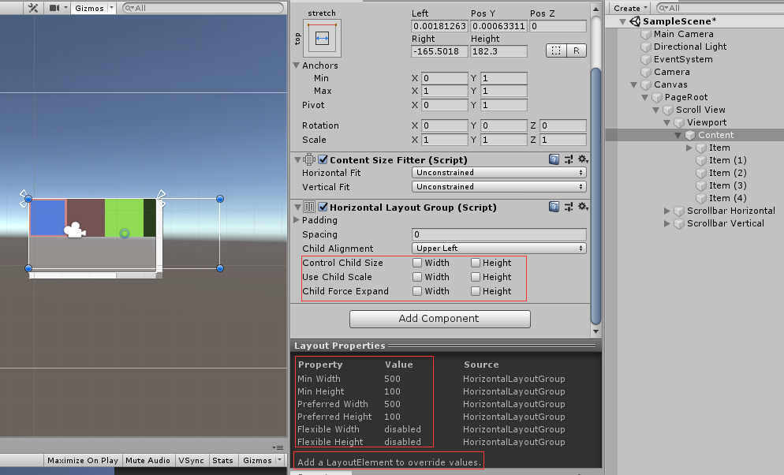

[UGUI之布局UI](#001)
  
<h3 id="001">1、 Layout Group </h3>

使用UGUI的布局组建，结合ScrollView能拓展出一些常用的功能组件。
先了解基本组件：

- 1、Content Size Fitter:
    Horizontal/Vertical Fit:
    在水平或垂直方向上更具子元素的大小来裁剪父元素大小
- 2、Layout Group
    * 有,无Layout Element, Child Force Expand :强制将子元素等比分配父元素的区域，但是子元素大小不变，保持原样。
    * 选了Child Force Expand,子元素的Layout Element 设置了Felxible Width/Height ,会按照设置的比例将父元素区域分配，勾选Control Child Size,则，子元素大小由Layout Elemnt 控制。
    * Min Height/Width、Preferred Height/Width 和Control Child Size(勾选了 Min 和 Preferred 才会生效). 
  如果要子元素大小不一的话，就勾选Control Child Size,然后Layout Element 控制元素的具体大小。 如果是让元素自动布局的话，就选Force Expand 让元素自己布局扩充

