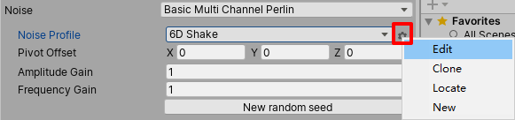
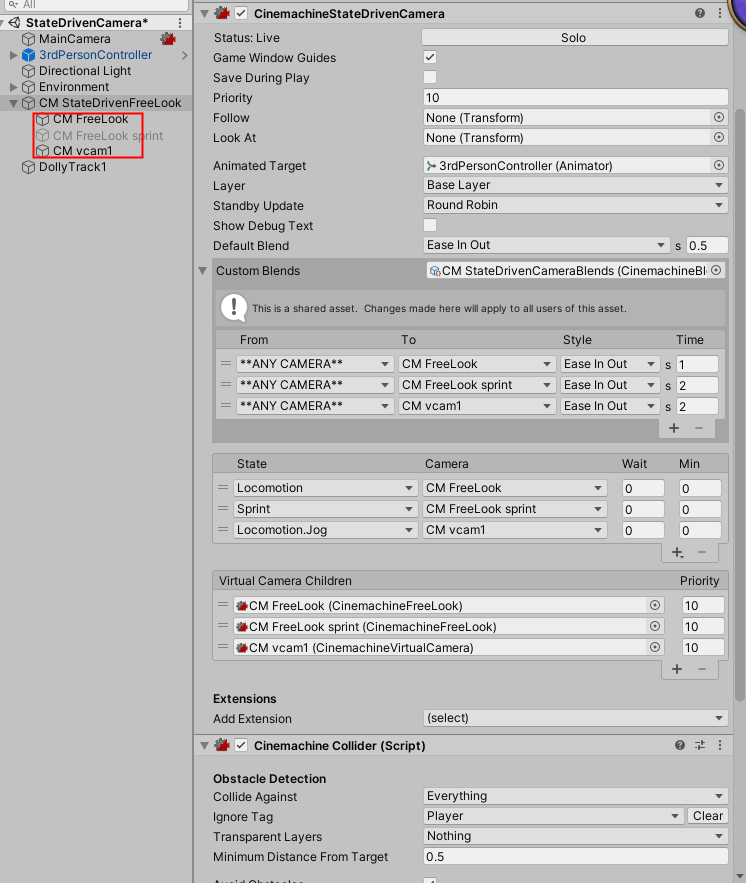

<h1 id = "000">目录</h2>

* [1、Cinemachine Brain](#001)
* [2、Cinimachine Virtual Camera](#002)
* [3、Cinimachine Virtual Camera Body](#003)
* [4、Cinimachine Virtual Camera Aim ](#004)
* [5、Cinimachine Virtual Camera Noise ](#005)
* [6、2D Camera](#006)
* [6.1Managing & Grouping Virtual Cameras](#0066)
* [7、FreeLook Camera](#007)
* [8、Blend List Camera](#008)
* [9、State-Driven Camera](#009)
* [10.0、相机拓展](#0100)
* [10、ClearShot Camera](#010)
* [11、Dolly Camera with Track](#011)
* [12、Dolly Track with Cart](#012)
* [13、Target Group Camera](#013)
* [14、Mixing Camera](#014)
* [15、Cinemachine Impulse](#015)
* [end](#999)

        

* [返回](#000)
<h1 id = "001">1、Cinemachine Brain</h2>

Cinemachine Brain： 所有相机组件的重要组件，控制主相机，同时允许用创建和控制许多不同的虚拟相机。

    * Live Camera：当前激活的虚拟相机。
    * Show Debug Text: 显示当前是哪个虚拟相机控制的主相机。 这里在多个相机切换时候，会以最后一个激活的相机作为当前主控制相机。
    * Show Camera Frustum:显示相机裁剪范围。
    * Ignore Time Scale: 忽略timescale的影响，不受unity加减速的影响。
    * World Up Override： 默认空相机使用世界Y作为构建视图矩阵的up向量。拖拽物体并旋转下，就会使用当前这个物体的Y方向作为构建up的向量。
    * Update Method: 更新相机位置和旋转的时机。 如果由于更新地方导致的不流畅可以在这里进行选择更新时机。
    * Default Blend：默认的相机融合时的国度曲线和持续时间。
    * Custom Blends: 如果选择了自定义的融合，就会覆盖默认的。自定义的可以定义多个相机的间的融合关系。
    * Events：
      Camera cut：任何虚拟相机要进入控制并且没有融合的时候切入到这个相机前，出发该事件。
      Camera Actived：相机激活的时候出发，cut或融合的方式都在第一帧触发该事件。

        

* [返回](#000)
<h1 id ="002">2、 Cinimachine Virtual Camera </h2>
CinimachineVirtualCamera: 是使用时间轴创建相机行为和镜头的关键。 

    Status: Live 当前相机处于显示状态。 Solo 关注当前相机直接显示在Game窗口。用于相机的调试。

    Game Window Guides：勾选时，Game窗口会显示辅助线，用于设置虚拟相机的各个属性。
        仅在以下任意一属性赋值时显示辅助线：
            * Look At 属性设置了物体，Aim设置为Composer或Group Composer
            * Follow 属性设置了物体，Body设置为Framing Composer

    Save During Play：虚拟相机的属性在运行时的修改可以被保存下来，退出Play状态时不会被重置。它是通过Cinemachine命名空间中的一个特殊的属性[SaveDuringPlay]。如果你自己的脚本也需要运行时保存的功能，只需要在类上加上这个属性即可。如果不想要类中的某些成员在运行时保存，可以给这些成员加上[NoSaveDuringPlay]属性。

    Priority：虚拟相机的优先级，用于Live镜头的选择。数值越高代表优先级越高。Cinemachine Brain会根据这个属性从所有激活的虚拟相机中选择活动的虚拟相机。在Timeline上使用时这个属性不生效。

    Follow： 相机需要跟随的物体

    Look At：相机需要镜头对准的物体

    Standby Update：相机待命时的更新方式，当虚拟相机物体没有被禁用，但是优先级不足时，虚拟相机处于待命状态。这个属性会影响性能，通常设置为Never是最好的，但是有时候可能需要虚拟相机更新来做一些镜头相关的计算判断。
        * Never 不更新
        * Always 每帧更新
        * Round Robin 循环更新：所有的待命虚拟相机循环更新，每帧更新一个相机（例如有10个待命的相机，第一帧更新第一个相机，第2帧更新第2个相机，….，第11帧更新第1个相机，以此类推）

    Lens：镜头设置，对应Unity相机中的属性，也可以从Preset中选择或者从现有的设置创建新的Preset。
        Field of view: 
        Near Clip Plane: 近裁面
        Far Clip Plane:  远裁面
        Dutch:   Camera Z roll，or tilt ，in degrees 。 这个属性在Unity相机中是没有的，可以用来控制镜头的旋转。（在屏幕空间的旋转）

    Transitions: 相机转换的相关设置

        Blend Hint: 混合方式
            None:无，默认线性混合
            Spherical Position:根据Look At的物体球面旋转混合
            Cylindrical Position:根据Look At的物体柱面旋转混合（水平方向圆弧，垂直方向线性）
            Screen Space Aim When Targets Differ:在屏幕空间瞄准目标

        Inherit Position: 下一个相机变成活动相机时，从上一个相机继承位置，即保持两个相机位置相同。

        On Camera Live: 相机激活事件：事件，相机变为活动时会触发对应的事件。

        

* [返回](#000)
<h1 id = "003">3、 Cinimachine Virtual Camera Body</h3>

Body: 主要用于设置相机的移动是的算法 . 

[Body参考地址](https://mp.weixin.qq.com/s?__biz=MjM5Mzg2Nzg2MQ==&mid=2456961795&idx=1&sn=6aefc3d506572248e84e675af0476448&chksm=b116923986611b2ff6fd0b9aa72eece0ee7eb66dbd435b98e677c8e15e9958397f94bd711fe0&token=1108897709&lang=zh_CN#rd)

<table><tr><td bgcolor=#6495ED> ------------Donothing算法-------------  </td></tr></table>

 Donothing ：不移动虚拟相机。选中这个算法时，虚拟相机激活时，会控制Unity相机会固定在当前虚拟相机的位置，不会移动。用于固定位置的镜头，也可以通过自定义脚本来控制相机的位置。通常和Look At配合使用，模拟固定位置的跟随镜头。

<table><tr><td bgcolor=#6495ED> ----------Framing Transposer算法-----------  </td></tr></table>
 Framing Transposer : 跟随目标移动，并在屏幕空间保持相机和跟随目标的相对位置。

选中这个算法时，Cinemachine会在屏幕空间将相机和跟随物体保持固定的相对位置关系。只会改变相机的位置，不会改变相机的旋转。还可以设置偏移、阻尼、构图规则等等。

Framing Transposer 算法是为2D和正交相机设计的，主要用于2D情况。但是对于透视相机和3D环境也可以使用。 

 
这个算法工作流程大概是：首先沿着相机的Z轴移动相机直到Camera Distance 距离的XY平面上，然后在XY面上平移，直到目标物体在屏幕空间到达期望的位置。
 
特别注意：使用Framing Transposer时，Look At属性必须为空。
 
Lookahead Time：根据目标的运动，调整虚拟相机与“跟随”目标的偏移量。Cinemachine预测目标在未来数秒之内到达的位置并提前设置Unity相机的位置。这个功能对微动的动画敏感，并且会放大噪点，导致非预期的相机抖动。如果不能接受目标运动时的相机抖动，减小这个属性可能会使相机动画更流畅。
 
Lookahead Smoothing：预测算法的平滑度。较大的值可以消除抖动但会使预测滞后。
 
Lookahead Ignore Y：如果选中，在预测计算时会忽略沿Y轴的移动。
 
X Damping：相机在X轴上移动的阻力系数。较小的值会使相机反应更快。较大的值会使相机的反应速度变慢。每个轴使用不同的设置可以制造出各种类型相机的行为。
 
Y Damping：相机在Y轴上移动的阻力系数。较小的值会使相机反应更快。较大的值会使相机的反应速度变慢。
 
Z Damping：相机在Z轴上移动的阻力系数。较小的值会使相机反应更快。较大的值会使相机的反应速度变慢。
  

  

Screen X：目标的水平屏幕位置。相机移动的结果是使目标处于此位置。 
Screen Y ：目标的垂直屏幕位置，相机移动的结果是使目标处于此位置。 
Camera Distance ：沿摄像机Z轴与跟随目标保持的距离。 
Dead Zone Width ：当目标在此位置范围内时，不会水平移动相机。 
Dead Zone Height ：当目标在此位置范围内时，不会垂直移动相机。 
Dead Zone Depth ：当跟随目标距离相机在此范围内时，不会沿其z轴移动相机。 

Unlimited Soft Zone ：如果选中，Soft Zone没有边界. 
 Soft Zone Width：当目标处于此范围内时，会水平移动相机，将目标移回到Dead Zone中。Damping属性会影响摄像机的运动速度。 
Soft Zone Height ：当目标处于此范围内时，会垂直移动相机，将目标移回到Dead Zone中。Damping属性会影响摄像机的运动速度。 
Bias X ：Soft Zone的中心与目标位置的水平偏移。 
Bias Y ：Soft Zone的中心与目标位置的竖直偏移。 
Center On Active ：选中时，虚拟相机激活时会将镜头中心对准物体。不选中时，虚拟相机会将目标物体放置在最近的dead zone边缘。

  
<table><tr><td bgcolor=#6495ED> ----------Cinemachine Target Group组件----------  </td></tr></table>

Cinemachine Target Group组件可以让多个GameObjects作为一个组，设置为Look At的对象。在虚拟相机中使用Group Composer算法，可以设置Follow属性为这个TargetGroup。

 如何创建一个Target Group呢？ 

1、菜单栏选择 Cinemachine > Create Target Group Camera 。Unity会在场景中添加一个虚拟相机和Target Group。Follow和Look At属性会自动设置为这个Group。 
2、Hierarchy中选中这个Group。 
3、Inspector上可以点击加号+添加新的物体到这个组。 
4、点击加号后，设置GameObject、权重和半径。 
5、可以重复多次3-4步来添加更多物体。 

  

属性详解 
Position Mode 如何计算Group的位置 
   * Group Center 根据所有物体的包围盒计算一个包含它们的大包围盒.Group Center就是这个大包围盒的中心.
   * Group Average 根据所有物体的位置加权重计算平均值.

Rotation Mode如何计算Target Group的旋转
   * Manual 使用TargetGroup根物体的旋转。推荐设置
   * Group Average 根据所有物体的旋转加权重计算

Update Method 更新Target Group的Transform的时机

 Targets  组内包含的物体列表
   * Weight 每个对象的权重
   * Radius 每个物体的半径，用于计算包围盒。不可为负数。

  
<table><tr><td bgcolor=#6495ED> ----------Hard Lock To Target算法----------  </td></tr></table>
 Hard Lock To Target  : 虚拟相机和跟随目标使用相同位置。Unity相机保持和目标位置一致，即位置同步

 
 Damping ：相机追赶上目标位置的时间。如果为0，那就是保持同步，如果大于0，相当于经过多少秒相机和目标位置重合。

  
<table><tr><td bgcolor=#6495ED> --------Orbital Transposer-------  </td></tr></table>
 Orbital Transposer : 相机和跟随目标的相对位置是可变的，还能接收用户的输入。常见于玩家控制的相机。

Orbital Transposer引入了一个新的概念叫  heading ，代表了目标移动的方向或面朝的方向。Orbital Transposer会尝试移动相机，让镜头朝向heading的方向。默认情况下，相机的位置会在target的正后面。也可以通过 Heading Bias 属性设置。

如果给Orbital Transposer添加了输入控制器，玩家就可以控制相机围绕目标旋转。可以设置为Input Manager中的轴，也可以直接用脚本控制。

当 Recenter To Target Heading  属性选中时，在没有输入时Orbital Transposer可以自动重新居中相机。

 属性详解   
 Binding Mode  绑定模式：从目标推断位置时使用的坐标空间。 
   *  Lock To Target On Assign  ：本地空间，相机被激活或target赋值时的相对位置.
   *  Lock To Target With World Up ：本地空间，保持相机y轴朝上，yaw和roll为0.
   *  Lock To Target No Roll ：本地空间，锁定到目标物体，roll为0.
   *  Lock To Target ：本地空间，锁定到目标物体.
   *  World Space ：世界空间.
   *  Simple Follow With World Up ：相对于目标的位置，使用相机的本地坐标系，保持相机y轴朝上.

 Follow Offset ：跟随目标时的位置偏移 
 X Damping ：相机在X轴上移动的阻力系数。较小的值会使相机反应更快。较大的值会使相机的反应速度变慢。每个轴使用不同的设置可以制造出各种类型相机的行为。 绑定模式为Simple Follow With World Up时不可用。 
 Y Damping ：相机在Y轴上移动的阻力系数。较小的值会使相机反应更快。较大的值会使相机的反应速度变慢。 
 Z Damping ：相机在Z轴上移动的阻力系数。较小的值会使相机反应更快。较大的值会使相机的反应速度变慢。 

【下面3个属性参考上面的飞机图】
 Yaw Damping ：相机在y轴旋转的阻力系数。较小的数字会使相机反应更快。较大的数字会使相机的反应速度变慢。每个轴使用不同的设置可以制造出各种类型相机的行为。Binding Mode为Lock to Target With World Up、Lock to Target No Roll、Lock to Target时可用。 
 Pitch Damping ：相机在x轴旋转的阻力系数。较小的数字会使相机反应更快。较大的数字会使相机的反应速度变慢。Binding Mode为Lock to Target No Roll、Lock to Target时可用。 
 Roll Damping ：相机在z轴旋转的阻力系数。较小的数字会使相机反应更快。较大的数字会使相机的反应速度变慢。Binding Mode为Lock to Target时可用。 

 Heading ：计算Follow朝向的方法 
    Definition ：计算方法 

        Position Delta：基于当前帧和上一帧的目标位置之间的变化
        Velocity：使用目标的刚体速度，如果目标没有Rigidbody组件，会使用Position Delta
        Target Forward ：使用目标的transform.forward作为heading的方向
        World Forward：使用世界坐标系中的Vector3.forward作为heading方向

 Bias ：相机围绕旋转的偏移，单位是度数。 

 Recenter To Target Heading ：接收不到用户输入时，自动居中。 
 Enable ：是否启用 
 Wait Time ：等待延迟时间，用户无输入后多长时间重新自动居中。 
 Recentering Time ：重新自动居中的过程花费的时间。 

 X Axis ：通过玩家输入控制Heading方向。 
 Value ：当前值。 
 Value Range ：输入范围。 
 Speed ：最大速度（Max Speed）或者最大增加速度（Input Value Gain）。 
 Accel Time ：加速到最高速度所需要的时间。 
 Decel Time ：减速到0所需的时间。 
 Input Axis Name ：接收输入的Input Manager中的轴名称，空字符串代表不接收输入。 
 Input Axis Value ：玩家输入的值。可以直接通过自定义脚本控制。 
 Invert ：是否反转输入的值（取相反数）。 

  
<table><tr><td bgcolor=#6495ED> --------Tracked Dolly-------  </td></tr></table>
 Tracked Dolly  : 这个算法可以让相机沿预定路径移动。使用 Path Position属性来指定将虚拟相机放置在路径上的位置。

使用 Auto-Dolly 模式将虚拟相机移动到路径上最接近 Follow 目标的位置。启用后， Auto-Dolly 会自动将虚拟相机的位置移动到最接近目标的路径上的位置。

提示 ：使用Auto-Dolly模式时，一定要谨慎选择路径形状。在围绕某个点形成弧形的路径上可能会有问题。举一个极端的例子，考虑一条以Follow 目标为中心的完美圆形路径。路径上最接近目标的点变得不稳定，因为圆形路径上的所有点都同样接近目标。在这种情况下，将Follow目标移动很小的距离会导致相机在轨道上移动很大的距离。

属性详解 
Path 相机移动的路径。此属性必须引用CinemachinePath或Cinemachine Smooth Path对象。 
Path Position 沿路径放置相机的位置。直接给这个属性作动画或启用Auto-Dolly。这个值以Position Units指定的单位为单位。 
Position Units  路径位置的度量单位。 
   *  Path Units ：  沿路径使用路径点。0表示路径上的第一个路径点，1表示第二个路径点，依此类推。
   *  Distance ：  沿路径使用距离。根据路径的Resolution属性对路径进行采样。Cinemachine创建一个距离查找表，并将其存储在内部缓存中。
   *  Normalized ： 使用路径的开头和结尾。值0表示路径的起点，值1表示路径的终点。
   
 Path Offset : 相机相对于路径的位置。X垂直于路径，Y向上，而Z平行于路径。使用此属性可使相机偏离路径本身。 

 X Damping :  设置相机如何在垂直于路径的方向上保持其位置。较小的数字会使相机反应更快。较大的数字会使相机的响应速度变慢。每个轴使用不同的设置可以产生多种相机表现。 
 Y Damping : 设置相机如何在路径局部坐标向上方向上保持其位置。较小的数字会使相机反应更快。较大的数字会使相机的响应速度变慢。 
 Z Damping : 设置相机如何在平行于路径的方向上保持其位置。较小的数字会使相机反应更快。较大的数字会使相机的响应速度变慢。 

 Camera Up  : 如何为虚拟相机设置向上的方向。这会影响屏幕的组成，因为相机的Aim算法会尝试遵循向上方向。
   *  Default  : 不修改虚拟相机的向上方向，而是使用Cinemachine Brain中的World Up Override属性。
   *  Path   : 在当前点使用路径的向上方向。
   *  Path No Roll  :  在当前点使用路径的向上方向，但Roll设置为零。
   *  Follow Target  :  使用Follow目标的向上向量。
   *  Follow Target No Roll  :  使用Follow目标的变换中的向上向量，但Roll为零。

 Pitch Damping  :    相机如何跟踪目标旋转的x角。较小的数字会使相机反应更快。较大的数字会使相机的响应速度变慢。 
 Yaw Damping   :   相机如何跟踪目标旋转的y角。较小的数字会使相机反应更快。较大的数字会使相机的响应速度变慢。 
 Roll Damping   :   相机如何跟踪目标旋转的z角。较小的数字会使相机反应更快。较大的数字会使相机的响应速度变慢。 
 Auto Dolly  :    控制自动轨道位置选择方式。要使用此功能，必须设置Follow目标。 
   *  Enabled  :  选中以启用。注意：这可能会影响性能，具体取决于search resolution。 
   * Position Offset  :   以position units为单位从路径上的最近点到跟随目标的偏移量。 
   *  Search Radius  :  当前段两侧的段数。如果只有一个路径使用0。当路径相对于目标位置的形状导致路径上最近的点变得不稳定时，请使用较小的数字。 
   *  Search Resolution  :  Cinemachine通过将片段分成许多直片段来搜索片段。数字越高，结果越准确。但是，对于更大的数字，性能成比例地变慢。 

  
<table><tr><td bgcolor=#6495ED> --------Transposer-------  </td></tr></table>
 Transposer : 跟随目标移动，并在世界空间保持相机和跟随目标的相对位置固定。这个算法将使用固定的相对位置将虚拟相机跟随目标，也可以使用Damping属性。

  属性详解                                
 Binding Mode  绑定模式：从目标推断位置时使用的坐标空间。
   *   Lock To Target On Assign   ：本地空间，相机被激活或target赋值时的相对位置。
   *   Lock To Target With World Up ：本地空间，保持相机y轴朝上，yaw和roll为0。
   *   Lock To Target No Roll ：本地空间，锁定到目标物体，roll为0。
   *   Lock To Target  ：本地空间，锁定到目标物体
   *   World Space   ：世界空间。
   *  Simple Follow With World Up  ：相对于目标的位置，使用相机的本地坐标系。

 Follow Offset ：跟随目标时的位置偏移    
 X Damping ：相机在X轴上移动的阻力系数。较小的值会使相机反应更快。较大的值会使相机的反应速度变慢。每个轴使用不同的设置可以制造出各种类型相机的行为。 绑定模式为Simple Follow With World Up时不可用。    
 Y Damping ：相机在Y轴上移动的阻力系数。较小的值会使相机反应更快。较大的值会使相机的反应速度变慢。    
 Z Damping ：相机在Z轴上移动的阻力系数。较小的值会使相机反应更快。较大的值会使相机的反应速度变慢。    

【下面3个属性参考上面的飞机图】    
 Yaw Damping ：相机在y轴旋转的阻力系数。较小的数字会使相机反应更快。较大的数字会使相机的反应速度变慢。每个轴使用不同的设置可以制造出各种类型相机的行为。    Binding Mode为Lock to Target With World Up、Lock to Target No Roll、Lock to Target时可用。
 Pitch Damping ：相机在x轴旋转的阻力系数。较小的数字会使相机反应更快。较大的数字会使相机的反应速度变慢。Binding Mode为Lock to Target No Roll、Lock to Target时可用。    
 Roll Damping ：相机在z轴旋转的阻力系数。较小的数字会使相机反应更快。较大的数字会使相机的反应速度变慢。Binding Mode为Lock to Target时可用。    

        

* [返回](#000)
  <h2 id = "004">4、Cinimachine Virtual Camera Aim </h2>
CinemachineVitualCamera组件中的 Aim属性用于设置相机 旋转 旋转时使用什么算法。需要先设置 Look At 属性。

Aim
包含以下旋转的算法：

   * Do nothing : 不控制相机的旋转
   *  Composer: 保持目标物体在镜头内
   *  Group Composer: 保持多个目标在镜头内
   *  Hard Look At : 保持目标在镜头的中心
   *  POV : 基于玩家的输入旋转相机
   *  Same As Follow Target : 相机的旋转和目标的旋转保持同步

<table><tr><td bgcolor=#6495ED> --------Composer--------  </td></tr></table>
这个算法旋转相机来朝向目标物体。也可以添加偏移、阻尼和构图规则。常见跟踪的目标有：角色的上半身或头部的骨骼、车辆、动画或程序控制的空物体。

  属性详解 
 Tracked Object Offset : 相对于跟踪目标的偏移。当注视的位置不是被跟踪对象的中心时，可以通过这个属性微调跟踪目标位置。 
 Lookahead Time : 提前的时间。根据注视目标的运动来调整偏移量。该算法估计目标将在未来数秒之内到达的位置。这个功能对微动的动画敏感，并且会放大噪点，导致非预期的相机抖动。如果目标运动时相机抖动不可接受，降低此属性可能会使目标动画更流畅。 
 Lookahead Smoothing : 控制前瞻算法的平滑度。较大的值可以消除抖动预测但会使预测滞后。 
 Lookahead Ignore Y : 预测算法会忽略Y轴的运动。 
 Horizontal Damping  : 水平阻尼。相机在屏幕水平方向上对目标的反应速度如何。使用较小的数字可以使照相机更快地旋转，以使目标保持在dead zone。使用较大的数字来模拟较重，响应缓慢的相机。 
 Vertical Damping : 垂直阻尼。相机在屏幕垂直方向上对目标的反应速度如何。使用不同的垂直和水平设置可以模拟不同相机行为。 

各区域示意图

 Screen X  ：dead zone中心的水平屏幕位置，相机旋转保持目标在此处。 
 Screen Y  dead zone中心的垂直屏幕位置，相机旋转保持目标在此处。 
 Dead Zone Width  目标在这个区域时，相机会忽略目标的任何移动，此属性设置这个区域的宽度。目标位于该区域内的任何位置时，虚拟相机不会更新其旋转角度。这对于忽略较小的目标移动很有用。 
 Dead Zone Height  目标在这个区域时，相机会忽略目标的任何移动，此属性设置这个区域的高度。如果目标位于该区域内的任何位置，则虚拟相机不会更新其旋转角度。这对于忽略较小的目标移动很有用。 
 Soft Zone Width  soft zone的宽度。如果目标出现在屏幕的此区域中，则相机将旋转，以在Horizontal Damping设置的时间内将其推回dead zone。 
 Soft Zone Height  soft zone的高度。如果目标出现在屏幕的此区域中，则相机将旋转，以在Vertical Damping设置的时间内将其推回dead zone。 
 Bias X soft zone 中心相对于dead zone中心的水平偏移。 
 Bias Y  soft zone中心相对于dead zone中心的垂直偏移。 

 Center On Active ：选中时，虚拟相机激活时会将镜头中心对准物体。不选中时，虚拟相机会将目标物体放置在最近的dead zone边缘。 

<table><tr><td bgcolor=#6495ED> --------Group Composer--------  </td></tr></table>
这个算法可以用来让镜头瞄准多个目标。如果Look At属性设置的是一个Cinemachine Target Group，这个算法会调整相机的FOV和举例来保证Group中的物体都能被镜头看到。如果Look At属性设置的是一个物体，那么会和Composer算法表现一致。

 属性详解
 Tracked Object Offset： 相对于跟踪目标的偏移。当注视的位置不是被跟踪对象的中心时，可以通过这个属性微调跟踪目标位置。 

 Lookahead Time： 提前的时间。根据注视目标的运动来调整偏移量。该算法估计目标将在未来数秒之内到达的位置。这个功能对微动的动画敏感，并且会放大噪点，导致非预期的相机抖动。如果目标运动时相机抖动不可接受，降低此属性可能会使目标动画更流畅。 
Lookahead Smoothing： 控制前瞻算法的平滑度。较大的值可以消除抖动预测但会使预测滞后。 
 Lookahead Ignore Y ：预测算法会忽略Y轴的运动。 

 Horizontal Damping ：水平阻尼。相机在屏幕水平方向上对目标的反应速度如何。使用较小的数字可以使照相机更快地旋转，以使目标保持在dead zone。使用较大的数字来模拟较重，响应缓慢的相机。 
 Vertical Damping： 垂直阻尼。相机在屏幕垂直方向上对目标的反应速度如何。使用不同的垂直和水平设置可以模拟不同相机行为。 

各区域示意图

 Screen X  ：dead zone中心的水平屏幕位置，相机旋转保持目标在此处。 
 Screen Y  dead zone中心的垂直屏幕位置，相机旋转保持目标在此处。 
 Dead Zone Width  目标在这个区域时，相机会忽略目标的任何移动，此属性设置这个区域的宽度。目标位于该区域内的任何位置时，虚拟相机不会更新其旋转角度。这对于忽略较小的目标移动很有用。 
 Dead Zone Height  目标在这个区域时，相机会忽略目标的任何移动，此属性设置这个区域的高度。如果目标位于该区域内的任何位置，则虚拟相机不会更新其旋转角度。这对于忽略较小的目标移动很有用。 
 Soft Zone Width  soft zone的宽度。如果目标出现在屏幕的此区域中，则相机将旋转，以在Horizontal Damping设置的时间内将其推回dead zone。 
 Soft Zone Height  soft zone的高度。如果目标出现在屏幕的此区域中，则相机将旋转，以在Vertical Damping设置的时间内将其推回dead zone。 
 Bias X soft zone 中心相对于dead zone中心的水平偏移。 
 Bias Y  soft zone中心相对于dead zone中心的垂直偏移。 

 Center On Active ：选中时，虚拟相机激活时会将镜头中心对准物体。不选中时，虚拟相机会将目标物体放置在最近的dead zone边缘。 

 Group Framing Size：目标应占据的屏幕大小比例。使用1填充整个屏幕，使用0.5填充一半的屏幕，依此类推。
 Framing Mode：指定构图时要考虑的屏幕尺寸。

   *  Horizontal 仅考虑水平尺寸。忽略垂直尺寸。
   *  Vertical  仅考虑垂直尺寸。忽略水平尺寸。
   *  Horizontal And Vertical  使用水平和垂直尺寸中较大的那个来获得最佳匹配。
Adjustment Mode  如何调整相机以获得所需的取景。可以是缩放、拉近拉远或同时进行。
   *  Zoom Only  不移动相机，仅调整FOV。
   *  Dolly Only  移动相机，不修改FOV。
   *  Dolly Then Zoom  将相机移动到范围允许的最大范围，然后根据需要调整FOV。

 Max Dolly In ：朝目标拉近相机的最大距离。 
 Max Dolly Out：远离目标拉远相机的最大距离。 
 Minimum Distance：设置此项以限制相机可以接近目标的最小距离。 
 Maximum Distance：设置此项以限制相机可以达到的最远目标距离。 
 Minimum FOV：自动调节FOV时的最小值。 
 Maximum FOV：自动调节FOV时的最大值。 

<table><tr><td bgcolor=#6495ED> --------POV--------  </td></tr></table>此算法基于玩家的输入来调节相机的旋转

 属性详解 
 Apply Before Body 不勾选时，Aim算法会在Body之后设置Camera相关属性。勾选时，Aim会在Body之前设置Camera相关属性。通常Body使用Framing Transposer算法时会很有用。

 
 Recenter Target R 重置回中心的目标对象。
   *  None 无
   *  Follow Target Forward Follow属性的forward
   * Look At Target Forward  Look At属性的forward

 Vertical Axis 控制虚拟相机目标的垂直朝向。 
   * Value  轴的当前值，以度为单位。可接受的值为-90至90。 
   * Value Range  虚拟相机的垂直轴的最小值和最大值。 
   * Wrap     如果选中，则轴将在Value Range范围内，形成一个循环。 
   * Max Speed  该轴的最大速度，以度/秒为单位。
   *  Accel Time Input Axis Value处于最大值时，加速到最大速度 所花费的时间（以秒为单位）。
   *  Decel Time 轴减速为零所花费的时间（以秒为单位）。
   * Input Axis Name  输入轴的名称。在Unity Input Manager中指定的该轴的名称。将此属性设置为空字符串来禁用此轴的自动更新。
   * Input Axis Value  输入轴的值。值为0表示无输入。你可以直接从自定义脚本中修改这个值。或者设置Input Axis Name并由Unity Input Manager驱动。
   * Invert  将原始值反转。

 Vertical Recentering 当接收不到玩家输入时，自动在垂直方向重新居中。
   *  Enable 是否启用。选中以启用自动垂直居中。
   *  Wait Time 等待时间。如果在垂直轴上未检测到用户输入，则相机将等待几秒钟，然后再进行重新居中。
   *  Recentering Time 重新居中所花费的时间。

 Horizontal Axis 控制水平方向。
   *  Value  轴的当前值，以度为单位。可接受的值为-180至180。
   *  Value Range  虚拟相机水平轴的最小值和最大值。
   *  Wrap     如果选中，则轴将在Value Range范围内，形成一个循环。
   *  Max Speed  该轴的最大速度，以度/秒为单位。
   *  Accel Time Input  Axis Value处于最大值时，加速到最大速度所花费的时间（以秒为单位）。
   *  Decel Time  轴减速为零所花费的时间（以秒为单位）。
   *  Input Axis Name  输入轴的名称。在Unity Input Manager中指定的该轴的名称。将此属性设置为空字符串来禁用此轴的自动更新。
   *  Input Axis Value  输入轴的值。值为0表示无输入。你可以直接从自定义脚本中修改这个值。或者设置Input Axis Name并由Unity Input Manager驱动。
   *  Invert  将原始值反转。

 Horizontal Recentering  当接收不到玩家输入时，自动在水平方向重新居中。
   *  Enable  是否启用。选中以启用自动水平居中。
   *  Wait Time  等待时间。如果在水平轴上未检测到用户输入，则相机将等待几秒钟，然后再进行重新居中。
   *  Recentering Time   重新居中所花费的时间。

<table><tr><td bgcolor=#6495ED> --------Same As Follow Target--------  </td></tr></table>此算法基于玩家的输入来调节相机的旋转
这个算法会让相机和Follow Target一个方向。如果想让相机和目标保持同样的位置和朝向，可以在Body中使用Hard Lock to Target，在Aim中使用Same As Follow Target算法。

        

* [返回](#000)
  <h2 id = "005">5、Cinimachine Virtual Camera Noise </h2>
使用Noise属性可以模拟相机的晃动。Cinemachine中自带了一个Basic Multi Channel Perlin算法，可以给虚拟相机的运动添加柏林噪声。柏林噪声是一种随机算法技术，可以给相机添加比较自然的随机运动

Basic Multi Channel Perlin需要设置一个 Noise Profile 属性。Noise Profile是一个配置文件资产，里面有噪声的相关配置。Cinemachine中自带了几种profile配置，你也可以自己创建profile。  

 Amplitude Gain  振幅增益。相机最终的噪声振幅会是profile中的振幅乘以这个增益系数。设置为1时使用噪声配置文件中定义的振幅。将此设置为0时禁用噪声。提示：给这个属性添加动画可以通过动画控制噪波增强、减弱的效果。

 Frequency Gain ：频率增益。相机最终的噪声频率会是profile中的频率乘以这个增益系数。设置为1时使用噪声配置文件中定义的频率。使用较大的值可以更快地晃动相机。提示：给这个属性添加动画可以通过动画控制噪波变快、变慢的效果。

<table><tr><td bgcolor=#6495ED> --------如何创建或修改Noise Profile--------  </td></tr></table>

 Noise profile 是定义程序化生成噪声曲线相关属性的资产。 Basic Multi Channel Perlin 算法使用这个profile来控制相机的运动。Cinemachine在计算相机的位置后会添加噪声造成的偏移。这样，相机噪声不会影响将来相机运动的计算。
  
Cinemachine包含一些预定义的profile资产。你还可以在CinemachineVirtualCamera组件的Noise Profile属性上来修改、克隆、定位位置、新建。
    

我先Clone出来一个6D Shake的Profile。

选中这个Noise Profile后，Inspector中可以直观地显示噪声曲线。x，y和z轴有位置和旋转的属性。每个轴可以具有多个层。

如果想创建逼真的程序化噪声，需要搞懂并选择合适的频率和振幅，以确保产生的噪声质量，噪声不会出现重复的情况。最有说服力的相机晃动还得使用 Rotation 噪点，这会影响相机的瞄准。手持摄像机通常情况会有更多的旋转晃动，而不是位置移动。一般先添加 Rotation旋转 噪声，再添加 Position位置 噪声。  

令人信服的噪声曲线通常将低频，中频和高频混合在一起。创建新的noise profile时，可以从每个轴的这三层噪声开始。  

对于振幅（Amplitude），较大的值相机晃动越明显。对于远景，使用较小的振幅值，因为较小的FOV会放大晃动效果。  

对于频率（Frequency），典型的低频范围为0.1-0.5 Hz，中频范围为0.8-1.5，高频范围为3-4。最高可用频率取决于游戏的帧频。游戏通常以30或60Hz运行。高于游戏帧速率的噪声频率可能会出现采样出现跳跃的情况。  

例如，如果你的游戏以60帧/秒的速度运行，并且将噪声频率设置为100，则相机会发出断断续续的噪声。这是因为你的游戏渲染帧率无法比噪声频率更快。  

 属性详解 
 Preview Time  在Inspector中的图形预览的时长。仅用于可视化预览，不会影响你编辑的噪声配置文件资产的内容。
 Preview Height Inspector 中噪声曲线图的垂直高度。仅用于可视化预览，不会影响你编辑的噪声配置文件资产的内容。
 Animated  勾选后，Inspector中的噪声曲线会水平移动。示仅用于可视化预览，不会影响你编辑的噪声配置文件资产的内容。

 Position Noise  位置噪波图层。
 Position X, Position Y, Position Z  每个轴都可以设置多层的噪波。每个轴有一个图形展示。可以设置多层，点击下面的+或-可以添加或删除一层。
   *  Frequency  频率 噪声层中的频率，以Hz为单位。
   *  Amplitude  振幅 噪声层中波的振幅（高度），以距离为单位。
   *  Non-random   选中时不给波形添加柏林噪声。在没有Perlin噪声的情况下，Cinemachine使用规则的正弦波。取消选中可将Perlin噪声应用于该层，从而使频率和振幅随机化，同时保持在所选值的附近。

 Rotation Noise   所有轴的所有旋转噪波图层。
 Rotation X, Rotation Y, Rotation Z   每个轴都可以设置多层的噪波。每个轴有一个图形展示。可以设置多层，点击下面的+或-可以添加或删除一层。
   *  Frequency频率 噪声层中的频率，以Hz为单位。
   * Amplitude振幅  噪声层中波的振幅（高度），以度数为单位。
   *  Non-random 选中时不给波形添加柏林噪声。在没有Perlin噪声的情况下，Cinemachine使用规则的正弦波。取消选中可将Perlin噪声应用于该层，从而使频率和振幅随机化，同时保持在所选值的附近。

   * [返回](#000)
<h1 id="006"> 6.1、Managing & Grouping Virtual Cameras </h1>
 虚拟相机分组管理器。相机管理器可以检测多个虚拟相机，但是对于Cinemachine和Timeline来说他们相当于还是一个虚拟相机。
   Free Look Camera : 增强版的Orbital Transposer相机. 它管理三个水平轨道，垂直排列包围一个avator.

  Mixing Camera :最多使用八个子虚拟摄像头的加权平均值.

   Blend List Camera: 执行其子虚拟摄影机的混合或剪切序列。.

  Clear Shot Camera : 选择具有目标最佳视图的子虚拟摄影机。

  State-Driven Camera : 选择子虚拟摄影机以响应动画状态的更改。

管理器相机和普通虚拟相机行为一样，可以通过多种相机组合实现复杂的需求。

   * [返回](#000)
<h1 id="007"> 15、FreeLook Camera </h1>
 Cinemachine FreeLook Camera  他提供了一个一种第三人称的相机体验。由顶、中，低三个单独的相机设置来围绕主体旋转。
 

每个装配都围绕目标定义了一个环，有自定义的半径，高度，和旋转，noise的设置
 

   * [返回](#000)
<h1 id="008"> 8、Blend List Camera </h1>
 Cinemachine Blend List Camera  改类型虚拟相机激活后按添加的虚拟相机列表按设置的持续时间和混合方式依次进行混合播放，全波播放完成保持最后一个相机的状态。
 

   * [返回](#000)
<h1 id="009"> 9、State-Driven Camera </h1>
 Cinemachine State-Driven Camera  状态驱动相机，通过该相机可以对每个动画指定特定的相机关注。 当动画目标变更状态时，Cinemachine State-Driven Camera会激活子虚拟摄像机。 例如Avator运动时，相机晃动的更多。 待机时处于一个自由相机下. 每个相机间的切换可以配置融合，每个动画可以配置一个指定的相机。
 

   * [返回](#000)
<h1 id="0100"> 10.0、相机拓展 </h1>

<h3 color = Coral> Avoiding collisions and evaluating shots  避免碰撞和快速评估</h3>
<table><tr><td bgcolor=#6495ED> --------Cinemachine Collider--------  </td></tr></table>
Cinemachine Collider 是Cinemachine虚拟摄像机的扩展。它对虚拟摄像机的最终位置进行后处理，以尝试保留虚拟摄像机的“注视”目标的视线。它是通过远离阻碍视图的GameObjects来实现的。 
将Cinemachine Collider 扩展添加到Cinemachine虚拟摄像机以执行以下任何任务： 

   * 将相机推开，使其不妨碍场景中的障碍物。 
   * 将相机放置在虚拟相机与其“ 看向”目标之间的障碍物前面。 
   * 评估镜头质量。拍摄质量是虚拟相机到其理想位置的距离，虚拟相机到其目标的距离以及阻碍目标视线的障碍物的度量。其他模块使用镜头质量，包括Clear Shot 。 
   * 对撞机使用 Physics Raycaster 。因此，Cinemachine Collider要求潜在障碍物具有碰撞体体积。此要求会产生性能成本。如果您的游戏费用高昂，请考虑以其他方式实现此功能。 
 

Collide Against 碰撞:Cinemachine Collider认为这些层中的GameObjects是潜在的障碍。它会忽略不在选定图层中的GameObject。

Minimum Distance From Target : 忽略距离目标枢轴点小于此距离的障碍物。

Avoid Obstacles : 当目标被障碍物遮挡时，请选中以允许对撞机在场景中移动相机。使用距离限制，相机半径和策略属性来调整如何避开障碍物。如果未选中，Cinemachine Collider将根据障碍物报告镜头质量，但不会尝试移动相机来改善镜头质量。

Distance Limit 检查到本相机目标的视线是否清晰时的最大光线投射距离。输入0以使用当前到目标的实际距离。当选中避免障碍物时可用。

Camera Radius 与任何障碍物保持的距离。尝试保持较小的值以获得最佳结果。如果由于摄像机的FOV大而看到内部障碍物时，请增大该值。当选中避免障碍物时可用。

Strategy 对撞机试图保留目标视线的方式。当选中避免障碍物时可用。

   *  Pull Camera Forward  沿其Z轴向前移动相机，直到它位于距离目标最近的障碍物的前面。
   *  Preserve Camera Height  尝试将相机移至另一视角，同时尝试将其保持在其原始高度。
   *  Preserve Camera Distance  尝试将相机移动到另一视角，同时尝试将相机保持在与目标之间的原始距离。
   *  Smoothing Time  将相机保持在距目标最近的位置的最小秒数。在有许多障碍物的环境中可用于减少过多的相机移动。当选中避免障碍物时可用。

 Damping遮挡消失后，将相机恢复到其正常位置的速度。较小的数字会使相机反应更快。较大的数字会使相机响应速度变慢。当选中避免障碍物时可用。
 Damping When Occluded相机移动速度如何避免障碍。较小的数字会使相机反应更快。较大的数字会使相机响应速度变慢。当选中避免障碍物时可用。
Optimal Target Distance 如果大于零，则当目标距离该距离较近时，给镜头更高的分数。将此属性设置为0以禁用此功能。

<table><tr><td bgcolor=#6495ED> --------Cinemachine Confiner--------  </td></tr></table>
Cinemachine Confiner 扩展程序将摄像机的位置限制在一个体积或区域内。Confier以2D或3D模式运行。模式影响其接受的边界形状的种类。在3D模式下，相机在3D模式下的位置仅限于一个体积。这也适用于2D游戏，但您需要考虑深度。在2D模式下，您不必担心深度。

对于正交相机，还有一个附加选项可以限制屏幕边缘，而不仅仅是相机点。这样可以确保整个屏幕区域都位于边界区域内。
Confine Mode使用2D边界区域或3D边界体积进行操作。

   * Confine 2D使用Collider2D边界区域。
   * Confine 3D使用3D Collider边界体积。

Bounding Volume包含相机的3D体积。当“限制模式”设置为“限制3D”时，此属性可用。

Bounding Shape 2D包含照相机的2D区域。当“限制模式”设置为“限制2D”时，此属性可用。

Confine Screen Edges正交摄影机时，请检查以将屏幕边缘限制在该区域。取消选中时，仅限制摄像机中心。如果相机处于透视模式，则无效。

Damping如果超出边界，如何逐渐将相机返回到包围的体积或区域。更高的数字更渐进。

 

   

<table><tr><td bgcolor=#6495ED> --------Cinemachine Follow Zoom--------  </td></tr></table>
此扩展功能可调节镜头的FOV，以使目标物体在屏幕上保持恒定大小，而不管相机和目标位置如何。

 

FollowZoom.png
Width射程宽度，以世界单位保持在目标距离。将调整FOV，以使目标距离下此大小的对象充满整个屏幕。

Damping增大此值可软化跟随缩放的响应性。较小的数字会使相机反应更快。较大的数字会使相机响应速度变慢。

Min FOV此行为生成的FOV的下限。

Max FOV此行为生成的FOV的上限。

   
<table><tr><td bgcolor=#6495ED> --------CinemachinePostProcessing--------  </td></tr></table>
使用Cinemachine后处理扩展将后处理V2配置文件附加到虚拟相机。
Cinemachine Post Processing扩展拥有一个后处理配置文件资产，以便在激活后应用于虚拟摄像机。如果摄像机正在与其他虚拟摄像机混合，则混合权重也将应用于后期处理效果。

Focus Tracks Target: 检查以将“聚焦距离”设置为相机与“注视”目标之间的距离。
Offset: 选中“聚焦轨迹目标”后，在设置聚焦，聚焦距离时，此偏移量将应用于目标位置。如果没有“注视”目标，则这是与Unity相机位置（实际焦距）的偏移量。

   
<table><tr><td bgcolor=#6495ED> --------Cinemachine Storyboard--------  </td></tr></table>
 

 Show Image :切换情节提要图像的可见性。

 Image :图像显示为虚拟相机输出的覆盖图。

 Aspect :如何处理图像外观和屏幕外观之间的差异。

   * Best Fit在屏幕上将图像调整为尽可能大的尺寸，而不进行裁切。保留垂直和水平比例。
   * Crop Image To Fit调整图像大小以填满屏幕，必要时裁切。保留垂直和水平比例。
   * Stretch To Fit调整图像大小以填满屏幕，必要时调整垂直或水平宽度。

 Alpha :图像的不透明度。使用0表示透明，使用1表示不透明。

 Center :图像的屏幕空间位置。使用0作为中心。

 Rotation :图像的屏幕空间旋转。

 Scale :图像的屏幕空间缩放。

 Sync Scale :检查以同步x和y轴的比例。

 Mute Camera :检查以防止虚拟摄像机更新Unity摄像机的位置，旋转或比例。使用此功能可以防止时间轴将摄像机混合到场景中的意外位置。

 Split View :水平擦拭图像。

   * [返回](#000)
<h1 id="010"> 10、Cinemachine ClearShot Camera </h1>

 Cinemachine ClearShot Camera  组件会给目标从他的子VC中选取最优视野评估的相机 。使用Clear Shot  可以设置场景的复杂多摄像机覆盖范围，以确保清晰地看到目标。

 这可能是一个非常强大的工具。具有Cinemachine Collider扩展功能的Virtual Camera child可以分析场景中的目标障碍物，最佳目标距离等。Clear Shot使用此信息来选择最佳的孩子来激活。

提示  ：要将单个Cinemachine Collider 用于所有Virtual Camera子代，请将Cinemachine Collider扩展添加到ClearShot GameObject，而不是其每个Virtual Camera子元素。此 Cinemachine Collider 扩展适用于所有子元素，好像每个孩子都有该Collider作为其自己的扩展一样。

如果多个子相机具有相同的拍摄质量，则“清晰拍摄”相机会选择优先级最高的相机。最终每个相机的视野清晰优先级由Cinemachine Collider 设置计算的。

您还可以在ClearShot子项之间定义自定义混合。

 

 Cinemachine ClearShot Camera  
允许设置多个子相机，会自动选取最佳匹配的

 Activate After 等待这几秒钟，然后再激活新的子相机。

 Min Duration 除非有更高优先级的相机处于活动状态，否则活动的相机必须至少处于活动状态至少几秒钟。

 Randomize Choice 如果多个摄像机具有相同的拍摄质量，请检查以选择随机摄像机。取消选中以使用子虚拟摄像机的顺序及其优先级。

   * [返回](#000)
<h1 id="014"> 14、Mixing Camera </h1>
 Cinemachine Mixing Camera 使用其子虚拟摄像机的加权平均来计算位置和unity相机的其他属性。
   

 Cinemachine Mixing Camera 最多可管理八个子虚拟摄像头。在混合摄像机组件中，这些虚拟摄像机是固定插槽，而不是动态阵列。混合摄像头使用此实现在时间轴中支持权重动画。时间轴无法为数组元素设置动画。

   * [返回](#000)
<h1 id="015"> 15、Cinemachine Impulse </h1>
响应游戏事件生成并管理相机震动。例如当两个GO碰撞或爆炸时，可以使用Impluse使VC抖动。
   
   *  Raw vibration signal  ：原始脉冲信号：可以设置位置xyz，旋转pitch，roll，yaw6个维度的曲线。 有已经定义好的几种脉冲源。
   *  Impulse Source ：从场景中一点发射脉冲源的组件，同时定义信号特征 例如 持续时间，强度和振幅。
   *  Impulse Listener : 脉冲监听组件，vc的拓展组件，可以监听脉冲通过它抖动。

   

 
  Amplitude Gain ：振幅增益。1表示完全引用振源。0静音。
  Frequency Gain ： 振幅增益。

  Cinemachine impluse Sources : 场景中固定存在的振源。
  Cinemachine Collision impluse Sources : 碰撞触发的震源
 

   
<h1 id="016"> 16、UpDown Game </h1>

           
* [返回](#000)
<h1 id="999"> End</h1>
    Extensions:
        Cinemachine Camera Offset:
        Cinemachine Collider:
        Cinemachine Confiner:
        Cinemachine Stotryboard:
        Cinemachine Impulse Listener:
        Cinemachine Post Processing:

