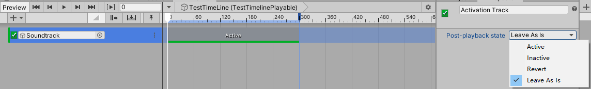
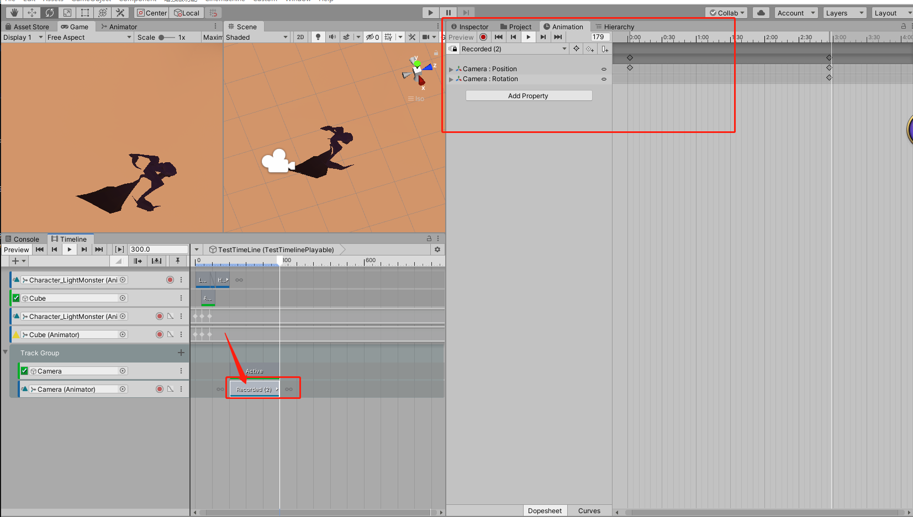
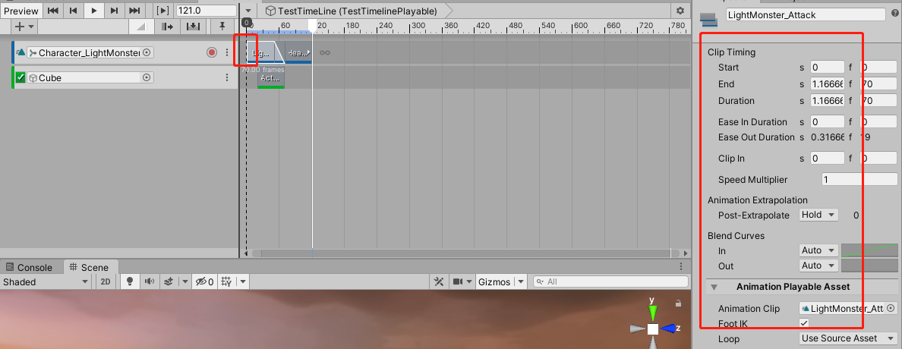
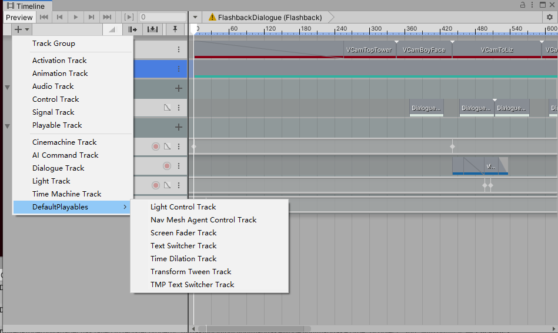

  * [Timeline](#01)

  <h3 id = "#01"></h3>

Timeline 寄托于PlayableDirector 组件，通过编辑Timeline序列将数据存于 【.playable】 中，通过寄托于PlayableDirector组件进行播放。
Track： timeline 的构成基础轨道原子。

Track Group: 管理Track分组

1、使用Activation 控制流程
Activation Track: 是一种在Timeline动画中可内嵌动画片段的Track。可以使用它在一些动画特定的地方添加一些额外完整的动画到Timeline中。例如背景上爆炸效果，屏幕上风吹过时的烟尘。主要用于对多个动画进行组合的时候在特定的时间进行显示和隐藏。
Active：Timeline播放完毕后选择的GO显示。
Inactive：TimelineAsset播放完毕后隐藏选择绑定的GO.
Revert: TimelineAsset 开始播放前重置为初始状态。例如播放结束的时候是inactive ，初始状态是active ，重新播放时重置
Leave As Is: 保持状态为TImelineAsset 结束的的状态
主要是控制GO的显隐。

(实际看了下，这几个选项没什么用。 激活的物体不管怎么设置都是开始播前会隐藏，播完了，然后隐藏。)

2、在Timelime控制和编辑动画和组件。
timeline asset：选中或创建一个GO作为想要表现的剧情动画的节点，作为创建Assetline aasset的容器。然后就可以对timelineAsset进行编辑。

Animation Track: 这是一个动画组件，有两种方式可以表现动画，一种是直接通过录制，然后操作GO的动作旋转等，会在时间轴上记录帧信息这种叫 Infinite Clip ，它包含了通过编辑器操作时记录下来帧数据，位置大小旋转等，记录当前选择帧的相关数据，然后插值到下个帧的数据。 形成动画片段。 第二种是直接通过一个现有的clip创建一个timeline上的动画clip。

可以直接控制Animator，在当前track上 进行多个动画进行播放融合等。可以录制动画和录制循环动画录制的动画一旦录制成功，就不能修改了，要再编辑需要转换成track clip ，然后通过animator编辑器进行编辑。

对于时间轴上的clip 选中可以进行复制，粘贴，删除，锁定等各种操作。
选中一个Clip，Inspactor面板上会有相应的属性显示，可以进行时间轴上的帧编辑,timeline上 会显示clip的长度，鼠标到clip两边也可以直接进行拖拽控制长度。两个clip重叠后面的会覆盖前面的。 对于动画clip，两者相连的部分会进行动画融合。

3、使用Audio Track。
Audio Track: 两种方式创建AudioTrack，直接拖拽一个Audio到timeline 或者手动创建一个。
属性:
Volume: 音量
StereoPan: 立体声
SpatialBlend: 空间混合
属性分三大部分：Clip Timing 控制音频在Timeline 中的位置和时间，速度等。s秒表示f帧所在的时间。BlendCurves:表示开始结束的淡入淡出曲线。 AudioPlayableAsset:控制音量和是否循环。

Control Track:
Signal Track:
Playable Track:
Ciemachine Track:
DefaultPlayables Track: 官方自带的做好的一些Track

Sub Track： 一般叫覆盖轨道(Override Tracks),用于覆盖或者遮蔽原本的动画。SubTrack会晚安覆盖主track的animtion，可以使用Avatar Mask进行两个anim 的合并。

Unity Recorder:

这个是Unity的插件：允许直接在UnityEditor上进行aniClip，Videos，和图片的clip录制。
 RecordMode: 
 Manual： 手动点击开始录制结束录制
 Single Frame: 基于设置的帧率，按单帧录制。 例如2秒的工程，要录制地24帧，
 Frame Interval: 指定起始帧结束帧 录制
 Time Interval: 制定开始时间结束时间开始录制。
 cap： 只有 播放帧率是固定值时，才可以使用Cap。Cap开启时， 工程运行的帧率受限于你设置的目标帧率。 关闭时，允许你的工程录制的更快比正常时间，没有录制回放速度的影响。 这可以在不依赖于用户实时输入的情景下节约时间。例如游戏预告片的用户交互和工程教程的回放录像。或者是视频动态图片或者录制教标题录像等等。

 可以录制4种类型的东西：GIF Animation , Animation Clip ,Movie ,Image Sequence . 每种类型的配置可以导出，导入，多个工程通用。

Animation Clip：会记录录制的位置动作，位移，融合成一个单独的anim。
Movie：
Image Sequence：