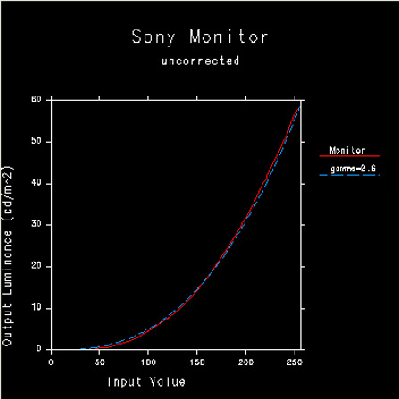
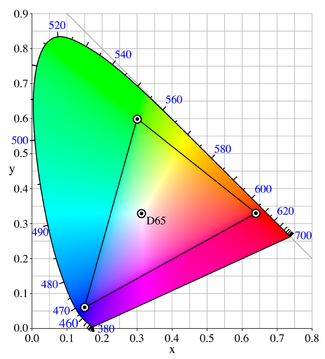
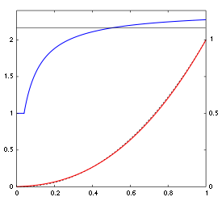

对于显示器而言,本身的输入的电压和显示的亮度不是线性关系

 

gamma源至CRL显示器的图像亮度和输入的电信号电压的非线性关系的一个参数。 由于将图片信息输入后CRL显示发现都偏暗，这是显示器本身的物理特性决定的。于是只好将图片都手动变亮，以适应CRL显示。因此制定了一套颜色空间的标准，叫sRGB，用来统一处理图片变亮的方式。 如果图片本身是sRGB空间下制作的，在CRT显示器上看起来就是正常的。 为了量化和衡量这种非线性关系引入了Gamma，抽象化为数学表达式 output= input ^ gamma .

CIE 1931 xy色彩图表示的sRGB色彩空间的色域以及原色的位置。白点D65显示在中间

红色曲线是相对横轴sRGB压缩值的sRGB强度的函数，蓝色曲线是这个函数在对数-对数空间中斜率，它是每个点上的有效gamma。在压缩值0.04045或线性强度0.00313之下，曲线是线性的所以gamma为1。在红色曲线之后的黑色虚线曲线展示了完全gamma = 2.2幂次定律时的曲线。
 
LCD没有CRT的问题，但是由于现有图片很多是sRGB，为了兼容在显示器内加入一次处理，对sRGB变暗处理，LCD内也gamma相应曲线。

[浅析](https://wenku.baidu.com/view/527777583b3567ec102d8a47.html)

gamma源至显示器对信号输入失真的度量，但是凡是设置到图像输入输出的对比差异都可以引入gamma参数。 
  * 显示器Gamma
  * 文件Gamma
  * 系统Gamma

显示器Gamma：是硬件决定的一个固定值，无法人为改变，(实际图像设备由多个非线性的系统组件组成，整个系统的传递函数是一个幂函数，它的指数gamma等于所有单个部件的Gamma的乘积)。例如普通的CRT的gamma约为2.5 ，为了使得图像信息尽量还原真实场景，需要将结果的Gamma趋近1，就需要通过Gamma校正来抵消这个2.5。

文件Gamma：
这种图形文件的gamma 可以理解为是相关标准规范给定的一个参数，为了描述图像文件表达信息制定的色调标准，或者是为了方便图像传输而定的图像传输协议，都会给定一个相应的Gamma值，确定图像信号的输入和输出关系 ，对于sRGB标准的输出图片给出的gamma变换就是为了抵消CRT的Gamma，可以称之为校正。  如果是处于特殊需要，需要改变数码相片文件的gamma值， 典型的是相机的自动gamma校正是为了输出人眼的感官图像，再例如对照片的gamma调解以对照片艺术化处理这种最终应用到图片上的效果直接体验在图像上都不属于校正过程。这种改变不能称作是像对显示器要做的那种 “校正”，而是换调解，属于曲线优化调整，是对亮度和对比度的辅助功能，强力的Gamma优化模式可以对画面进行细微的阴暗层次调整，控制整个画面的对比度表现。

系统Gamma：是对图计算机硬件系统读取图片数字信息后，输出到显示器前，做变换的衡量参数，可以通过软件等认为去调节。这种显示前的变换操作，里目的是为了抵消显示器的Gamma。这种调解尽量使得不可调解的显示器Gamma ，文件Gamma 和 系统Gamma叠加为1，使得显示器显示的图片和原始图片一样，降低或者消除失真。 这里好比密码通讯，文件Gamma是加密过程，系统Gamma和显示器Gamma 用来对文件Gamma(是指原始图片进过sRGBk空间输出映射的图片)解密，最终得到和原始信息一样的值。

什么地方做校正：
从获取图像、存储成图像文件、读出图像文件，直到在某种类型的显示屏幕上显示图像，至少有5个地方可以利用非线性转换函数引入Gamma值。

文件级：
1、camera_Gamma:摄像机图像传感器的Gamma ，这种一般直接作用于输出图像，不算到需要校正的里面。原始raw文件是未经任何处理的原始传感数据。
2、encoding_gamma：编码器编码图像文件时引入的Gamma，例如将相机输出图片转成了sRGB
    某些图像处理软件可以调整文件的Gamma，这种调整的结果将写入文件(即对图像进行某种处理)比如，当你的PC未进行Gamma校正（你的系统Gamma=显示器的Gamma约2.2），这时你可以把文件的Gamma调为2.2保存，你以及其它未校正系统Gamma的PC用户看到的这个图片应是正好的。（注意，这里有一个前提即原始图片在Gamma=1的系统上看是“正好”的。
    另一种方式则是将Gamma校正的系数写入文件内，而不改变文件内容，而浏览/处理软件在解码这一图像时会依据这一参数对它单独进行Gamma校正。（这被称作“文件Gamma”。PNG格式支持）
　　总之，不管Gamma校正发生在哪一环节，它们是等效的（在理想情况下/或近似地看）。明白在哪些环节Gamma发生了怎样的变化，然后做一些乘除法就可以了。

应用程序级：
3、decoding_gamma: 解码器读图像文件时引入的Gamma。 例如对Unity图片导入设置勾选sRGB时候， 进行采样的时候需要将sRGB图片逆转取原图片。否则就采样图片本身的像素。
      前提到的，某些播放软件有Gamma校正功能，ACDSEE也有。这时，它们不是修改系统的Gamma校正表，而是在解码时对当前帧/图像作了实时的Gamma变换。

系统级：
4、LUT_gamma:图像帧缓存查找表中引入Gamma。 
    系统级别(硬件和操作系统)。 显示器一般没有补偿，即使有也对外呈现一定的gamma值
    主要的补偿发生在显卡及驱动程序内。 如果硬件显卡不支持，由驱动软件完成。winsows中，上层通过调用驱动程序的一个借口函数(DrvIcmSetDeviceGammaRamp)向其传递Gamma校正表（LUT），这个表的大小是3*256项（每项16字节），对应于RGB三个通道，每个通道256级。
    描述这一细节，可以对有些事情更有把握：
　　* 这种校正实际上可以是任意函数，而不限于gamma为幂的指数函数。
　　* 也是因为此，不能通过驱动程序得到系统的gamma值（因为最多只能得到那个表）。
　　* 这一设置对整个系统有效（任何程序，任意显示的图片都受它影响）。

5、CRT_LCD_gamma: CRT gamma 是尝试消除的

[can](https://diy.pconline.com.cn/display/study_screen/0703/975894_all.html)
校正方法：
根据上述提出的5中

 [相机的log Gamma](https://blog.csdn.net/ycc541/article/details/42263577)：
  相机拍的照片，胶片化学成像的方式和人眼的非线性感光方式相同。而CCD,CMOS成像方式是通过像点中的“硅” 感受光线强弱。硅感光是物理成像，真实的反应光线的变化，是线性的，于是他的gamma 和人眼的冲突了。
 
左边是人眼看到，右边是CCD成像

CCD可能更接近真实的世界，因为当时亮度也许就不高，但是人眼有自动补偿。因此，相机要输出一张人眼看到的画面，需要调整对光线的反应，也就是Gamma曲线。
 
左边是人眼看到，右边是CCD成像

 一般的相机Gamma的调整是自动的。 但是高级相机一般留有参数摄像者进行微调。
 

 
 相机的log Gamma曲线是对数曲线。一般相机里可以选JPEG的色彩空间，比如可以选sRGB 和 Adobe RGB。 这些空间都有自己规定的亮度映射(sRGB就是分段函数)。所以相机在完成相片成像后还要再把线性线性RGB的数据映射成颜色空间规定的亮度。所以相机里拍摄的jpeg 在电脑上看的时候流程是：  

 * 相机中：
    raw原始数据-> (tone mapping :适应人眼的gamma校正) -> 线性的RGB数据 -> ("gamma "映射) -> sRGB 数据
 * 显示器：
    sRGB 数据 -(逆 gamma 映射) -> 显示

[公式总结](https://www.zhihu.com/question/55444719/answer/144972733)

这种Gamma曲线和Log曲线都可以归类于OECF/OETF（Opto-Electronic Conversion/Transfer Function 光-电转换函数）之中。在将视频显示在屏幕上时，会由对应的EOCF/EOTF (Electro-Optical Conversion/Transfer Function 电-光转换函数)来完成映射。

【文件数值】=【场景相对物理亮度】^ Encode Gamma
【屏幕相对物理亮度】= 【文件数值】^ Display Gamma

RAW格式：RAW图像是CMOS或CCD图像感应器扑捉道德光源信息转化为数字信号的原始数据。

LUT：

Gamma校正：由于显示器Gamma和文件Gamma是固定不变的，Gamma校正过程是校正计算机的系统Gamma，使得显示器Gamma、系统Gamma、文件Gamma三个变换的叠加为1.0

gamma space: 对图片采样时先进行一次gamma校正，然后采样。
linear color space: 直接对图片采样。