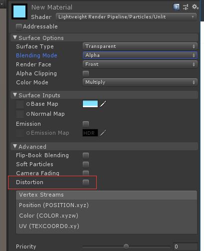

摘记阿蓝的分析：https://connect.unity.com/p/zou-jin-lwrp-universal-rp-de-shi-jie

* [Universal RP 的优势](#1)
* [关于前向渲染 和 延迟渲染](#2)

 <h3 id="1">Universal RP 的优势</h3>
   URP是Unity 2019.3中替换LWRP的新名字，即通用渲染管线。将是以后Unity兼容所有平台的通用渲染管线。
   
* URP在性能上的优势体现在哪里？
    首先要知道URP和内置管线在渲染上有什么区别
    
    1、渲染路径的差别
    URP是单Pass前向渲染管线，而内置管线是多Pass前向渲染管线 和 延迟管线。 URP没有延迟渲染，因此我们只对比前向渲染这一项.而延迟渲染的G-Buffer所需要的带宽带来的开销太大，目前的手机并不适用。
    
    前向渲染：在渲染物体受点光光照的时候，分别对每个点光 对 该物体产生的影响进行计算，最后将所有的光的渲染结果相加得到最终物体的颜色。 

    - 内置渲染管线是如何实现前向渲染的呢 ：用多个pass来渲染光照，第一个pass只渲染主光源，然后多出来的光，每个光用一个pass单独渲染。这也是平时做手游的时候很少会用到点光源的原因。对于内置管线来说，每多一盏光，整个场景的drawcall就会翻倍，这个性能开销是无法接受的。

    - URP 的实现方法是 ： 在一个pass当中，对这个物体受到的所有光源通过一个for循环一次性计算。
    
        好处：
        - 1）、一个物体的光照可以一次DrawCall中计算完毕。
        - 2）、 省去了多个Pass的上下文切换以及光栅化等开销。

        坏处：
        - 1)、只支持1盏直光
        - 2)、单个物体最多支持4盏点光
        - 3)、单个相机最多支持16栈灯光

    因此使用URP，只要控制好电光的范围，我们在手游里面也可以做多点光照明了，例如释放一个火球照亮周围物件，这在内置管线里是基本放弃不适用的。
   
   2、GrabPass
   GrabPass通常用来制作空气扰动或者刀光等特效带来的折射效果。内置管线中如果使用这个功能，则会在每个用到这个Shader的地方对屏幕缓冲区进行一次抓取操作，这个操作会大幅消耗GPU的带宽。在移动设备上贷款是非常有限的资源。另外GrabPass移动机型上很多设备并不能使用。

   在URP中，可以在渲染管线的配置文件中，开启Opaque Texture ，这张图是管线在完成不透明物体渲染后，将屏幕缓冲区中(也可能是i相机的ColorRT)的颜色保持到一张单独的RT中，然后在特效中就可以直接拿这张图去进行扭曲和扰动计算。  

   这样做的好处是可以将抓取操作的次数恒定下来，不会因为同屏有多少个需要扰动的对象而额外增加开销。 坏处是，没有办法对不透明物体进行扰动操作了，也就是说只能对场景物件而没法对特效进行扰动。

    

    

  不过Unity在URP的例子特效Shader当中直接内置了扰动的效果，通过勾选框就能开启。

  3、 SRP Batcher

    在所有的SRP管线中(URP和HDRP或者自定义管线)，都可以受益于SRP Batcher ，这个功能可以将没有进行静态合并，也没有通过Instancing 渲染的 使用相同shader的物体， 通过CBuffer 去保存每个物体材质球的参数，进而在不进行SetPassCall的情况下完成绘制。这个功能的效果是，可以大幅降低相同DrawCall情况下单个DrawCall的开销，这个功能开启的时候，也许场景中有500个DrawCall ，单实际上SetPassCall只有不到100，在相同情况下的渲染性能是要高于内置管线不少的。 不过Shader要支持SRP Batcher 还是有些条件的。

* URP在扩展性上的优势 ：

    URP 具备了非常强大的可拓展性，其大多数功能都是完全模块化的，可以自由搭配组合，而且对她进行拓展大多数情况下不需要要修改URP本身源码。

    1、RenderFeature/RenderObject

    这个功能是LWRP6.x之后加入的功能，RenderObject是RenderFeature的一个默认实现，可以让大家在不写一行代码情况下对渲染管线进行渲染。

    为了使用RenderObject 我们首先需要建立一个新的前向渲染器的配置文件

<h3 id="2">关于前向渲染 和 延迟渲染</h3>