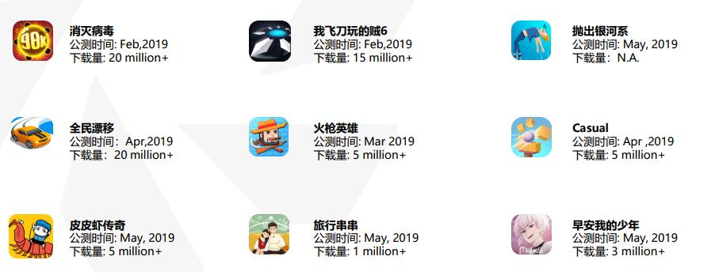
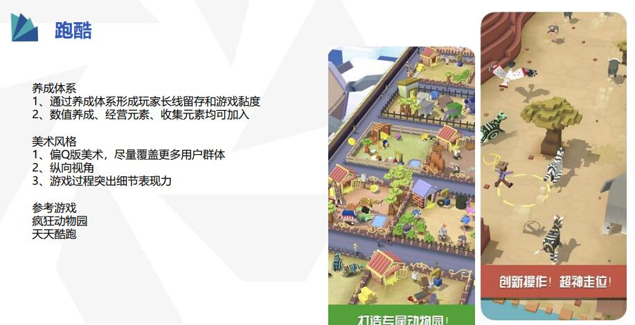
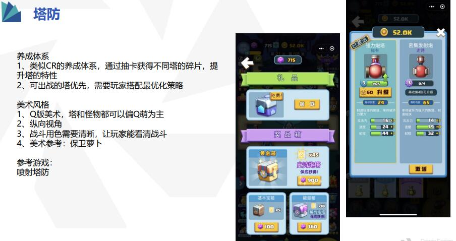
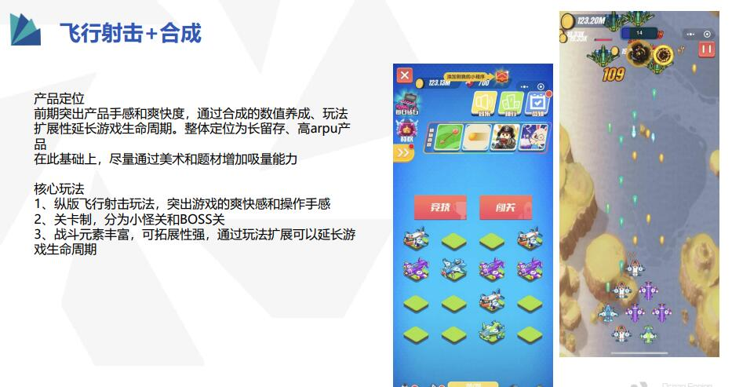
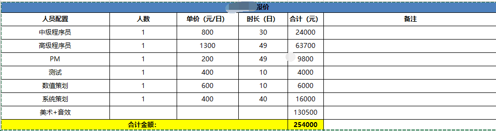

# 关于小游戏的资讯

## 如何关注平台寻找小游戏的资讯？
    创建的游戏平台： 
    [IOS AppStore](https://apps.apple.com/cn/genre/ios-游戏-休闲游戏/id7003)
    [TabTab](https://www.taptap.com) ,Goggle ,等。

    关注休闲游戏的的下载量，分析小游戏的玩法：

    关注成员配置，预估投入开销：

    关注玩法核心玩法，整合资源，推进项目：

    关注收入模式、推广、买量。例如弓箭传说用超休闲小游戏做到超低买量成本，却又做出大大超过休闲游戏应该有的收入