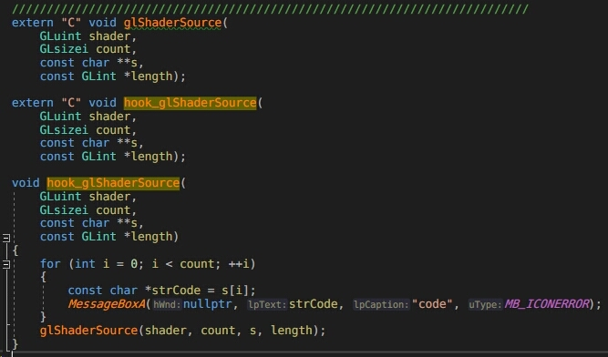

整理各种用的，用过的工具，插件等。以便快速查找.
同时摘录一些平时了解到的资源想法工具 
  
  * * *
  
  ## 开发工具

- [Visual Studio Code](https://code.visualstudio.com)
- [JetBrains Rider]()
- [JetBrains Resharper]()
- [Sublime Text]()
- [Notepad++]()
- [Beyond Compare 4]() --- 文件比较工具

- [SwitchyOmega]() --- vpn 工具 浏览器安装 SwitchyOmega工具 ，导入.bak工具。 pc导入jason 配置。

- [Criware: 1、有自己专有音频编码器，不是用的mpc vorbis这些公共编码，压缩比高，音质好，0延迟 2、有视频组件，可以在UI上用半透视屏](https://www.criware.com/cn/products/adx2.html)
* * *
  
## 逆向工具

- [IDA Pro 7 -- 找破解版]
- [IL2CPPDumper]()
- [AssetStudio]()
- [UtinyRipper](https://github.com/mafaca/UtinyRipper)
- [EasyHook](http://easyhook.github.io) --- Windows上C# Hook的插件工程
- [AndroidKiller]() --- apk的逆向分析拆包工具
- [stud_pe]()    --- 查看PE文件和识别常用加壳的工具
  
- [NVIDIA Nsight Graphics]() -- Dx11,12以上的抓帧逆向分析工具
- [Snapdragon Profiler]() --- 晓龙处理器抓帧逆向工具
- [VADebug](http://www.vadebug.cn) -- 
- [GameGuardian](https://gameguardian.net/download) --- dump dll tool
- [Renderdoc]()--- 一款shader修改和导出工具
  
-  [关于 windows dll forward, 直接hook手机打印出shader]()  
- [MonoHooker，运行时修改C#函数](https://github.com/easy66/MonoHooker)

* * *
  
## Plugins

- [IceKori]() --- 一款抽象的可视化脚本设计工程，对于设计关卡等逻辑接口可参考
  
* * *
* [这辈子最讨厌的 Mac]()
  
* * *
## 一些网站 很有用的资源 - 学会以产品的角度去看待

- [.NET CORE 最新的源码地址](https://github.com/dotnet/corefx)
- [Unity的Dot资讯](https://unity.com/cn/dots)
- [设计模式](https://www.runoob.com/design-pattern/proxy-pattern.html)
- [9秒社区](http://www.appcome.com)
- [看雪精华帖](https://bbs.pediy.com/user-536985.htm)
- [Bilibili-Unity官方资讯](https://space.bilibili.com/386224375?share_medium=android&share_source=copy_link&bbid=E2846471-B9A6-4694-8ECB-080EE654391329838infoc&ts=1567151662103)
- [像素骨骼](https://blog.csdn.net/u011771335/article/details/84144098)
- [将C#转换成Lua的一个开源项目工具库](https://github.com/yanghuan/CSharpLuaForUnity)
- [UWR开源库-都是一些很叼的东西](https://lab.uwa4d.com/lab/5ce85b3c72745c25a88d3ec3)

- [BitUp 像素游戏](https://mp.weixin.qq.com/s?__biz=MzU5MjQ1NTEwOA==&mid=2247500664&idx=1&sn=d219b6a57807a7f0192679cc08560217&chksm=fe1df7d3c96a7ec57e3d3e535bff3c29b7cc033d09c25128dd3c52b420e95f5ac60a76a92b63&mpshare=1&scene=23&srcid=0830OqmLI3LqVU3L6Mz4BYuY&sharer_sharetime=1567157796668&sharer_shareid=e261171ec7e6c6242755d4b529ecd90b#rd)
  
- [官方使用VisualEffectGraph和HDRP制作的一个3A的第一人称视角Demo](https://github.com/Unity-Technologies/SpaceshipDemo)

- [微软IL文档](https://docs.microsoft.com/zh-cn/dotnet/standard/managed-execution-process)
* * *

* * *
## ECS

-[URL-1-一些使用示例](https://lab.uwa4d.com/folder/single/5bf79f7c6822d234aa9eca84)
- [官方的示例1](https://github.com/Unity-Technologies/EntityComponentSystemSamples)
- [Git的一个ECS实现-有不少项目就是用的这个实现的](https://github.com/sschmid/Entitas-CSharp#download-entitas@Eddy)
- [Reactive-System 关于使用ECS时候 一些逻辑的处理 该如何组织的讨论](https://forum.unity.com/threads/reactive-system.522776/)

        使用ESC的话,一些UI逻辑如何组织，一些持续连续的逻辑如何组织。比如事件驱动系统。

        情景： 道具栏里使用一个道具。
        逻辑组织：Reactive System.  一个Component变化了，系统能监听这个Component变化捕获他们的entity。 例如，用Entitas 的标准ecs就是定义一个物品栏的component. 变化Replace 一下这个Component,这个可以所谓所谓 单例 的全局bag,或者跟Character的 entity 关联的某个com都可以。( 该哪个System 处理以及怎么筛选Component 呢) 然后UI可以响应这个数据变化，于是就有了Reactive System.

        ESC麻烦的是 写“持续执行的事件” , 项目很多时候有 例如：移动3格，然后播放动画，在执行攻击 ； 关卡的事件逻辑驱动系统 。 如果用ECS ,就要组织相应的 数据--> 行为系统，还有组织一个System 串联。 也有可能把这样一个行为作为一个System 去驱动一个 Bt Tree ,或者 node. 做主要的难点还是在数据设定 和系统拆分上面 ， 可拆分的细，也可以拆分的很统一。 看如何去组织的， 最后可能还不如直接几个单例接口调来调取 。 

        unity ecs 用来写特定的表现和功能确是很不错 。 如果组织逻辑还不如直接接口类调用。 

        可以将功能模块分离ecs 做某个独立的系统执行，ecs简单用来定义数据， 用context 获取entity(数据) 具体页面直接操作数据就行。

        ECS的Arch type 。对数据的“形态” 组织非常方便 。 可以提前在某个文件定义好游戏的数据"对象" ，这样一预览就大概之道有什么数据。

        吧entitas 丢到ULRuntime 效率极低，很多<T> 要改，Replace数据的消耗极高，用ILRuntime 泛型的容器都要拷贝过来 。 吧可视化entity 功能去掉，。 在一开始没针对ILRuntime 做所谓的里外功能分离。 做到功能丢里面，热更操作接口，相当于不运行Entitas系统。 要先把战斗或者某个消耗大的功能丢进去，外面相当于设置数据一样往Unity里面的那部分功能设置数据来控制。 甚至留一些反射的操作接口，通过字符串去做一些数据的操作，写好一些规则 。外面随便搞搞GC就很高

        开始都放外面热更，结果卡死，然后花了很多时间改Component数据变化不replace直接设置，把消耗的功能丢进去，例如寻路，通过外面设置数据，获取结果。 主要是多人同步，多人寻路然后走一格要判断整个事件的事件个各种限制，剧情触发，这些需要好好做里外隔离。 大头

* * *
  