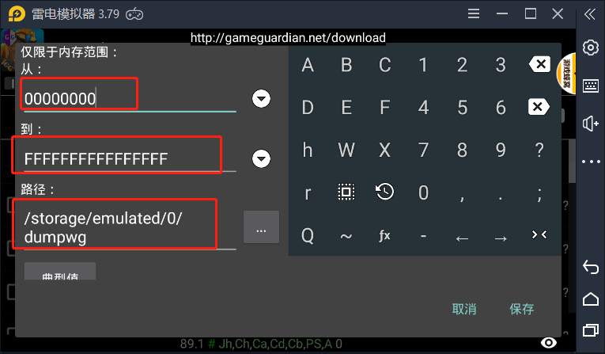

今天想分析下大梦龙图他们的游戏框架。 发现是mono发布的Unity游戏。 dll加壳了。然后网上找了一些脱壳教程。实现过程记录下

一下记录雷电模拟器上使用GameGuardian提取dll的方法这种只适用于Unitydll加载的方式咯。

* 使用的是网易mumu模拟器，装了北凉悍刀行，然后通过adb 启动apk，等待 ida 附加debug进程。 
  
  手机上安装好GG,运行游戏然后打开GG,通过内存搜索的方式搜索9460301(0x4D5A9000) ,这也是PE文件Dos头的特征码。
  
  

  搜索到的结果如下，记录下地址的开头和结尾。 后面dump需要这个地址，开始地址和结束地址要揽括记录的范围。
  

  打开dump工具，进行dump
  
  

将文件导出来后用get_dll_from_dumped_bin.exe解析dll.
