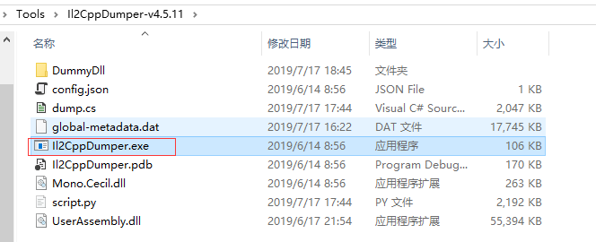
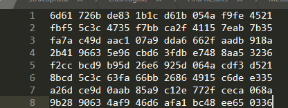
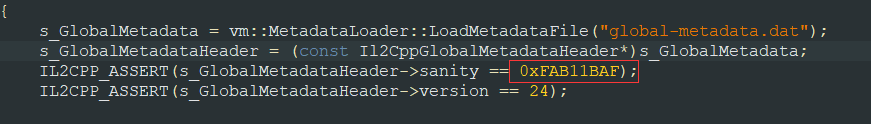
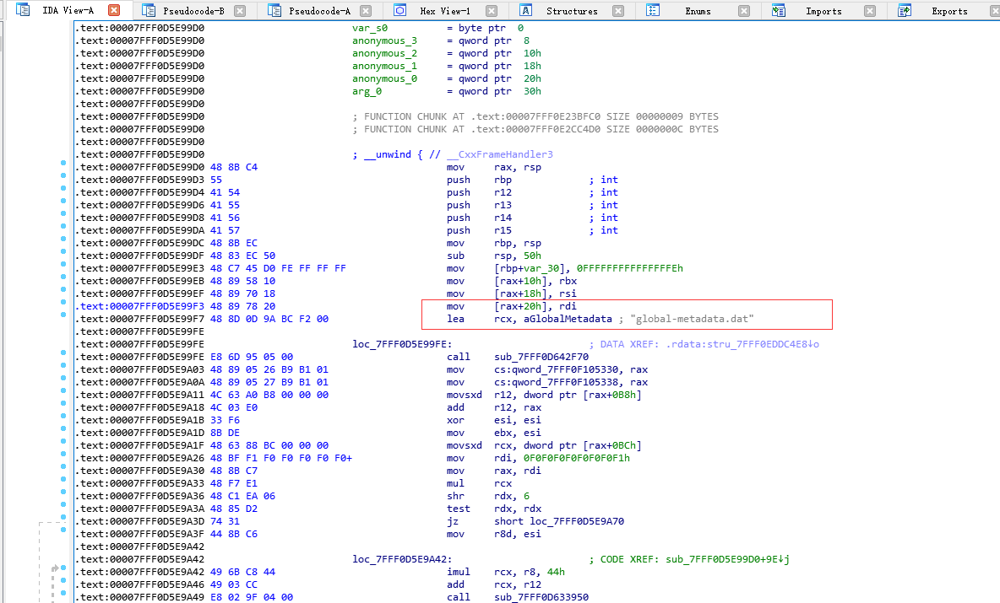
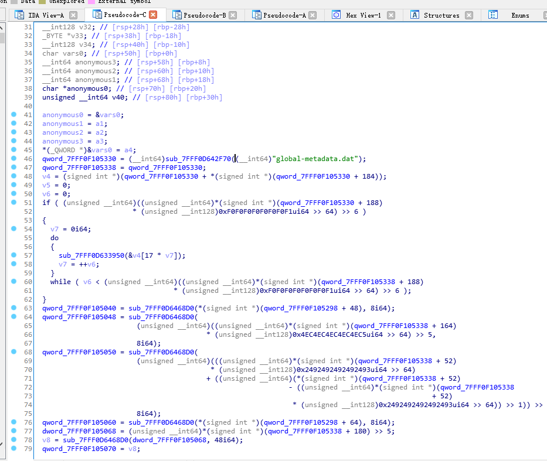
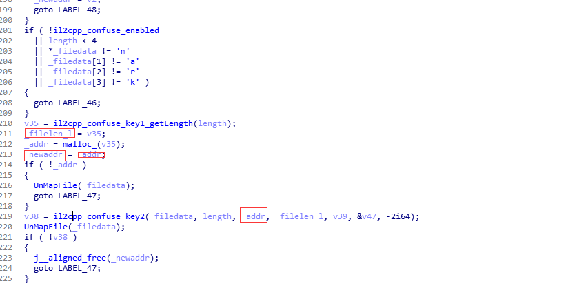
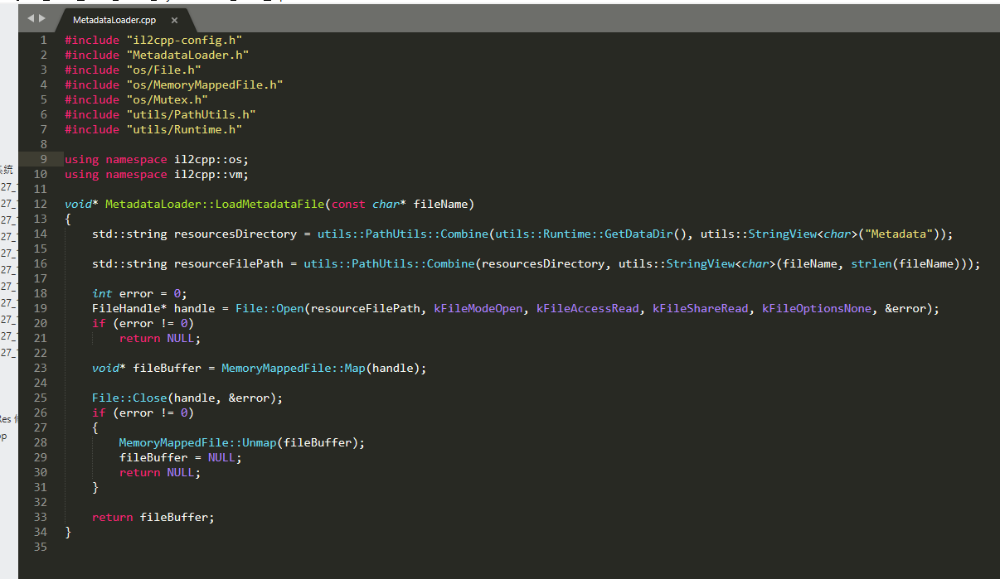
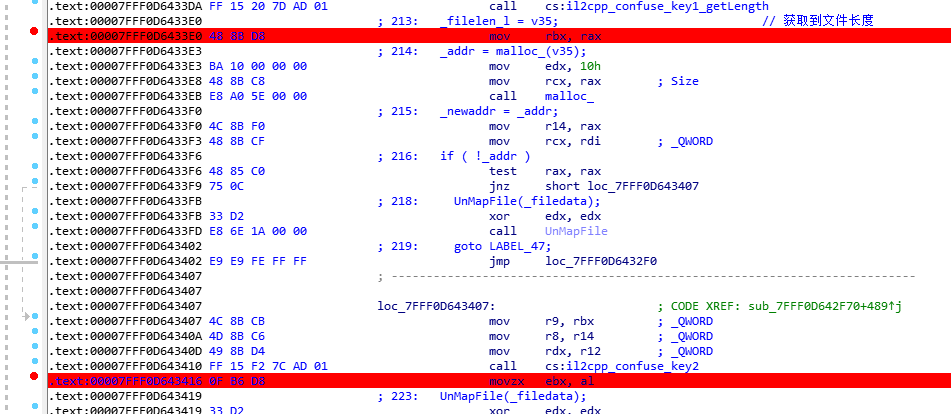
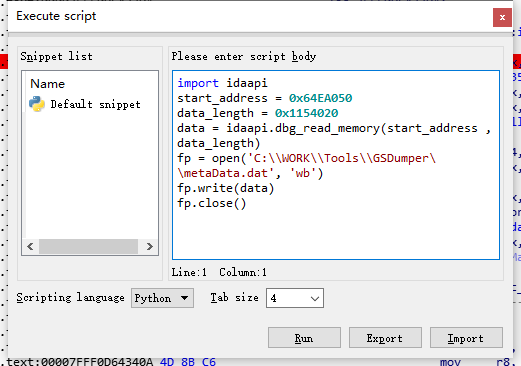
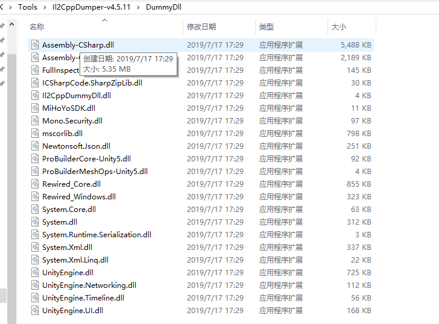

1下载原神PC包，用il2cpp导出发现metadata 加密。 对比metadata

  
   

2.将dll放入ida，看il2cpp 的代码unity安装包(Editor\data\il2cpp\libil2cpp\vm),找到加载metadata相关代码，在ida中搜索global-metadata.dat查找代码位置。

  

3、找到加载matedata加载代码 F5反编译 对比源代码分析

  

4、通过与源代码对比发现原函数没有变化，加密函数应该在 MetaDataLoader：：LoadMetadataFile() 里面，直接进入函数查看代码，发现这部分代码和源代码不一致。 对比发现加载完文件后没有直接返回，有后续操作，判断了加密的文件头是否需要解密，然后调用了两个函数一个计算解密长度，一个是根据加密文件长度解析出metadata，然后返回解密后的地址

5、进入找到对应长度 和解密后的地址的汇编指令的地方进行断电，可以找到文件的长度1154020h 和 64EA050

6、有了地址和长度 不用管加密算法直接导出

7、然后IL2CppDumper 用dll 和解密后正确的meta问价导出dll

 