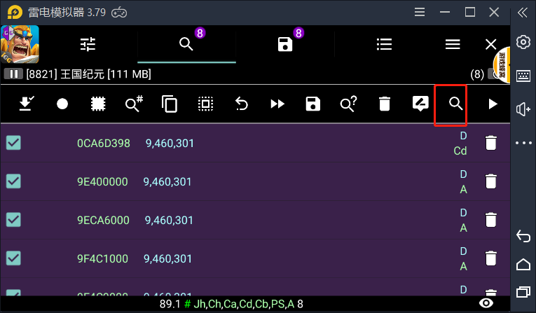
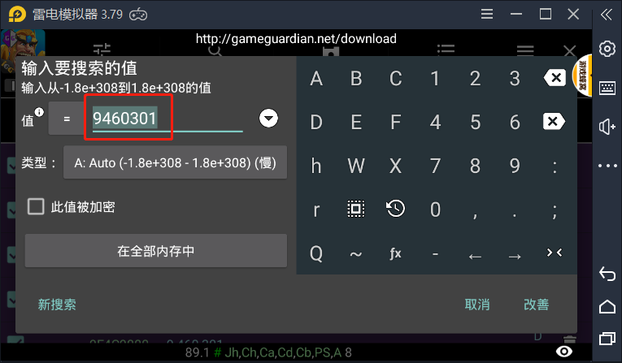
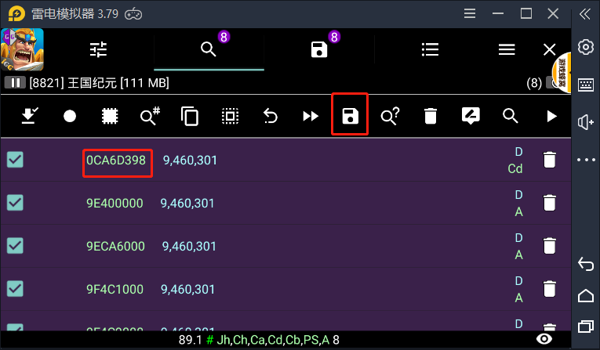
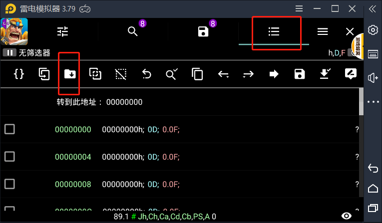
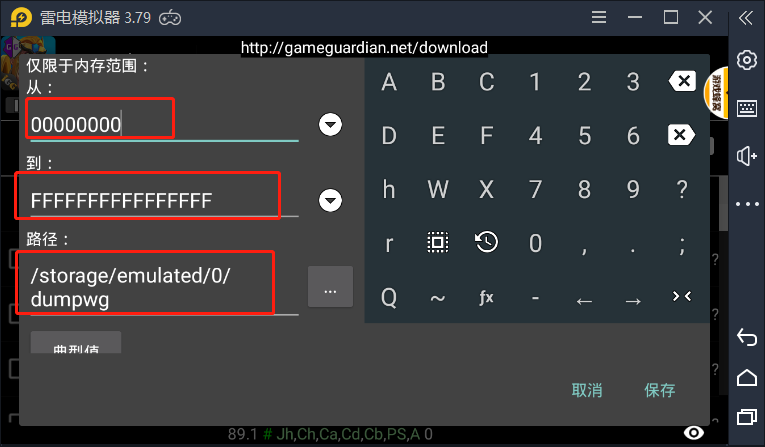

* [1、使用GameGuardian导出mono类游戏dll](#001)
* [2、逆向的一些基础知识](#002)
* [3、资源的逆向](#003)

              [返回目录](#001)
<h1 id="001">1、使用GameGuardian导出mono类游戏dll</h3>

一下记录雷电模拟器上使用GameGuardian提取dll的方法这种只适用于Unitydll加载的方式咯。

* 使用的是网易mumu模拟器，装了北凉悍刀行，然后通过adb 启动apk，等待 ida 附加debug进程。 
  
  手机上安装好GG,运行游戏然后打开GG,通过内存搜索的方式搜索9460301(0x4D5A9000) ,这也是PE文件Dos头的特征码。
  
  

  搜索到的结果如下，记录下地址的开头和结尾。 后面dump需要这个地址，开始地址和结束地址要揽括记录的范围。
  

  打开dump工具，进行dump
  
  

将文件导出来后用get_dll_from_dumped_bin.exe解析dll.

              [返回目录](#002)
<h1 id="002">2、逆向的一些基础知识</h3>

[IL2CPP的游戏修改](https://www.52pojie.cn/thread-982655-1-1.html)

hook常用的一些框架工具：frida , substrate ，gameguardian , andlua .
[Unity-Substrate-Hook](https://github.com/jbro129/Unity-Substrate-Hook-Android)

静态修改，动态修改

逆向注入主要手段：
框架类注入so
xposed换so
gg类内存修改
游戏蜂窝类自动点击
apk残端破解

<h1 id="003">2、资源</h3>

[Blender中国社区](https://www.blendercn.org/)
[sketchfab模型网站](https://sketchfab.com/3d-models/gono-x-a7908e8496e44e3ea584a485a75ebfdf)
[sketchfab加密提取](https://imjad.cn/archives/lab/ripping-sketchfab-models/)
[遨游浏览器，资源嗅探器]

【Mesh Optimizer 】 Unity 减面插件,导出Blender修改。
【FBX export】
【Lost Crypt】

