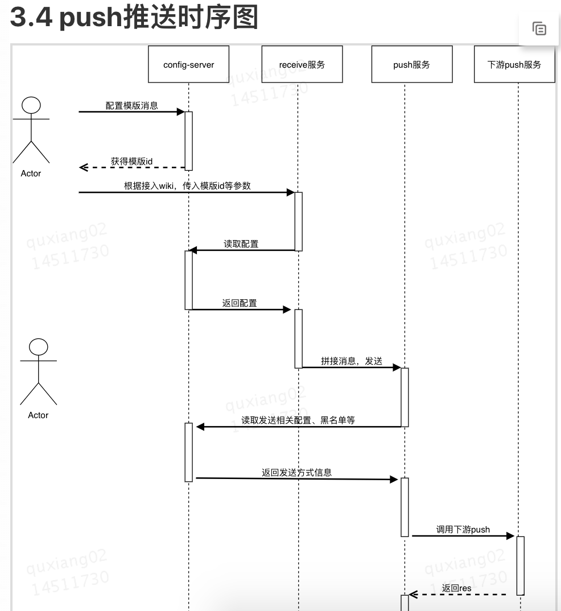
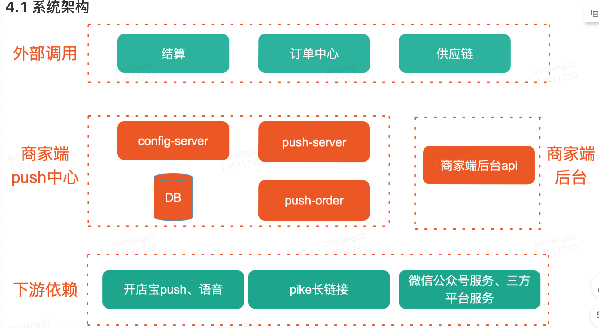

# 目录
# 1.背景

# 2.目标

# 3.技术方案

## 3.1 模版配置化（简接入）

### 3.1.1整体设计

###3.1.2 详细设计

## 3.2 业务功能隔离（高稳定）

### 3.2.1 整体设计

### 3.2.2 详细设计

### 3.2.3 平滑上线计划及稳定性监控

## 3.3 端到端的实时监控

### 3.3.1 整体设计

### 3.3.2 详细设计

### 3.3.3 平台地址

## 3.4 push推送时序图

## 3.5 整体业务流程图

## 3.6 业务使用场景

# 4.系统架构

## 4.1 系统架构

## 4.2 触达开店宝push中心能力

## 4.3 上下游链路

# 5.接入情况
